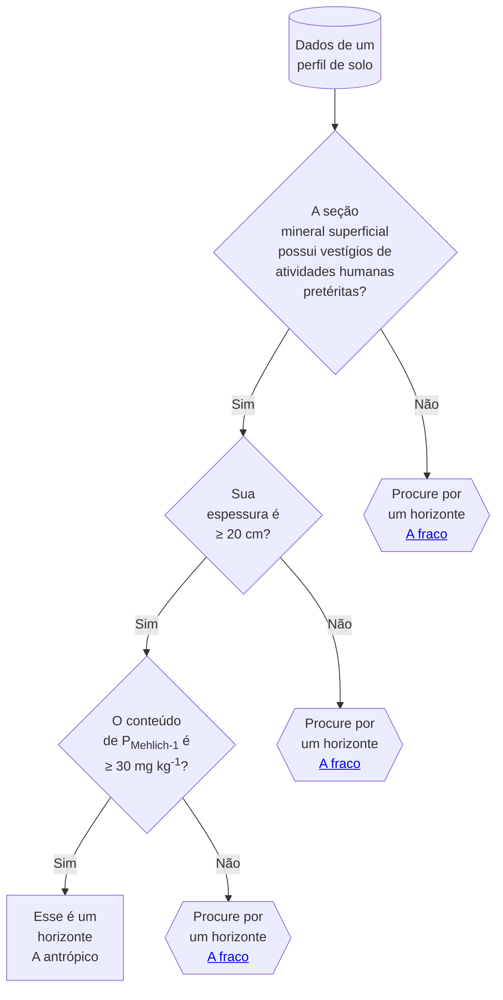

É um horizonte formado ou modificado pelo homem pelo uso prolongado, seja como lugar de residência, de descarte ou de cultivo, no qual haja sinais de adições de material orgânico de variada natureza, em mistura ou não com material mineral, cujas evidências possam ser comprovadas pela presença de artefatos cerâmicos e/ou líticos, ossos, conchas ou vestígios de ação do fogo (carvão e cinzas).