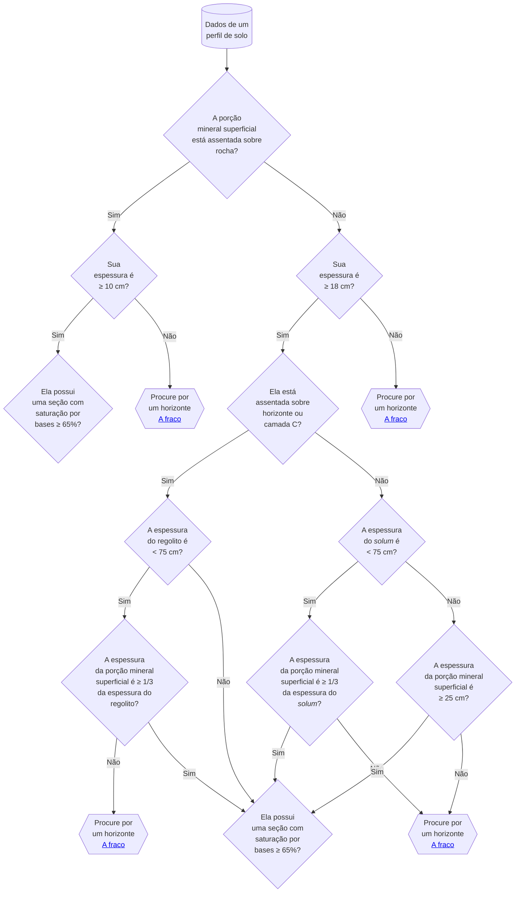
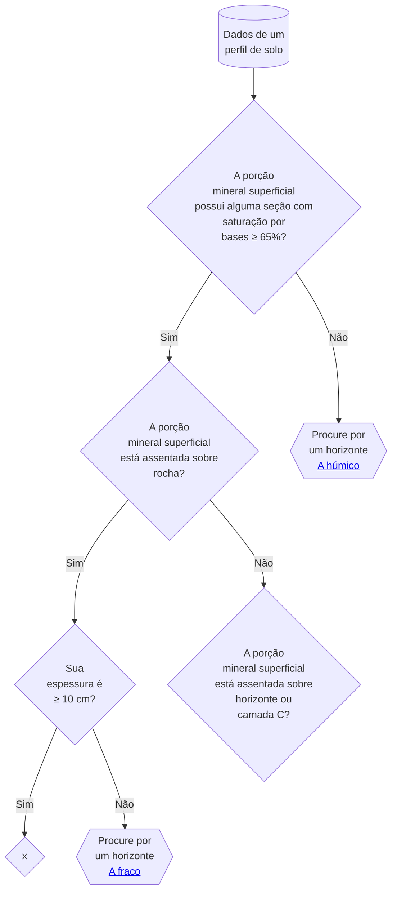
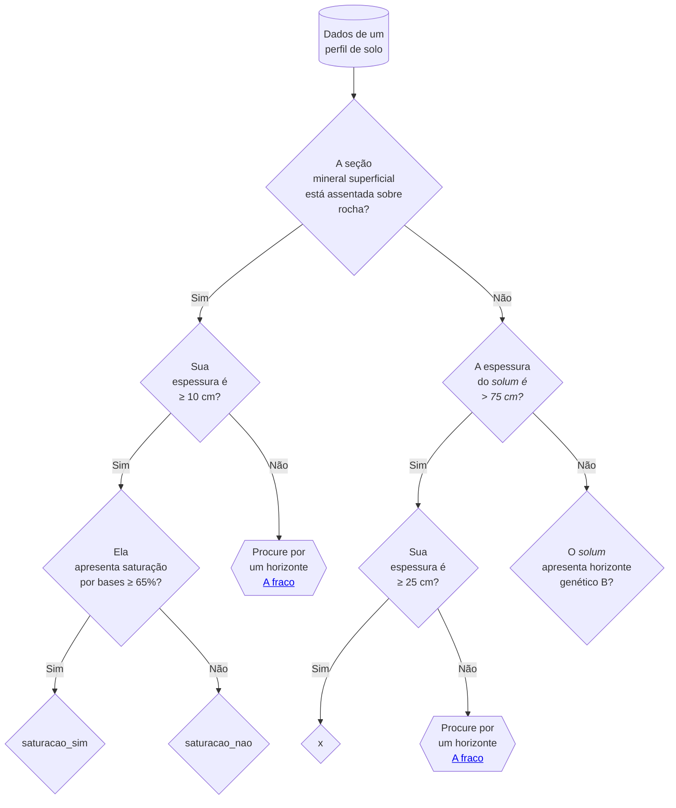
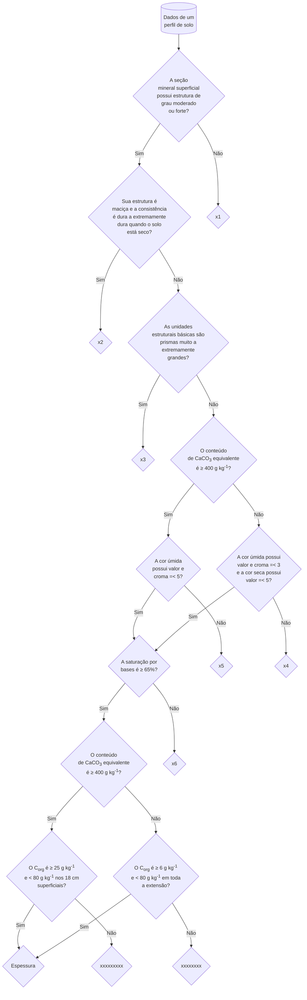

<!-- A seção superficial mineral está assentada sobre rocha?
  Sim: Sua espessura é ≥ 10 cm?
    Sim: Segue a análise
    Não: Sua espessura é < 5 cm?
      Sim: Neossolo Litólico com A fraco
      Não: Neossolo Litólico com A moderado
  Não: A profundidade do solo é < 75 cm?
    Sim: Sua espessura é ≥ 18 cm e > 1/3 da profundidade do solo?
      Sim: Segue a análise
    Não: Sua espessura é ≥ 25 cm?
      Sim: Segue a análise

  Sim: A espessura do solum é < 75 cm?
    Sim: A espessura do A é >= 18 cm e mais que 1/3 da espessura do solum?
    Não: A espessura do A é >= 25 cm?
  Não: O horizonte A está assentado sobre rocha?
    Sim: A espessura do A é >= 10 cm?
    Não: A espessura do A+C < 75 cm? -->

É um horizonte mineral superficial, relativamente espesso, de cor escura, com alta saturação por bases.