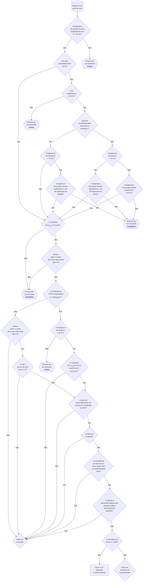

```mermaid
graph TB
  DADOS[("Dados de um<br>perfil de solo")]
  DADOS  --> DELGADO{"A espessura<br>da porção mineral<br>superficial do solo<br>é ≥ 10 cm?"}

  DELGADO -->|Sim| ROCHA{"Ela está<br>assentada sobre<br>rocha?"}
  %% A húmico e A proeminente exigem a mesma espessura, e A antrópico exige ≥ 20 cm. Então será A fraco ou A moderado.
  DELGADO -->|Não| FRACO1{{"Procure por<br>um horizonte<br><a href='../fraco/'>A fraco</a>"}}

  ROCHA -->|Sim| C6{"O conteúdo<br>de C<sub>org</sub> é ≥ 6 g kg<sup>-1</sup>"}
  ROCHA -->|Não| 18CM{"Sua<br>espessura é<br>≥ 18 cm?"}

  18CM -->|Sim| SAPROLITO{"Ela está<br>assentada sobre<br>horizonte ou<br>camada C?"}
  18CM -->|Não| FRACO{{"Procure por<br>um horizonte<br><a href='../fraco/'>A fraco</a>"}}

  SAPROLITO -->|Sim| REGOLITO75{"A espessura<br>do regolito é<br>< 75 cm?"}
  SAPROLITO -->|Não| SOLUM75{"A espessura<br>do <em>solum</em> é<br>< 75 cm?"}

  REGOLITO75 -->|Sim| 33REGOLITO{"A espessura<br>da porção mineral<br>superficial é ≥ 1/3<br>da espessura do<br>regolito?"}
  REGOLITO75 -->|Não| C6

  SOLUM75 -->|Sim| 33SOLUM{"A espessura<br>da porção mineral<br>superficial é ≥ 1/3<br>da espessura do<br><em>solum</em>?"}
  SOLUM75 -->|Não| 25CM{"A espessura<br>da porção mineral<br>superficial é<br>≥ 25 cm?"}

  33REGOLITO -->|Sim| C6
%% Pode ser A antrópico se a espessura for ≥ 20 cm
  33REGOLITO -->|Não| ANTROPICO1{{"Procure por<br>um horizonte<br><a href='../antropico/'>A antrópico</a>"}}

  33SOLUM -->|Sim| C6
  33SOLUM -->|Não| ANTROPICO1

  25CM -->|Sim| C6
  25CM -->|Não| ANTROPICO1

  C6 -->|Sim| COR5{"Ambos<br>valor e croma<br>da cor do solo úmido<br>são ≤ 5?"}
  C6 -->|Não| ANTROPICO2{{"Procure por<br>um horizonte<br><a href='../antropico/'>A antrópico</a>"}}

  COR5 -->|Sim| CACO3{"O conteúdo de<br>CaCO<sub>3</sub> equivalente<br>é ≥ 400 g kg<sup>-1</sup>?"}
  COR5 -->|Não| ANTROPICO2

  CACO3 -->|Sim| 18CM_CACO3{"A espessura<br>da seção é<br>≥ 18 cm?"}
  CACO3 -->|Não| COR3{"Ambos<br>valor e croma<br>da cor do solo úmido<br>são ≤ 3?"}  

  COR3 -->|Sim| COR3SECO{"O valor<br>da cor do solo<br>seco é ≤ 5?"}
  COR3 -->|Não| HUMICO1{Pode ser<br>A húmico}

  COR3SECO -->|Sim| FORTE{"O grau de<br>desenvolvimento da<br>estrutura é moderado<br>ou forte?"}
  COR3SECO -->|Não| HUMICO1

  18CM_CACO3 -->|Sim| C_CACO3{"O conteúdo<br>de C<sub>org</sub> nos 18 cm<br>superficiais é<br>≥ 25 g kg<sup>-1</sup>?"}
  18CM_CACO3 -->|Não| FRACO2{{"Procure por<br>um horizonte<br><a href='../fraco/'>A fraco</a>"}}

  C_CACO3 -->|Sim| FORTE
%%  C_CACO3 -->|Não| COR4{"Ambos<br>valor e croma<br>da cor do solo úmido<br>são ≤ 4?"}
  C_CACO3 -->|Não| HUMICO1

%%  COR4 -->|Sim| HUMICO1
%%  COR4 -->|Não| ANTROPICO3{{"Procure por<br>um horizonte<br><a href='../antropico/'>A antrópico</a>"}}

  FORTE -->|Sim| MACICA{"A estrutura<br>é maciça?"}
  FORTE -->|Não| HUMICO1
  
  MACICA -->|Sim| HUMICO1
  MACICA -->|Não| CONSISTENCIA{"A consistência<br>do solo seco é<br>dura, muito dura<br>ou extremamente<br>dura?"}

  CONSISTENCIA -->|Sim| HUMICO1
  CONSISTENCIA -->|Não| PRISMAS{"A unidades<br>estruturais básicas são<br>prismas muito a<br>extremamente<br>grandes?"}

  PRISMAS -->|Sim| HUMICO1
  PRISMAS -->|Não| SATBASES{"A saturação por<br>bases é ≥ 65%?"}

  SATBASES -->|Sim| CHENOZEMICO["Esse é um<br>horizonte<br>A chernozêmico"]
  SATBASES -->|Não| HUMICO0{Pode ser<br>A húmico ou<br>A proeminente}
```

É um horizonte mineral superficial, relativamente espesso, de cor escura, com alta saturação por bases.