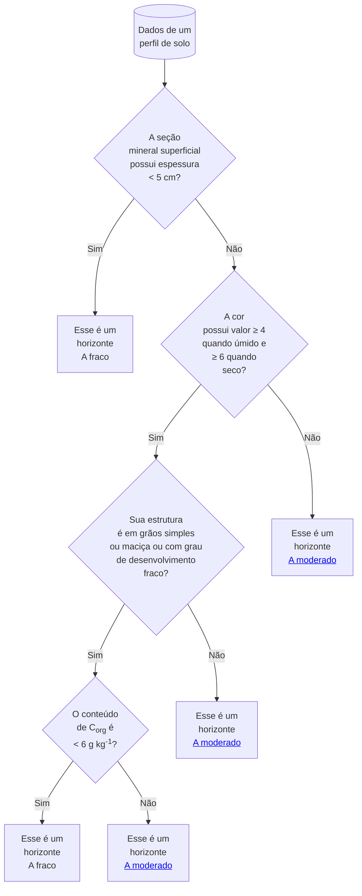

É um horizonte mineral superficial fracamente desenvolvido, seja pelo reduzido teor de coloides minerais ou orgânicos, seja por condições externas de clima e vegetação, como as que ocorrem na zona semiárida com vegetação de caatinga hiperxerófila.