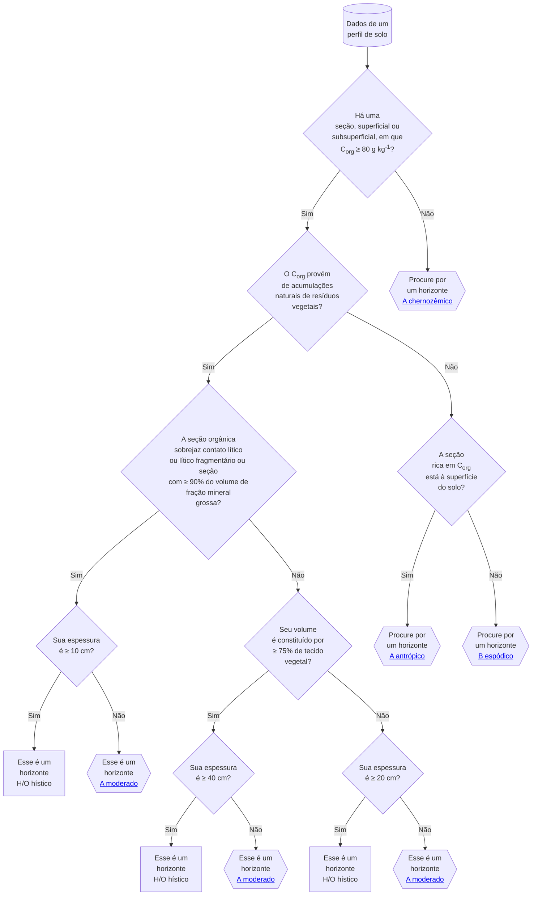

<!-- https://mermaid-js.github.io/mermaid/diagrams-and-syntax-and-examples/flowchart.html -->

O horizonte hístico é um tipo de horizonte diagnóstico de coloração preta, cinzenta muito escura ou bruna. Nele predominam características relacionadas ao elevado conteúdo de carbono orgânico proveniente de acumulações naturais de resíduos vegetais. Apesar de a deposição desses resíduos vegetais ter ocorrido superficialmente, o horizonte hístico pode ser encontrado recoberto por seções de material mineral ou orgânico mais recentes. Nesse caso, diz-se que o horizonte hístico está soterrado ou enterrado. Uma característica importante do horizonte hístico é que, quando localizado à superfície do solo, o conteúdo de carbono orgânico continua elevado mesmo após sua mistura por revolvimento com material mineral proveniente de seções inferiores.

Há dois tipos de horizonte hístico. Eles são definidos em função da condição ambiental em que o horizonte hístico é formado. O __horizonte H hístico__ é formado sob condições de excesso de água por longos períodos de tempo (meses a anos). Já o ambiente de formação do __horizonte O hístico__ é de drenagem livre, com estagnação de água por curtos períodos de tempo (dias a semanas). O clima frio e úmido é o fator determinante à acumulação de resíduos vegetais nesse tipo de ambiente.