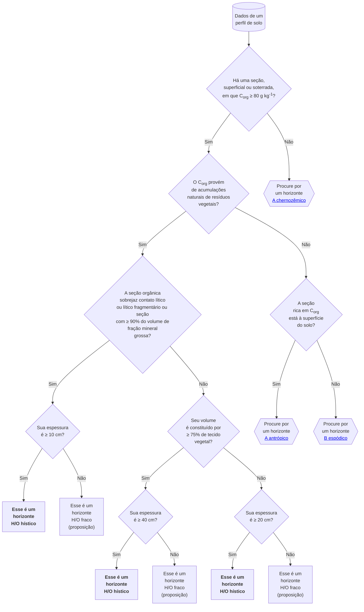

<!-- https://mermaid-js.github.io/mermaid/diagrams-and-syntax-and-examples/flowchart.html -->

```mermaid
graph TB
  DADOS[(Dados de um<br>perfil de solo)]
    --> ORGANICO{"Há uma seção,<br>superficial ou soterrada,<br>em que C<sub>org</sub> ≥ 80 g kg<sup>-1</sup>?"}
  ORGANICO
    -->|Sim| VEGETAL{"O C<sub>org</sub> provém<br>de acumulações<br>naturais de resíduos<br>vegetais?"}
  ORGANICO
    -->|Não| CHERNOZEM{{"Procure por<br>um horizonte<br><a href='../chernozemico/'>A chernozêmico</a>"}}
  VEGETAL
    -->|Sim| O_LITICO{"A seção orgânica<br>sobrejaz contato lítico<br>ou lítico fragmentário ou seção<br>com ≥ 90% do volume de<br>fração mineral<br>grossa?"}
  VEGETAL
    -->|Não| SUPERFICIE{"A seção<br>rica em C<sub>org</sub><br>está à superfície<br>do solo?"}
  O_LITICO
    -->|Sim| O_LITICO_DELGADO{"Sua espessura<br>é ≥ 10 cm?"}
  O_LITICO
    -->|Não| TECIDO{"Seu volume<br>é constituído por<br>≥ 75% de tecido<br>vegetal?"}
  SUPERFICIE
     -->|Sim| A_ANTROPICO{{"Procure por<br>um horizonte<br><a href='../antropico/'>A antrópico</a>"}}
  SUPERFICIE
    -->|Não| B_ESPODICO{{"Procure por<br>um horizonte<br><a href='../espodico/'>B espódico</a>"}}
  O_LITICO_DELGADO
    -->|Sim| O_HISTICO_1["Esse é um<br>horizonte<br>H/O hístico"]
  O_LITICO_DELGADO
    -->|Não| A_FRACO_1["Esse é um<br>horizonte<br>H/O fraco<br>(proposição)"]
  TECIDO
    --> |Sim| O_ESPESSO{"Sua espessura<br>é ≥ 40 cm?"}
  TECIDO
    --> |Não| O_TIPICO{"Sua espessura<br>é ≥ 20 cm?"}
  O_ESPESSO
    -->|Sim| O_HISTICO_2["Esse é um<br>horizonte<br>H/O hístico"]
  O_ESPESSO
    -->|Não| O_FRACO_2["Esse é um<br>horizonte<br>H/O fraco<br>(proposição)"]
  O_TIPICO
    -->|Sim| O_HISTICO_3["Esse é um<br>horizonte<br>H/O hístico"]
  O_TIPICO
    -->|Não| O_FRACO_3["Esse é um<br>horizonte<br>H/O fraco<br>(proposição)"]
  O_HISTICO_1:::HISTICO
  O_HISTICO_2:::HISTICO  
  O_HISTICO_3:::HISTICO
  classDef HISTICO font-weight:bold;
```
