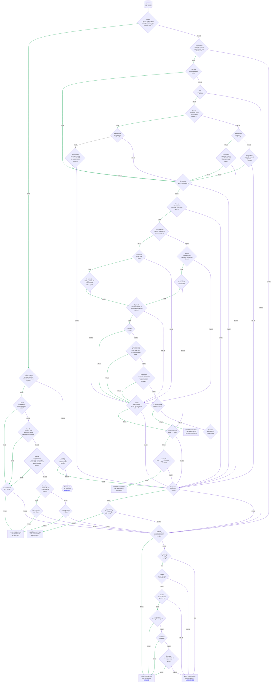

```mermaid
graph TB
  DADOS[("Dados de um<br>perfil de solo")]
  DADOS --> ORGANICO{"Há uma<br>seção, superficial ou<br>subsuperficial, em que<br>C<sub>org</sub> ≥ 80 g kg<sup>-1</sup>?"}

  ORGANICO -->|TRUE| VEGETAL{"O C<sub>org</sub> provém<br>de acumulações<br>naturais de resíduos<br>vegetais?"}
  ORGANICO -->|FALSE| DELGADO{"A espessura<br>da seção mineral<br>superficial do solo<br>é ≥ 10 cm?"}

  VEGETAL -->|TRUE| O_LITICO{"A seção<br>orgânica está<br>assentada sobre<br>rocha?"}
  VEGETAL -->|FALSE| SUPERFICIE{"A seção<br>rica em C<sub>org</sub><br>está à superfície<br>do solo?"}

  O_LITICO -->|TRUE| 10CM{"Sua espessura<br>é ≥ 10 cm?"}
  O_LITICO -->|FALSE| O_FRAGMENTARIO{"A seção<br>orgânica está<br>assentada sobre<br>camada fragmentária?"}

  O_FRAGMENTARIO -->|TRUE| 10CM
  O_FRAGMENTARIO -->|FALSE| CASCALHO{"A seção<br>orgânica está<br>assentada sobre seção<br>com ≥ 90% do volume de<br>fração mineral<br>grossa?"}

  CASCALHO -->|TRUE| 10CM
  CASCALHO -->|FALSE| TECIDO{"Seu volume<br>é constituído por<br>≥ 75% de tecido<br>vegetal?"}

  10CM -->|TRUE| HISTICO["VOCÊ ENCONTROU<br>UM HORIZONTE<br>H/O HÍSTICO"]
  10CM -->|FALSE| 5CM

  SUPERFICIE -->|TRUE| 20CM
  SUPERFICIE -->|FALSE| B_ESPODICO{{"Procure por<br>um horizonte<br><a href='../espodico/'>B espódico</a>"}}

  TECIDO --> |TRUE| O_ESPESSO{"Sua espessura<br>é ≥ 40 cm?"}
  TECIDO --> |FALSE| O_TIPICO{"Sua espessura<br>é ≥ 20 cm?"}

  O_ESPESSO -->|TRUE| HISTICO
  O_ESPESSO -->|FALSE| 5CM

  O_TIPICO -->|TRUE| HISTICO
  O_TIPICO -->|FALSE| 5CM

  DELGADO -->|TRUE| ROCHA{"Ela está<br>assentada sobre<br>rocha?"}
  DELGADO -->|FALSE| 5CM{"A seção<br>mineral superficial<br>possui espessura<br>< 5 cm?"}

  ROCHA -->|TRUE| C6{"O conteúdo<br>de C<sub>org</sub> é ≥ 6 g kg<sup>-1</sup>?"}
  ROCHA -->|FALSE| 18CM{"Sua<br>espessura é<br>≥ 18 cm?"}

  18CM -->|TRUE| SAPROLITO{"Ela está<br>assentada sobre<br>horizonte ou<br>camada C?"}
  18CM -->|FALSE| 5CM

  SAPROLITO -->|TRUE| REGOLITO75{"A espessura<br>do regolito é<br>< 75 cm?"}
  SAPROLITO -->|FALSE| SOLUM75{"A espessura<br>do <em>solum</em> é<br>< 75 cm?"}

  REGOLITO75 -->|TRUE| 33REGOLITO{"A espessura<br>da seção mineral<br>superficial é ≥ 1/3<br>da espessura do<br>regolito?"}
  REGOLITO75 -->|FALSE| C6

  SOLUM75 -->|TRUE| 33SOLUM{"A espessura<br>da seção mineral<br>superficial é ≥ 1/3<br>da espessura do<br><em>solum</em>?"}
  SOLUM75 -->|FALSE| 25CM{"A espessura<br>da seção mineral<br>superficial é<br>≥ 25 cm?"}

  33REGOLITO -->|TRUE| C6
  33REGOLITO -->|FALSE| 20CM{"A espessura<br>da seção é<br>≥ 20 cm?"}

  33SOLUM -->|TRUE| C6
  33SOLUM -->|FALSE| 20CM

  25CM -->|TRUE| C6
  25CM -->|FALSE| 20CM

  20CM -->|TRUE| FOSFORO{"O conteúdo<br>de P<sub>Mehlich-1</sub> é<br>≥ 30 mg kg<sup>-1</sup>?"}
  20CM -->|FALSE| 5CM

  C6 -->|TRUE| COR5{"Ambos<br>valor e croma<br>da cor do solo úmido<br>são ≤ 5?"}
  C6 -->|FALSE| 20CM

  COR5 -->|TRUE| CACO3{"O conteúdo de<br>CaCO<sub>3</sub> equivalente<br>é ≥ 400 g kg<sup>-1</sup>?"}
  COR5 -->|FALSE| 20CM

  CACO3 -->|TRUE| 18CM_CACO3{"A espessura<br>da seção é<br>≥ 18 cm?"}
  CACO3 -->|FALSE| COR3{"Ambos<br>valor e croma<br>da cor do solo úmido<br>são ≤ 3?"}

  COR3 -->|TRUE| COR3SECO{"O valor<br>da cor do solo<br>seco é ≤ 5?"}
  COR3 -->|FALSE| COR4{"Ambos<br>valor e croma<br>da cor do solo úmido<br>são ≤ 4?"}

  COR3SECO -->|TRUE| FORTE{"O grau de<br>desenvolvimento da<br>estrutura é moderado<br>ou forte?"}
  COR3SECO -->|FALSE| SATBASES1{"A saturação por<br>bases é < 65%?"}

  SATBASES1 -->|TRUE| INEQUACAO{"A relação<br>β × C<sub>org<sub>HzA</sub></sub> - α ≥ Argila<sub>HzA</sub><br>é atendida?"}
  SATBASES1 -->|FALSE| 20CM

  18CM_CACO3 -->|TRUE| C_CACO3{"O conteúdo<br>de C<sub>org</sub> nos 18 cm<br>superficiais é<br>≥ 25 g kg<sup>-1</sup>?"}
  18CM_CACO3 -->|FALSE| COR4

  C_CACO3 -->|TRUE| FORTE
  C_CACO3 -->|FALSE| COR4

  COR4 -->|TRUE| SATBASES1
  COR4 -->|FALSE| 20CM

  FORTE -->|TRUE| MACICA{"A estrutura<br>é maciça?"}
  FORTE -->|FALSE| COR4
  
  MACICA -->|TRUE| COR4
  MACICA -->|FALSE| CONSISTENCIA{"A consistência<br>do solo seco é<br>dura, muito dura<br>ou extremamente<br>dura?"}

  CONSISTENCIA -->|TRUE| COR4
  CONSISTENCIA -->|FALSE| PRISMAS{"A unidades<br>estruturais básicas são<br>prismas muito a<br>extremamente<br>grandes?"}

  PRISMAS -->|TRUE| COR4
  PRISMAS -->|FALSE| SATBASES{"A saturação por<br>bases é ≥ 65%?"}

  SATBASES -->|TRUE| CHENOZEMICO["VOCÊ ENCONTROU<br>UM HORIZONTE<br>A CHERNOZÊMICO"]
  SATBASES -->|FALSE| HUMICO0{Pode ser<br>A húmico ou<br>A proeminente}

  INEQUACAO -->|TRUE| HUMICO["VOCÊ ENCONTROU<br>UM HORIZONTE<br>A HÚMICO"]
  INEQUACAO -->|FALSE| 20CM

  FOSFORO -->|TRUE| ANTROPICO["VOCÊ ENCONTROU<br>UM HORIZONTE<br>A ANTRÓPICO"]
  FOSFORO -->|FALSE| 5CM

  5CM -->|TRUE| A_FRACO["VOCÊ ENCONTROU<br>UM HORIZONTE<br><a href='../fraco/'>A FRACO</a>"]
  5CM -->|FALSE| C_BAIXO{"O conteúdo<br>de C<sub>org</sub> é<br>< 6 g kg<sup>-1</sup>?"}

  C_BAIXO -->|Sim| COR_UMIDO_4{"O valor<br>da cor do solo<br>úmido é ≥ 4?"}
  C_BAIXO -->|Não| A_MODERADO["VOCÊ ENCONTROU<br>UM HORIZONTE<br><a href='../moderado/'>A MODERADO</a>"]

  COR_UMIDO_4 -->|TRUE| COR_SECO_6{"O valor<br>da cor do solo<br>seco é ≥ 6?"}
  COR_UMIDO_4 -->|FALSE| A_MODERADO

  COR_SECO_6 -->|TRUE| GRAO_SIMPLES{"A estrutura<br>é em grãos simples?"}
  COR_SECO_6 -->|FALSE| A_MODERADO

  GRAO_SIMPLES -->|TRUE| A_FRACO
  GRAO_SIMPLES -->|FALSE| FRACO_MACICA{"A estrutura<br>é maciça?"}

  FRACO_MACICA -->|TRUE| A_FRACO
  FRACO_MACICA -->|FALSE| GRAU_FRACO{"O grau de<br>desenvolvimento da<br>estrutura é<br>fraco?"}

  GRAU_FRACO -->|TRUE| A_FRACO
  GRAU_FRACO -->|FALSE| A_MODERADO

  linkStyle 1,3,5,7,9,11,13,15,17,19,21,23,25,27,19,31,33,35,37,39,41,43,45,47,49,51,53,55,57,59,61,63,65,67,69,71,73,75,77,79,81,83,85 stroke:mediumseagreen,stroke-width:2px;
  linkStyle 2,4,6,8,10,12,14,16,18,20,22,24,26,28,30,32,34,36,38,40,42,44,46,48,50,52,54,56,58,60,62,64,66,68,70,72,74,76,78,80,82,84,86 stroke:mediumpurple,stroke-width:2px;
```
