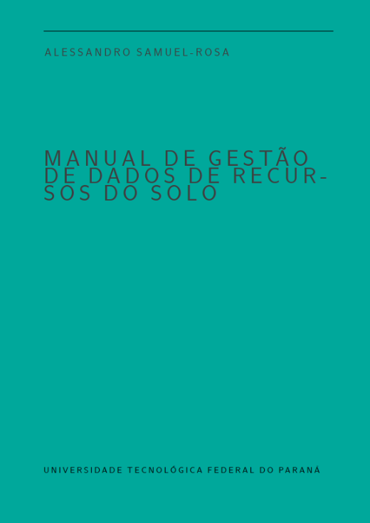
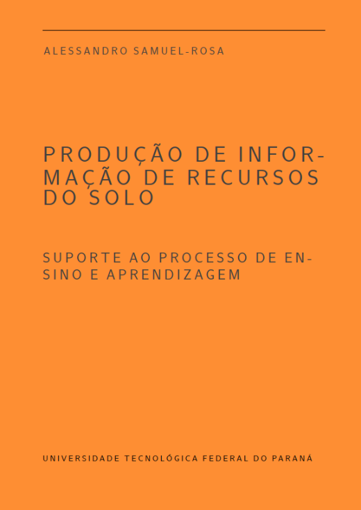

---
header:
  caption: ""
  image: ""
layout: docs
title: Livros
---

## [Manual de Gestão de Dados de Recursos do Solo](manual-de-gestao-de-dados-de-recursos-do-solo)

A pesquisa em ciência do solo já produziu grande quantidade de dados. Contudo, a questão da gestão eficiente desses dados foi negligenciada por muito tempo. O "livro verde" do Laboratório de Pedometria vem lançar luz sobre essa questão. Construído a partir de experiências reais de gestão de dados no [Repositório Brasileiro Livre para Dados Abertos do Solo](febr/), o manual lida com questões que vão da produção dos dados no campo à sua disponibilização em formato digital. Se você quiser saber mais sobre o livro ou contribuir em sua construção, [entre em contato](/#contato) conosco agora mesmo. Você pode conferir o código fonte, em `RMarkdown` e $\LaTeX$, que está disponível num repositório público no [GitHub](https://github.com/samuel-rosa/verde). Todo o conteúdo está disponível sob uma licença [CC BY-NC-SA 4.0](https://creativecommons.org/licenses/by-nc-sa/4.0/deed.pt_BR).

## Produção de Informação de Recursos do Solo

Também conhecido como "livro laranja", consiste num livro de suporte ao processo de ensino e aprendizagem da disciplina _Produção de Informação de Recursos do Solo_ (antiga Classificação do Solo), ofertada pelo Laboratório de Pedometria aos estudantes do quarto período do curso de Agronomia da Universidade Tecnológica Federal do Paraná, câmpus Santa Helena. Por enquanto, o código fonte, em `RMarkdown` e $\LaTeX$, está hospedado num repositório privado no [GitHub](https://github.com/samuel-rosa/laranja). Se você for docente de universidade pública e quiser saber mais sobre o livro, [entre em contato](/#contato) conosco agora mesmo. A primeira edição do livro está prevista para publicação, sob uma licença [CC BY-NC-SA 4.0](https://creativecommons.org/licenses/by-nc-sa/4.0/deed.pt_BR), no primeiro semestre do ano de 2021.
