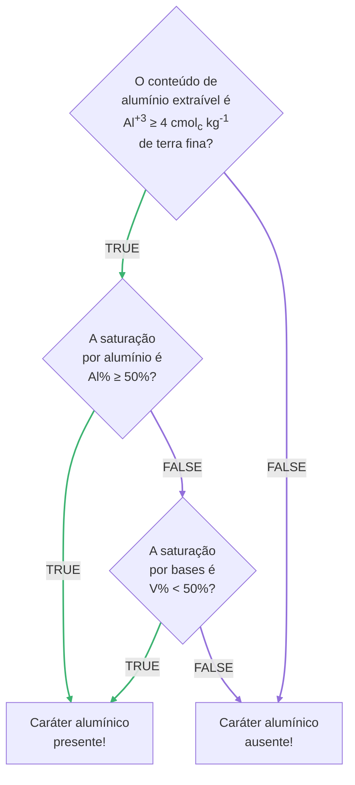

---
# Title, summary, and page position.
linktitle: Caráter alumínico
weight: 2
# icon: book
# icon_pack: fas

# Page metadata.
title: Caráter alumínico
date: "2021-12-04T00:00:00Z"
type: book  # Do not modify.
---

__Descrição geral.__

__Critérios diagnósticos.__ O caráter alumínico está presente quando:

* O conteúdo de alumínio extraível é Al+3 ≥ 4 cmolc kg-1 de terra fina; ___e___
* A saturação por alumínio é Al% ≥ 50%; ___ou___
* A saturação por bases é V% < 50%.

Onde:

Al% = [Al+3 / (SB + Al+3)] &#215; 100

<!-- $Al\\% = \frac{Al^{+3}}{SB + Al^{+3}} \times 100$ -->

$V\\% = \frac{SB}{CTC} \times 100$

Em que:

* SB é a soma do conteúdo dos cátions trocáveis básicos Ca2+, Mg2+, K+ e Na+.
* CTC é a capacidade de troca de cátions, obtida somando o conteúdo de Al3+ e H+ à soma de bases.

