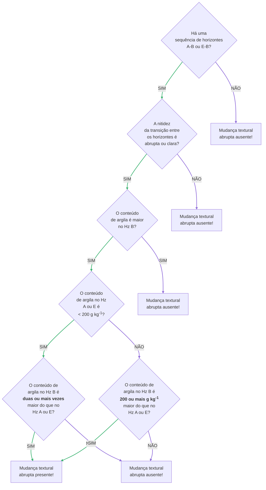

---
# Title, summary, and page position.
linktitle: Mudança textural abrupta
weight: 220
# icon: book
# icon_pack: fas

# Page metadata.
title: Mudança textural abrupta
date: "2021-12-07T00:00:00Z"
type: book  # Do not modify.
---

## Descrição geral

## Critérios diagnósticos

<!-- A mudança textural abrupta está presente num perfil de solo quando: -->
<!-- A mudança textural entre dois horizontes genéticos A-B ou E-B é abrupta quando: -->
<!-- A mudança textural entre dois horizontes genéticos subsequentes A ou E e B é abrupta quando: -->
<!-- A mudança textural entre o horizonte genético A ou E mais profundo e o horizonte genético B imediatamente abaixo dele é abrupta quando: -->

<!-- * A nitidez da transição entre o último horizonte A ou E e o horizonte B subjacente é abrupta ou clara, ___e___ -->
<!-- * O conteúdo de argila no horizonte B é maior do que no horizonte A ou E: -->

A mudança textural abrupta está presente num perfil de solo quando, numa sequência de horizontes genéticos A-B ou E-B:

* A nitidez da transição entre os horizontes é abrupta ou clara ___e___
* O conteúdo de argila é maior no horizonte B:
  * Se o conteúdo de argila do A ou E é:
    * < 200 g kg-1 de terra fina, o conteúdo de argila no horizonte B é, pelo menos, duas vezes maior, ___ou___
    * ≥ 200 g kg-1 de terra fina, o conteúdo de argila no horizonte B é, pelo menos, 200 g kg-1 maior.

O diagrama abaixo mostra a sequência de passos para avaliar a presença de mudança textural abrupta num perfil de solo.

## Identificação no campo ou laboratório

p. ex.: de 300 g kg-1 para no mínimo 500 g kg-1, ou de 220 g kg-1 para no mínimo 420 g kg-1.

um horizonte genético A ou E e o horizonte genético B , ou seja, se dá numa faixa de separação < 7,5 cm, 