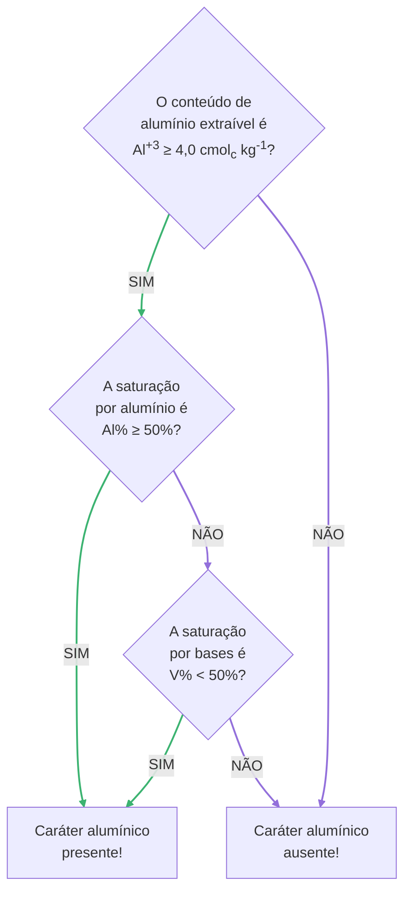

---
# Title, summary, and page position.
linktitle: Caráter alumínico
weight: 203
# icon: book
# icon_pack: fas

# Page metadata.
title: Caráter alumínico
date: "2021-12-04T00:00:00Z"
type: book  # Do not modify.
---

## Descrição geral

## Critérios diagnósticos

O caráter alumínico está presente numa seção do solo quando, na fração terra fina (⌀ < 2 mm):

* O conteúdo de alumínio extraível é Al+3 ≥ 4,0 cmolc kg-1, ___e___
* A saturação por alumínio é Alsat ≥ 50%, ___ou___
* A saturação por bases é SBsat < 50%.

O diagrama abaixo mostra a sequência de passos para avaliar a presença do caráter alumínico numa seção do solo.

## Identificação no campo ou laboratório

Para a distinção de solos mediante este critério, é considerado o teor de alumínio extraível no horizonte B ou no horizonte C (na ausência de B).

A saturação por alumínio Alsat, também representada por _Al%_ ou _m_, é calculada usando a seguinte expressão:

$$Al_{sat} = \frac{Al^{+3}}{SB + Al^{+3}} \times 100$$

A saturação por bases SBsat, também representada por _V%_, é calculada usando a seguinte expressão:

$$SB_{sat} = \frac{SB}{SB + Al^{+3} + H^+} \times 100$$

Nas duas expressões acima, SB, também representada por _S_, é a soma do conteúdo dos quatro cátions básicos trocáveis:

$$SB = Ca^{2+} + Mg^{2+} + K^{+} + Na^{+}$$
