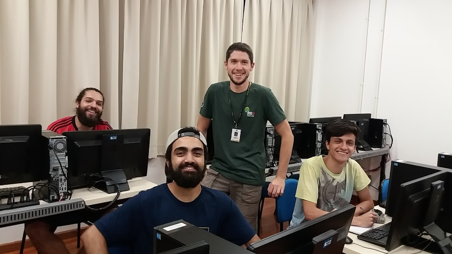

O Brasil acabou de sediar o *21st World Congress of Soil Science* ([21WCSS][wcss]), realizado na cidade do Rio de Janeiro. Durante o evento, a comunidade internacional de cientistas do solo conheceu o Repositório Brasileiro Livre para Dados Abertos do Solo, FEBR, o resultado da colaboração de 54 pesquisadores, a maioria deles brasileiros. Passadas algumas semanas, a equipe do FEBR ganha três novos membros. Vamos conhecer um pouco sobre cada um eles?

[wcss]: https://www.21wcss.org/

O primeiro deles é [Matheus Ferreira Ramos][lattesMatheus], aluno do curso de Bacharelado em Ciência da Computação da Universidade Tecnológica Federal do Paraná -- câmpus Santa Helena ([UTFPR-SH][utfprsh]). Matheus atua na área de extensão no FEBR, recebendo bolsa do Programa Institucional de Apoio à Inclusão Social, Pesquisa e Extensão Universitária ([PIBIS][pibis]) da [Fundação Araucária][fa] de Apoio ao Desenvolvimento Científico e Tecnológico do Paraná. Dentre as tarefas descritas em seu [plano de trabalho][planoMatheus] estão o suporte aos colaboradores de instituições parceiras, a divulgação e popularização do FEBR, o desenvolvimento de funcionalidades de facilitação de acesso, e a condução de atividades educativas com a comunidade de Santa Helena e região.

[fa]: http://www.fappr.pr.gov.br/
[pibis]: http://www.fappr.pr.gov.br/arquivos/File/chamadas2018/2018_CP03_Pibis.pdf
[planoMatheus]: https://docs.google.com/document/d/1xkjNqejZtoBl9P4UhHWb_OBceVY2fo6ovgpgbdAtr7I
[utfprsh]: http://portal.utfpr.edu.br/
[lattesMatheus]: http://lattes.cnpq.br/1502739519386205

O segundo membro é [Mikael Messias][lattesMikael], também aluno da UTFPR-SH no curso de Bacharelado em Ciência da Computação. Mikael atua na área de pesquisa no FEBR, com bolsa do Programa de Bolsas de Iniciação Científica ([PIBIC][pibic]) financiada também pela Fundação Araucária. No FEBR, Mikael é responsável pela revisão e avaliação da qualidade dos dados do solo da região Sul do Brasil -- com ênfase no estado do Paraná -- já publicados no FEBR. Seu [plano de trabalho][planoMika] inclui ainda a compilação de novos conjuntos de dados para preenchimento das áreas com poucos dados no FEBR.

[lattesMikael]: http://lattes.cnpq.br/4784406446479043
[pibic]: http://www.fappr.pr.gov.br/arquivos/File/chamadas2018/2018_CP02_PibicPibit.pdf
[planoMika]: https://docs.google.com/document/d/1TvRbCYK7pPvBllimMiSzuBWPvRX0wTryg-gq0Rcm8bg

Finalmente, o terceiro mais novo membro da equipe do FEBR, [Rander Carneiro][lattesRander], trabalha com os conjuntos de dados da região Sudeste do Brasil. Seu [plano de trabalho][planoRander] inclui, além da revisão e avaliação de qualidade dos dados do solo, a recuperação de coordenadas espaciais para uso dos dados do FEBR em projetos de mapeamento digital do solo. Assim como Matheus e Mikael, Rander é discente do curso de Bacharelado em Ciência da Computação da UTFPR-SH, atuando como voluntário no Programa Institucional em Iniciação Científica e Tecnológica ([PIVICT][pivict]).

[lattesRander]: http://lattes.cnpq.br/9844984024940216
[planoRander]: https://docs.google.com/document/d/1sxRSJkP1z1jNWVfeBNz79X15mSEfO9j07m-l26aWh18
[pivict]: http://portal.utfpr.edu.br/editais/pesquisa-e-pos-graduacao/reitoria/programa-institucional-de-voluntariado-em-iniciacao-cientifica-e-tecnologica

_Figura 1. Os mais novos integrantes da equipe do FEBR: Matheus, ao fundo, Mikael, à frente, e Rander, à direita. Ao centro, Alessandro, coordenador do FEBR._

Com a entrada desses três novos membros na equipe, os dados do repositório passarão por uma ampla revisão e verificação de consistência. Isso trará mais qualidade e confiança para o FEBR. O compartilhamento imediato desses dados revisados alavancará novas pesquisas em ciência do solo. Permitirá também otimizar o uso dos recursos públicos, principalmente pela eliminação de esforços duplicados de compilação e revisão de dados. Isso será de extrema importância, por exemplo, no contexto do Programa Nacional de Levantamento e Interpretação de Solos do Brasil, o [PronaSolos][pronasolos].

[pronasolos]: http://www.planalto.gov.br/ccivil_03/_ato2015-2018/2018/Decreto/D9414.htm

E pra você, discente do curso de Bacharelado em Agronomia da UTFPR-SH, que só ficou sabendo do FEBR agora, ou que já o conhecia, e quer fazer parte da nossa equipe, mas não sabe como, nós temos uma dica pra você! Envie-nos uma mensagem de e-mail com o assunto "novo membro" e diga-nos porque quer trabalhar no FEBR. Até o final do mês de novembro de 2018 nós selecionaremos dois novos integrantes para nossa equipe.
