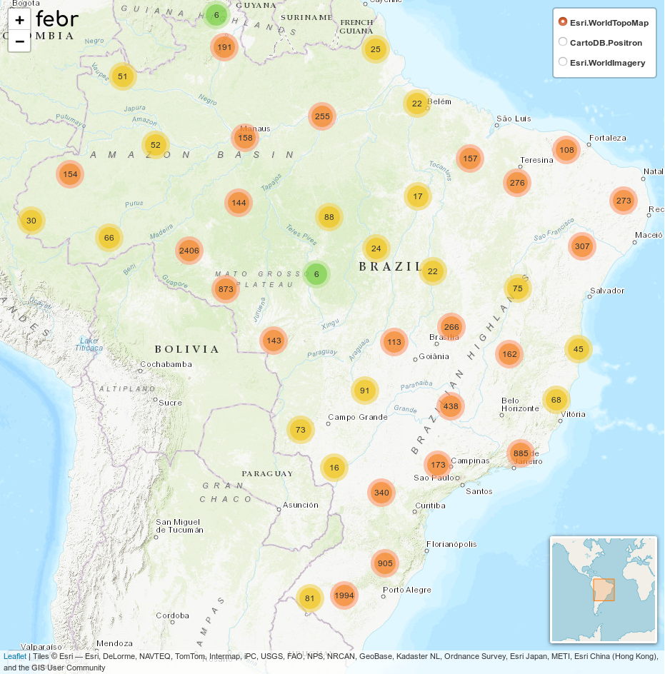

O Dia Mundial do Solo é celebrado anualmente no dia 05 de dezembro.
Professores, estudantes, pesquisadores, instituições de todo o mundo realizam atividades especiais neste dia para lembrar a todos da importância do solo para a vida na Terra.
Neste ano de 2018, o Laboratório de Pedometria inicia com um mês de antecedência as celebrações do Dia Mundial do Solo.
Nossa equipe preparou um calendário recheado de atividades que inclui uma novidades a cada semana.
Fique de olho!

A primeira novidade é a [nova página de visualização][view] das observações do solo no território brasileiro.
Na versão anterior, preparada usando o pacote `mapview` para o R, era possível visualizar todas as observações do solo.
Com a adição de novos conjuntos de dados ao FEBR, muitos pontos acabaram ficando amontoados, gerando uma visão bastante poluída.
Além disso, o carregamento dos dados no navegador começou a ficar cada vez mais lenta, o que prejudica nossos visitantes com limitações de _hardware_.

[view]: https://pedometria.shinyapps.io/febr-busca-de-dados-processados/

A nova versão da página de visualização foi preparada usando o pacote `leaflet` para o R.
Agora, as observações do solo aparecem de maneira agregada, produzindo uma visão mais limpa.
Além disso, com a agregação das observações nossos visitantes podem ter uma ideia quantitativa melhor, uma vez que cada agregado informa o número de observações e a área coberta.
Ao aproximar a visualização, os agregados vão se desfazendo até chegar às observações individuais.
Além da visão mais limpa, o carregamento da página ficou bem mais rápido.
Nossos usuários mais assíduos também verão que agora usamos um mapa com o relevo e a vegetação ao fundo.
Veja abaixo!

_Figura 1. Nova página de visualização das observações do solo no FEBR._

Na próxima terça-feira, dia 13 de novembro de 2018, uma nova versão do pacote `febr` [para o R][pacote]. Aguarde!

[pacote]: https://github.com/samuel-rosa/febr-package
