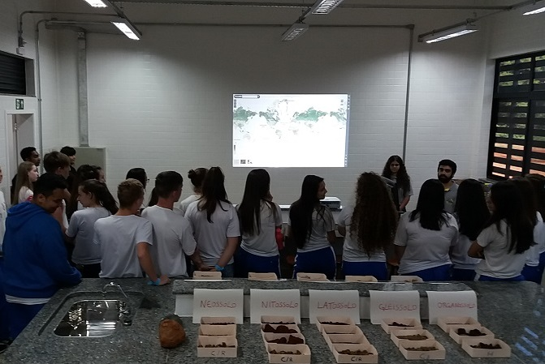

A ExpoUT 2018 foi um sucesso. Contamos com a presença de mais de duzentos alunos das escolas de Santa Helena participando de um circuito, montado por professores e alunos da Universidade Tecnológica Federal do Paraná ([UTFPR][utfpr]), onde conheciam um pouco de cada curso. E a equipe do FEBR estava presente em um dos laboratórios para apresentar um pouco do repositório e sua importância.  

[utfpr]: http://portal.utfpr.edu.br/

O espaço do laboratório de geologia foi destinado à exposição de rochas e tipos de solos do Paraná e de outras regiões do Brasil, coordenada pelo professor [Dr. Anderson Sandro da Rocha][anderson], e também para uma demonstração do FEBR, coordenada pelo professor [Dr. Alessandro Samuel-Rosa][alessandro].

[alessandro]: http://lattes.cnpq.br/1609751519717461
[anderson]: http://lattes.cnpq.br/1429629017719392

_Figura 1. Equipe do FEBR apresentando para os alunos do ensino médio na ExpoUT_

Os representantes do FEBR introduziram os alunos ao repositório, mostrando algumas de suas funções, explicando quais os objetivos que se buscava alcançar e a relevância do mesmo para a pesquisa e exploração dos solos brasileiros. Foi projetada a visualização do mapa dinâmico mostrando a distribuição espacial dos dados abertos do solo que estão disponíveis no site e em sua maioria disponibilizadas pela [Embrapa][embrapa]. Enfatizamos a região de Santa Helena, com o objetivo de atrair a atenção dos alunos. 

Para finalizar a apresentação, mostramos o mapa com a concentração de carbono no solo da [LandGis][land], enfatizando o Brasil. A partir da informação que os alunos obtiveram das amostras de rocha que foram apresentadas anteriormente, os representantes do FEBR fizeram a correlação dos dados apresentados no mapa com o seu material de origem. Como exemplo, mostramos a região do refúgio biológico de Santa Helena, onde era possível visualizar uma grande presença de carbono devido ao acúmulo de matéria orgânica.

[embrapa]: https://www.embrapa.br/
[land]: https://landgis.opengeohub.org/
