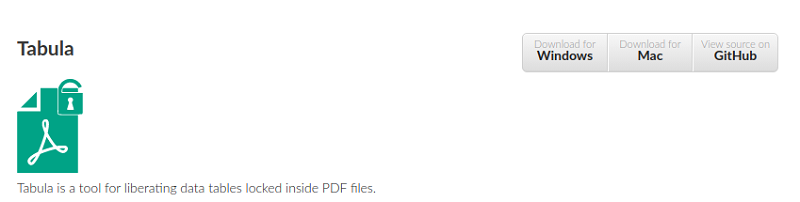
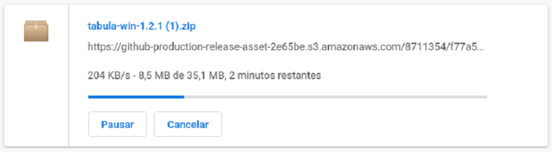
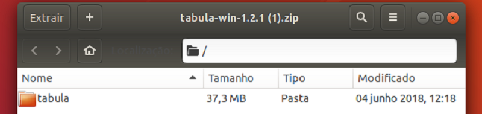
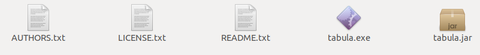
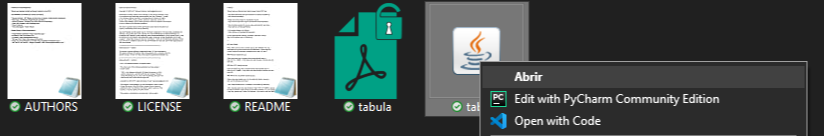
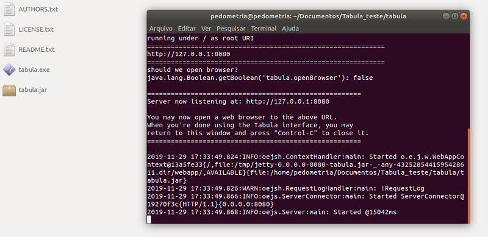
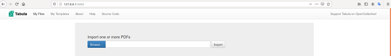

Você já deve estar sabendo que o Laboratório de Pedometria elegeu o Tabula como ferramenta de extração de dados do solo de arquivos no formato PDF. Se não sabe, então leia nossa [matéria][materia] anterior sobre o uso do Tabula. Na presente matéria você vai saber mais sobre como descarregar e executar o Tábula nos sistemas operacional [Ubuntu 18.04 LTS][ubuntu] e [Windows 10][windows].

[materia]: /blog/2019/12/02/extracao-de-dados-de-documentos-pdf/
[ubuntu]: https://ubuntu.com/
[windows]:https://www.microsoft.com/pt-br/windows/

Para usar o Tabula no seu sistema operacional, você deverá ter instalado em seu computador os seguintes softwares:

1. [Java][java], linguagem de programação com a qual o Tabula foi construído;
2. Um editor de planilhas eletrônicas como o [LibreOffice][libreoffice];
3. Um descompactador de arquivos como o [7zip][7zip]; 

[java]: https://www.java.com/pt_BR/download/
[libreoffice]: https://www.libreoffice.org/
[7zip]: https://www.7-zip.org/

Feito isso, você precisa seguir apenas três passos bastante simples.

### Passo 1

Descarregar o programa do site oficial do Tabula em <https://tabula.technology/>.


_Figura 1. Página inicial do Tabula._


_Figura 2. Download do arquivo, no formato zip._


### Passo 2

Descompactar o arquivo ZIP em uma pasta de sua preferência.


_Figura 3. Abrindo arquivo zip para extrair os arquivos do Tabula._


_Figura 4. Arquivos do Tabula._

### Passo 3

Inicializar o Tabula. No __Windows 10__, basta pressionar sobre o arquivo `tabula.jar` com o botão direito do mouse e selecionar `Abrir`. Seu navegador preferido será inicializado no endereço local `http://127.0.0.1:8080/`. No __Ubuntu 18.04 LTS__, você precisará de uma manipulação adicional... veja abaixo.


_Figura 5. Inicialização do Tabula no Windows 10._

Para inicializar o Tabula no Ubuntu 18.04 LTS, é preciso abrir uma janela do terminal, na pasta onde se encontram os arquivos do Tabula. Em seguida, basta digitar o seguinte comando:

```
java -Dfile.encoding=utf-8 -Xms256M -Xmx1024M -jar tabula.jar
```


_Figura 6. Execução do Tabula no Ubuntu 18.04 LTS via comando no terminal._


Em seguida, abra o navegador de sua preferência e vá até o endereço local `http://127.0.0.1:8080/`.



_Figura 7. Interface do Tabula._

Viu como é fácil?
