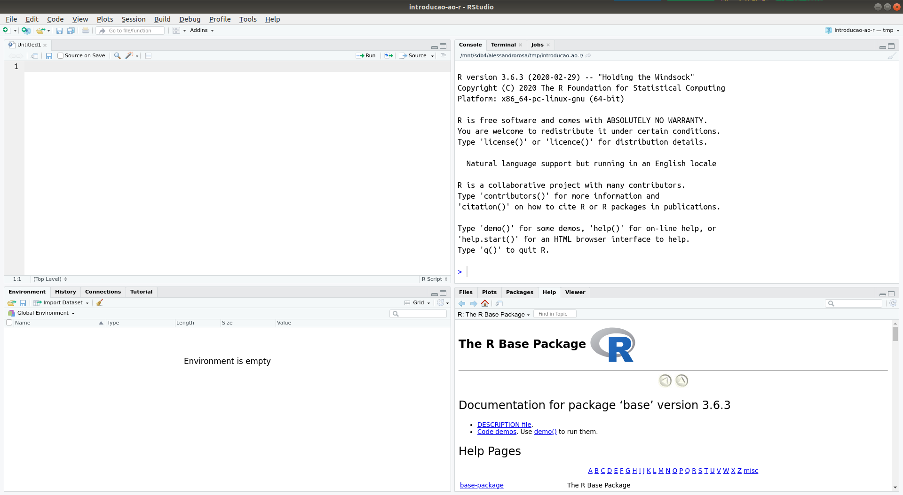

# R & RStudio

A página do projeto R na Internet pode ser acessada pelo endereço https://www.r-project.org/. Nela você encontra grande quantidade de informação sobre o R. Estão disponíveis diversos manuais de uso (_Documentation_ > _Manuals_), bem como livros (_Documentation_ > _Books_) e artigos publicados na revista do projeto (_Documentation_ > _The R Journal_). Também há uma página com respostas às perguntas mais frequentes (_Documentation_ > _FAQs_) e uma página inteira explicando como é possível conseguir ajuda sozinho antes de recorrer a terceiros (_Help With R_ > _Getting Help_)[^ajuda].

[^ajuda]: Como a documentação do R é extensa e a maioria dos colaboradores do projeto não são pagos pelo trabalho desenvolvido, recomendo que você sempre procure, primeiro, resolver qualquer dúvida sozinho.

O procedimento de instalação do R depende do sistema operacional ([OS][os], do inglês *operating system*) de seu computador:

[os]: https://en.wikipedia.org/wiki/Operating_system

* Linux: https://cloud.r-project.org/bin/linux/
* (Mac) OS X: https://cloud.r-project.org/bin/macosx/
* Windows: https://cloud.r-project.org/bin/windows/base/

A página de cada OS possui as instruções necessárias para descarregar e instalar o R em seu computador. Em geral, o processo de instalação é muito parecido com aquele de outros programas de computador que você está acostumado a usar.

Depois de completada a instalação do R, é hora de instalar o RStudio. A última versão gratuíta[^rstudio] do instalador do RStudio para o OS de seu computador pode ser descarregada do seguinte endereço na Internet:

[^rstudio]: Licença AGPL v3.

* https://www.rstudio.com/products/rstudio/download/

Assim como para o R, você não encontrará maiores dificuldades no processo de instalação do RStudio.

Depois de instalados R e RStudio, inicie o RStudio em seu computador. A interface do RStudio deve se parecer mais ou menos com aquela mostrada na figura abaixo[^panes].

[^panes]: A disposição dos painéis do ambiente de trabalho pode ser alterada acessando _Tools_ > _Global Options_ > _Pane Layout_.

O RStudio é composto por quatro painéis retangulares que ocupam seus quadrantes:

* Painel superior esquerdo: usado para preparar o roteiro (_script_) de análise de dados.
* Painel superior direito: interface de linha de comando (CLI), o console do R.
* Painel inferior direito: serve à visualização de gráficos e páginas de ajuda do R.
* Painel inferior esquerdo: apresenta informações sobre a sessão de trabalho.

Dentre os quatro painéis, é no painel superior esquerdo que passamos a maior parte do tempo quando analisamos dados no R. É ali que redigimos aquilo que queremos que o R faça com nossos dados na forma de comandos usando a linguagem do R. Para nos comunicamos com o R, enviamos esses comandos para o console do R, localizado no painel superior direito. Os resultados produzidos pelo R podem ser emitidos, tanto no console (tabelas), como no painel inferior direito (gráficos). Se não soubermos como nos comunicarmos com o R para que execute determinada função, podemos visitara aba de ajuda localizada no painel inferior direito.
