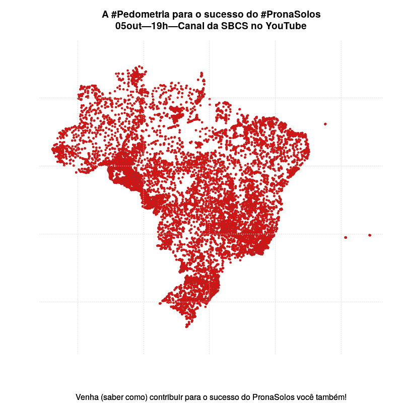

Usando métodos pedométricos, o [PronaSolos](https://www.embrapa.br/en/pronasolos) poderá mapear, em alta resolução, as propriedades químicas, físicas, morfológicas e biológicas do solo em todo o território nacional. Para isso, é preciso que estejam disponíveis [dados abertos](../palestra/acesso-aberto-aos-dados-da-pesquisa-em-ciencia-do-solo/) dessas propriedades do solo em muitos pontos distribuídos em todo o território nacional. Na figura abaixo, cada ponto representa um local para o qual já temos dados abertos de inúmeras propriedades do solo disponíveis. Ao todo, são 18.083 pontos, produzidos ao longo dos últimos 100 anos por muitas instituições e organizações brasileiras.

{}
Agora já são 18.173 pontos!
{}

### Ajude-nos a passar a marca de 20.000 pontos!!!

Você precisa seguir apenas quatro passos para abrir seus dados do solo:

1. Descarregue a planilha XLSX com o [modelo de conjunto de dados](https://github.com/samuel-rosa/febr-metadados/raw/master/public/febr-modelo-de-conjunto-de-dados-v3.xlsx)
1. Preencha a planilha XLSX com os dados e metadados
    * A tabela 'Metadados de Citação' armazena os dados de identificação do conjunto de dados
    * A tabela 'Metadados Geoespaciais' armazena os dados do local aos quais os dados se referem
    * Já a tabela 'Metadados Analíticos' serve para organizar os dados sobre os métodos analíticos usados na geração dos dados
    * Na tabela 'Dados' vão os dados de sua autoria
1. Compacte a planilha em um arquivo ZIP acompanhada do arquivo PDF da publicação onde os dados aparecem pela primeira vez
1. Deposite o arquivo ZIP na [interface de entrada de conjuntos de dados](https://cloud.utfpr.edu.br/index.php/s/Eh0FQpm9YfHYfLX) do FEBR

<!--  -->

