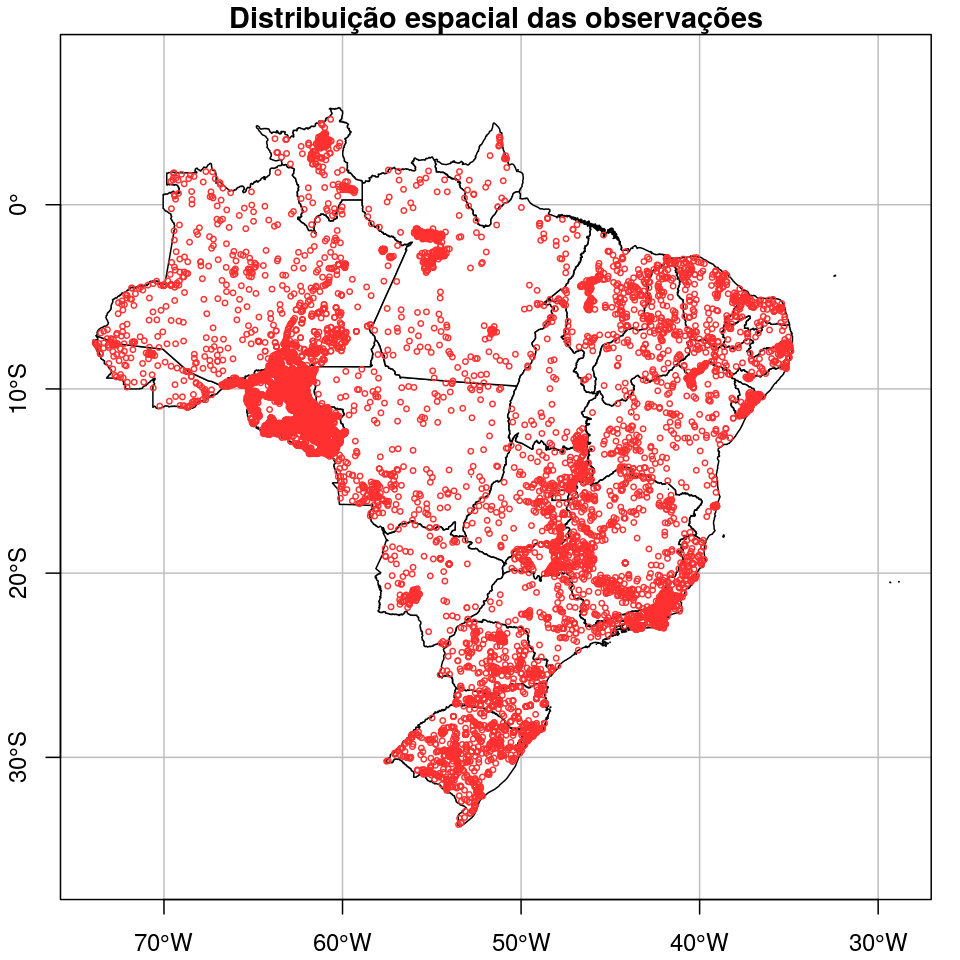
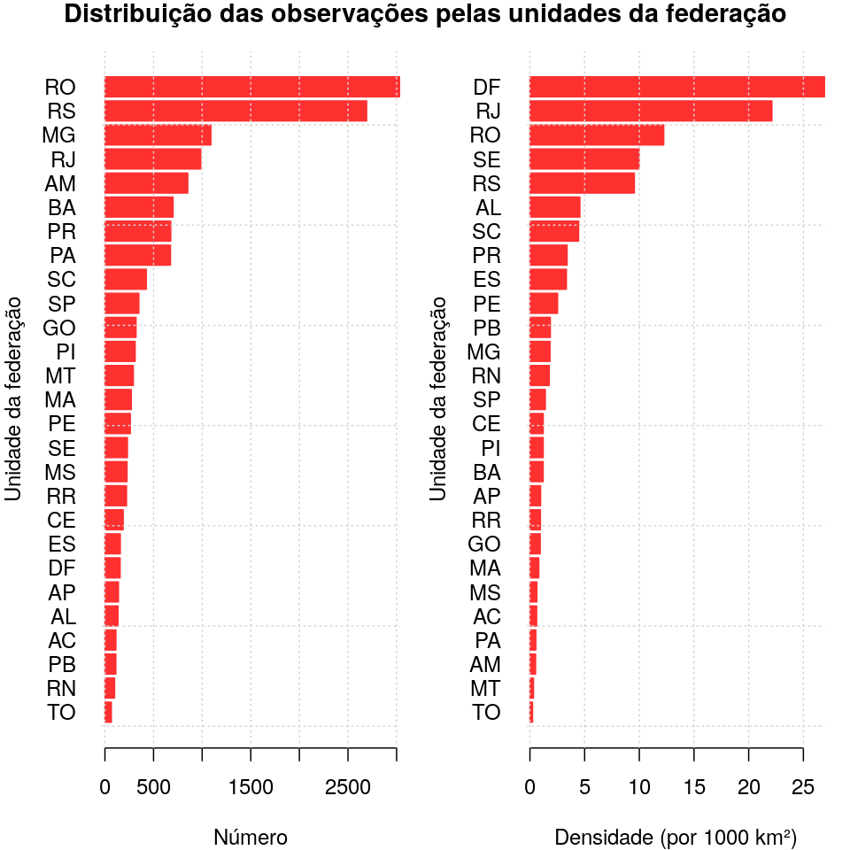

<script src="https://ajax.googleapis.com/ajax/libs/jquery/1.12.2/jquery.min.js"></script>
<script>
    $(document).ready(function() {
    $('slide:not(.title-slide, .backdrop, .segue)').append('<footer></footer>');
    $('footer').attr('label', 'Samuel-Rosa (2019) Dados para MDS em larga escala no Brasil');
  })
</script>

```{r, echo=FALSE, include=FALSE}
library(magrittr)
```

# Qual é o problema?

## Mapeamento Digital do Solo

```{r, echo=FALSE, fig.align='center', out.width='100%'}
knitr::include_graphics("img/componentes-mds.png")
```

## Fontes de dados do solo

```{r, echo=FALSE, fig.align='center', out.width='100%'}

```

## O cenário brasileiro

* 1930s: primeiros levantamentos pedológicos
* 1970s e 1980s: programa nacional oficial de levantamento pedológico
* 2010s:
  + BDSolos: < 10 000 observações, ~ 2/3 sem coordenadas
  + BDIA: < 6000 observações, ~ 10 % sem coordenadas

Em comparação (Arrouays _et al_. 2017):

* Austrália: 290 000
* França: 64 123
* México: 22 430

# Uma (possível) solução!?

## febr -- https://www.ufsm.br/febr/

_Free Brazilian Repository for Open Soil Data_

* Um repositório livre com infraestrutura simples para dados abertos:
  + reunir a compilação e armazenamento de dados do solo;
  + servir dados do solo em formato padronizado e harmonizado;
* Dados legados: limpeza, avaliação de qualidade, melhoria de qualidade;
* Dados novos: participação de cientistas do solo e estudantes;

___Queremos que o compartilhamento de dados do solo se torne uma febr!___

# Onde já chegamos?

---

<!-- Spatial distribution of soil observations -->
<!-- Overall, a poor spatial coverage, with very low density in the agricultural frontier -->
<!-- (Amazon, Cerrado...) -->

```{r, fig.align='center', echo=FALSE, out.width=550}

```

--- 

```{r, fig.align='center', echo=FALSE, out.width=550}

```

---

<!-- About 20% of the observations still miss spatial coordinates. This is an issue for DSM. -->
<!-- Depending on the quantity of information, this can be estimated with a precision of 30-100 m. -->

```{r, fig.align='center', echo=FALSE, out.width=550}
knitr::include_graphics("img/febr-observacao-sem-coordenadas.png")
```

---

<!-- The temporal distribution of soil observations is uneven. -->
<!-- There are three peaks: -->
<!-- * 1970's-1980's: national soil survey program -->
<!-- * end of 1990's: a single survey in Rondônia (Amazônia) -->
<!-- * begining of 2010's: master and PhD thesis (recent additions) -->

```{r, fig.align='center', echo=FALSE, out.width=550}
knitr::include_graphics("img/febr-observacao-tempo.png")
```

---

<!-- Distribution of observations without temporal coordinate: an issue for spatio-temporal modelling, -->
<!-- for example, of dynamic soil properties such as carbon. -->

```{r, fig.align='center', echo=FALSE, out.width=550}
knitr::include_graphics("img/febr-observacao-sem-data.png")
```

# Onde queremos chegar?

## Onde VOCÊS querem chegar?

```{r, fig.align='center', echo=FALSE, out.width=450}

```
