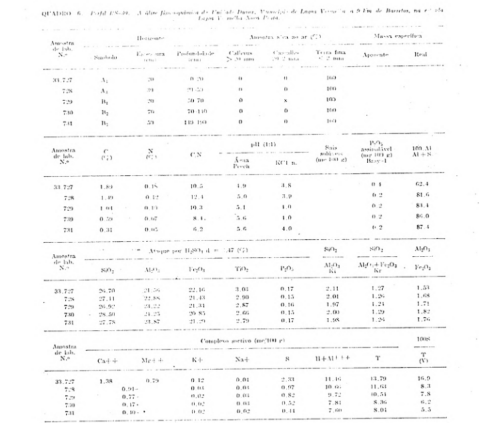
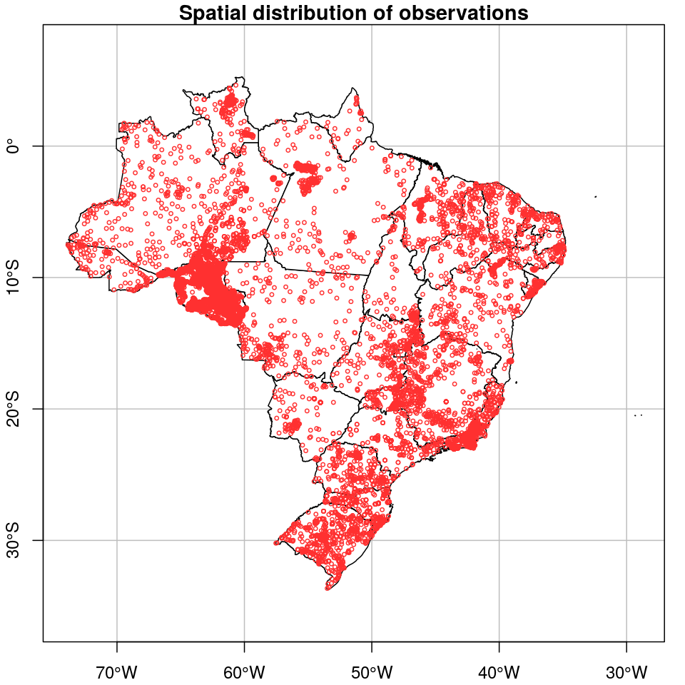
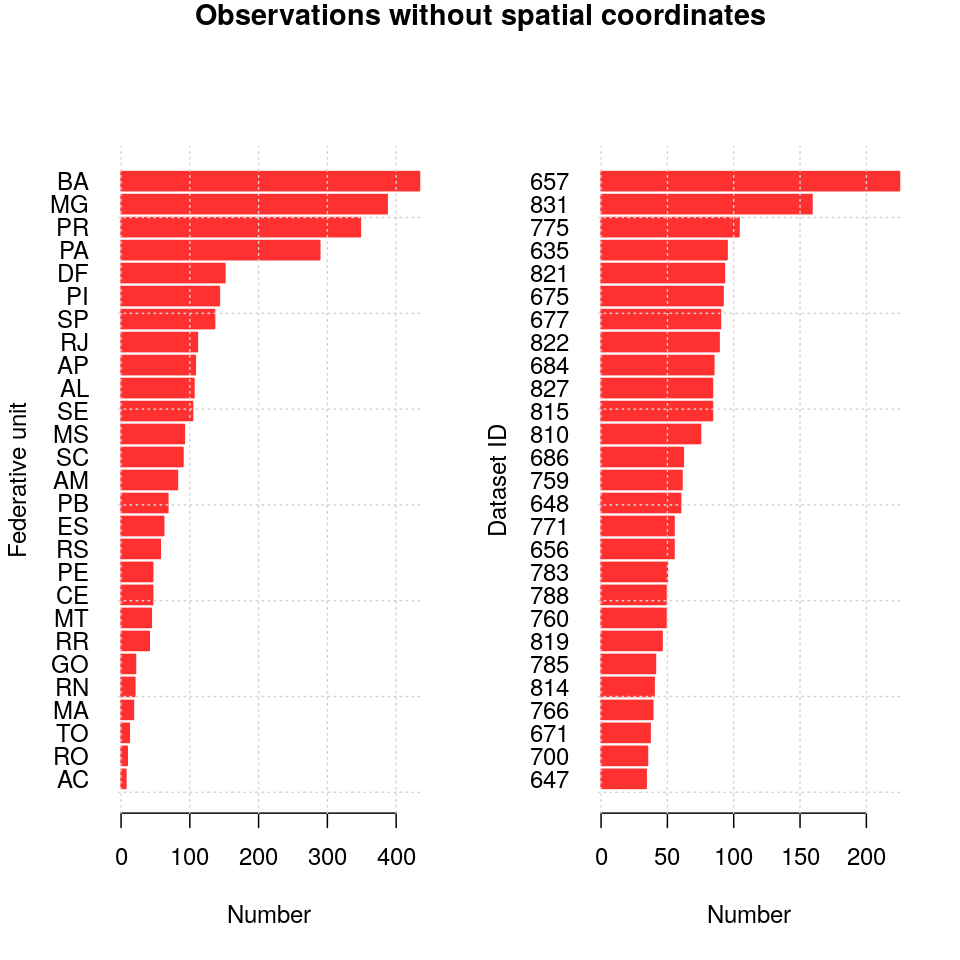
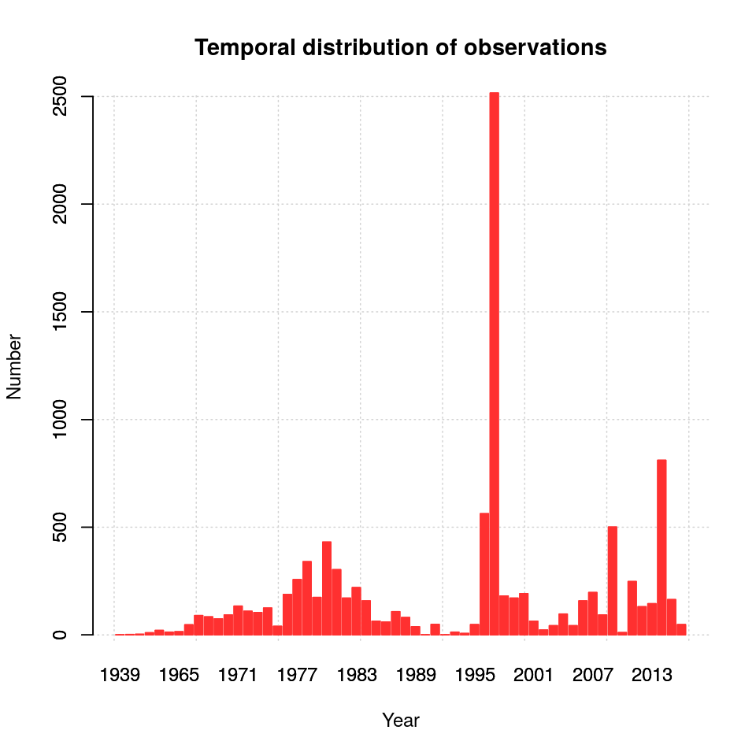
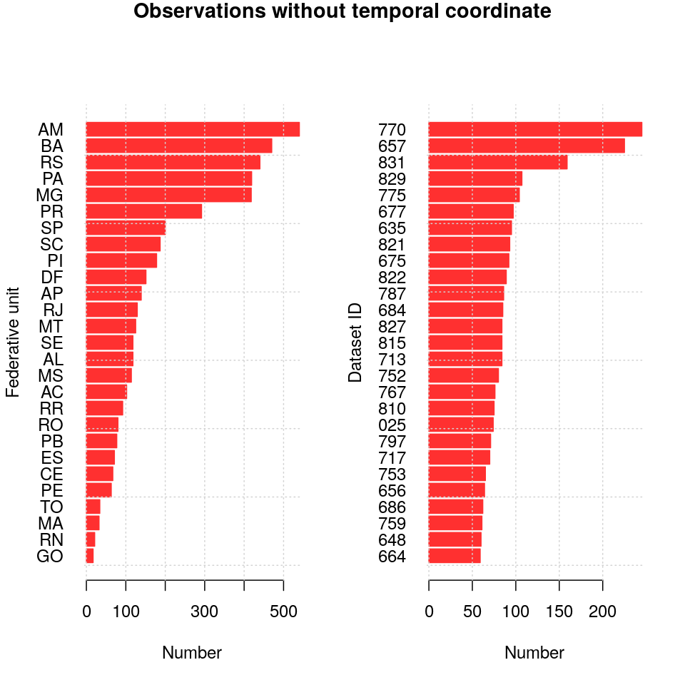
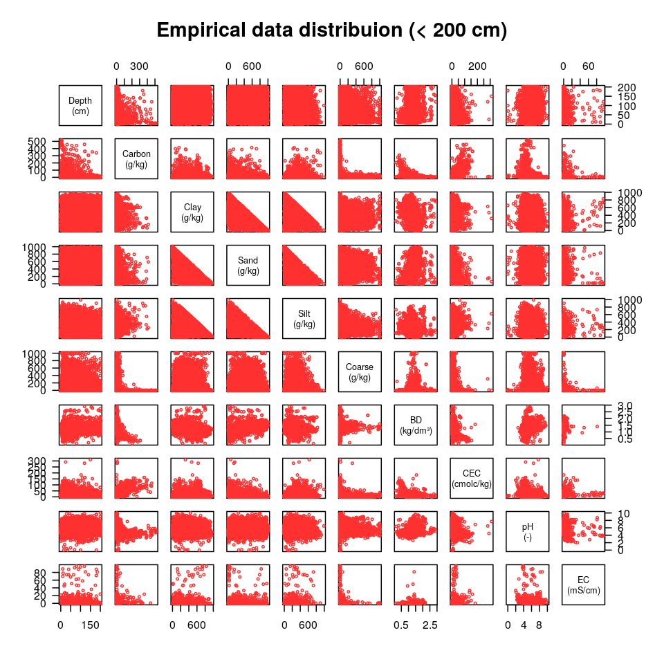
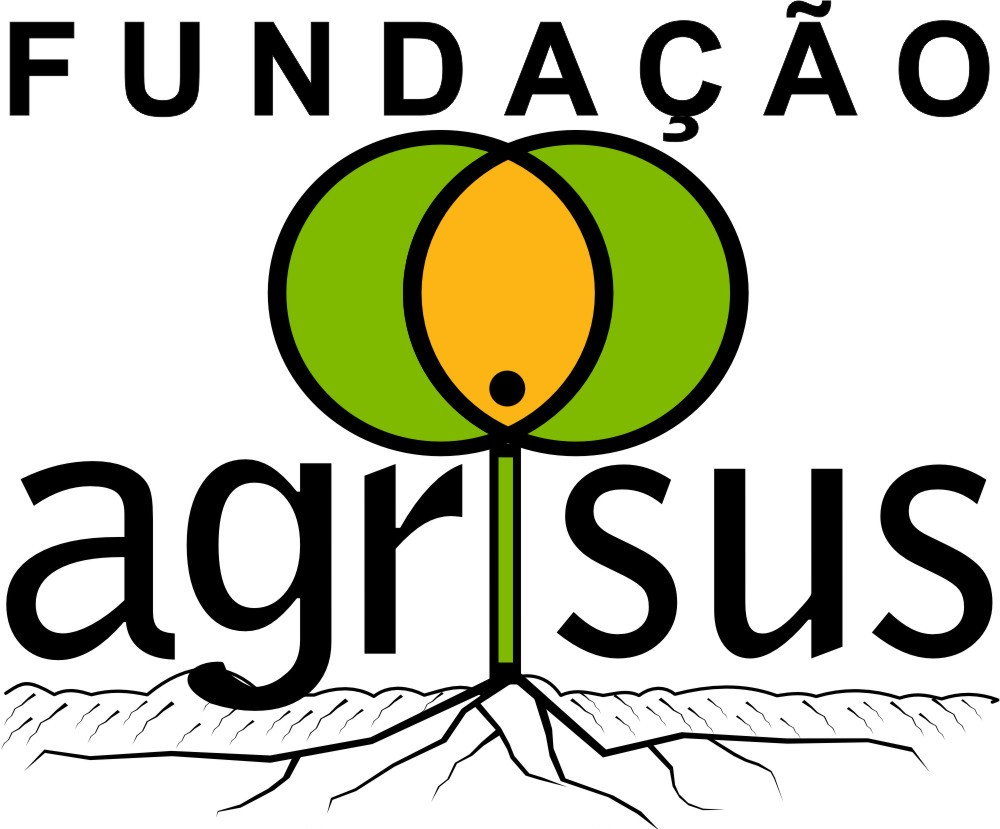

# What is the problem?

<!-- We all know that digital soil mapping (DSM) has benefited from the rapid: -->

<!-- * development of new mathematical and statistical methods (machine learning algorithms), -->
<!-- * evolution and avaliability of remote sensing techniques and products, and -->
<!-- * increase in the power of computers to deal with large volumes of data. -->

<!-- But in some countries the increase in availability of soil data... -->
<!-- Well, it has not followed the same pace! -->
<!-- Let us take a look at the Brazilian case. -->

## The Brazilian case

Long story short:

* 1930's: first soil surveys
* 1970's and 1980's: official national soil survey program (Radam Brasil)
* 2010's: 9000 soil observations in the Brazilian Soil Information System (BDSolos)

In comparison (Arrouays _et al_. 2017):

* Australia: 290 000
* France: 64 123
* Mexico: 22 430

---

<!-- A large part of the soil data is still in paper format, some of it almost gone. -->
<!-- A key reasons is that organizing soil data in digital format, in a consistent way, and sharing it with -->
<!-- others for reuse has not been a priority (because it was not valued as a scientific output) at least -->
<!-- not till recently. -->

  

# A solution?

## febr | Free Brazilian Repository for Open Soil Data

<!-- A simple and easy to use platform, that could foster collaboration, bringing together pedometricians, -->
<!-- pedologists and, most importantly, soil students. -->
<!-- Bring together the various legacy soil data rescue initiatives. -->

<!-- IT'S ABOUT DATA... BUT ALSO ABOUT PEOPLE! -->

* Centralized repository, built on previous work of BDSolos, for storing open soil data and serving it in a
  standardized and harmonized format.
  
* Quality of legacy soil data: check coordinates for positional accuracy and estimate missing ones, and
  assess soil property data correctness.

* Participation of pedometricians, pedologists and, most importantly, soil students.
  
* Promote a cultural change towards a more open and collaborative soil science in Brazil.

---

<!-- Legacy soil data rescue and quality check/improvement included in the syllabus of regular bachelor -->
<!-- courses. -->
<!-- Students review existing digitized soil data, estimate missing coordinates, adjust existing -->
<!-- coordinates, and update the soil classification. -->
<!-- Then the data is made available for reuse. -->

<!-- IT'S ABOUT DATA... BUT ALSO ABOUT PEOPLE! -->

  

# What have we got so far?

---

<!-- Spatial distribution of soil observations -->
<!-- Overall, a poor spatial coverage, with very low density in the agricultural frontier -->
<!-- (Amazon, Cerrado...) -->

  

---

<!-- About 20% of the observations still miss spatial coordinates. This is an issue for DSM. -->
<!-- Depending on the quantity of information, this can be estimated with a precision of 30-100 m. -->

  

---

<!-- The temporal distribution of soil observations is uneven. -->
<!-- There are three peaks: -->
<!-- * 1970's-1980's: national soil survey program -->
<!-- * end of 1990's: a single survey in Rondônia (Amazônia) -->
<!-- * begining of 2010's: master and PhD thesis (recent additions) -->

  

---

<!-- Distribution of observations without temporal coordinate: an issue for spatio-temporal modelling, -->
<!-- for example, of dynamic soil properties such as carbon. -->

  

---

<!-- Distribution and correlation between soil properties within 200-cm depth -->
<!-- Once a month we prepare an updated version of a standardized and harmonized dataset with 10 soil -->
<!-- properties, plus soil classification.  -->

  

# The message

---

<!-- IT'S ABOUT DATA... BUT ALSO ABOUT PEOPLE! -->
<!-- A bottom-up approch is the best way to achieve a significant and lasting cultural change, where  -->
<!-- people will collaborate and produce soil information together by default. -->

  

## febr | Free Brazilian Repository for Open Soil Data

Download the data at http://www.ufsm.br/febr/dados/

Contact: alessandrorosa@utfpr.edu.br

  

