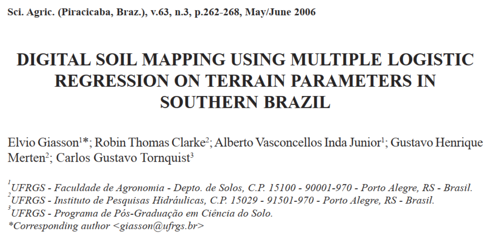
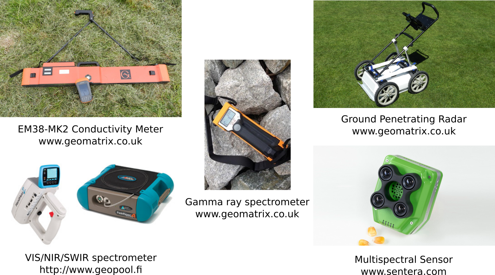
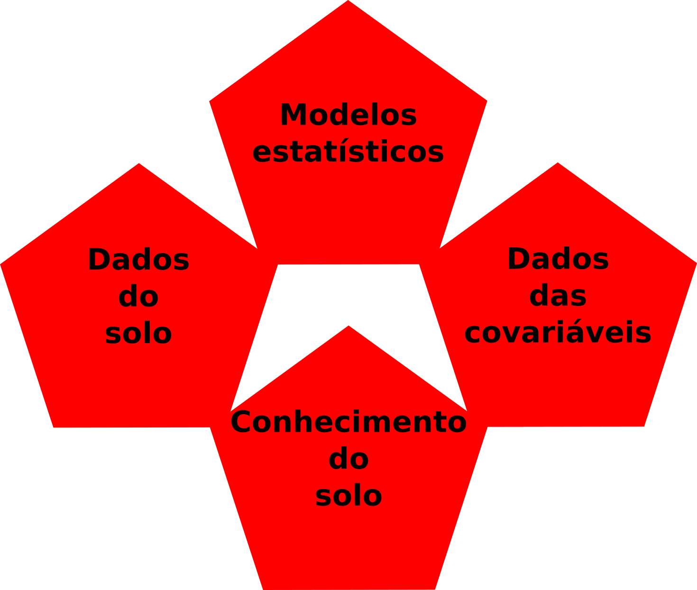
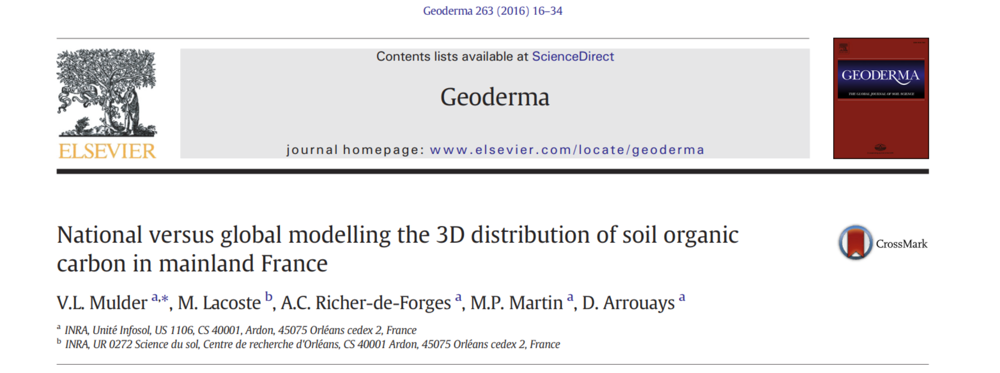
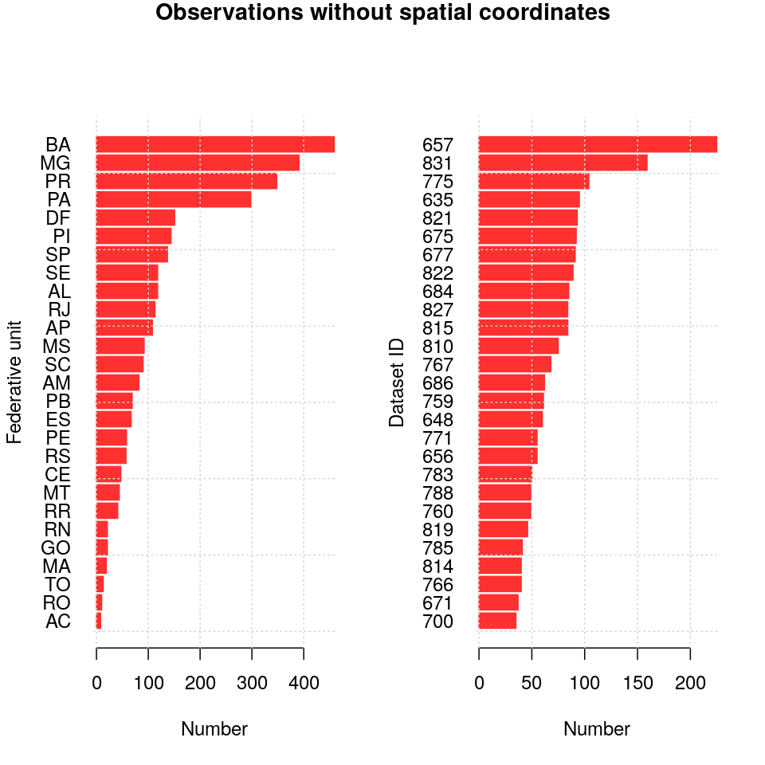
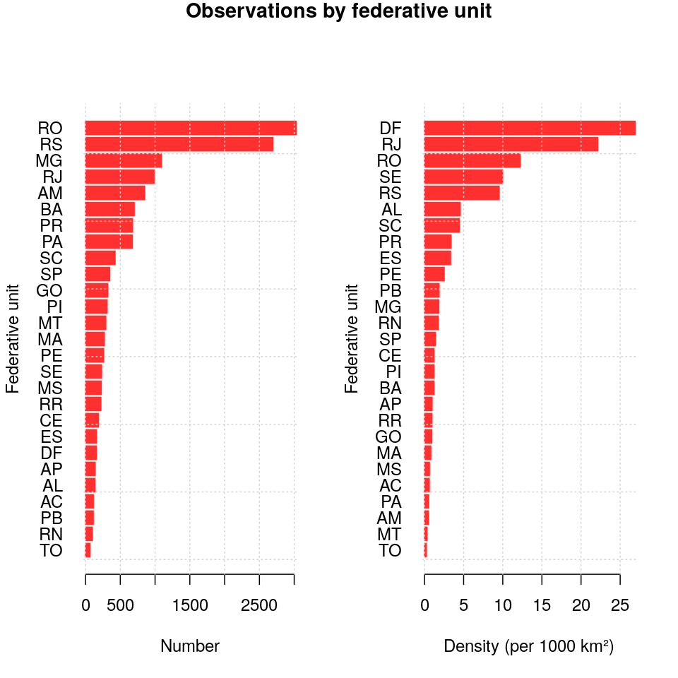
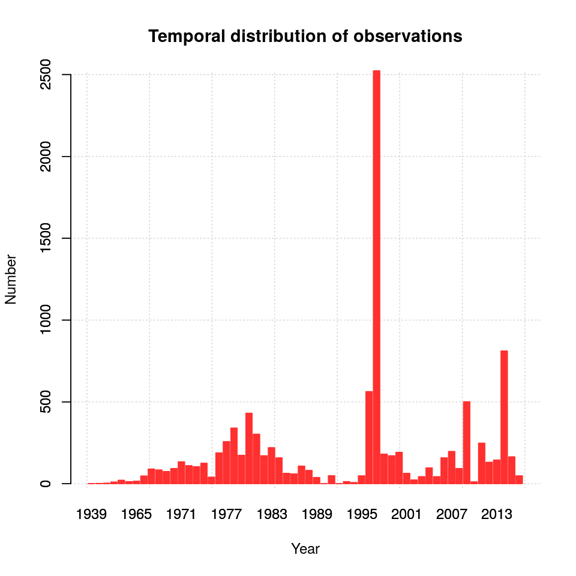
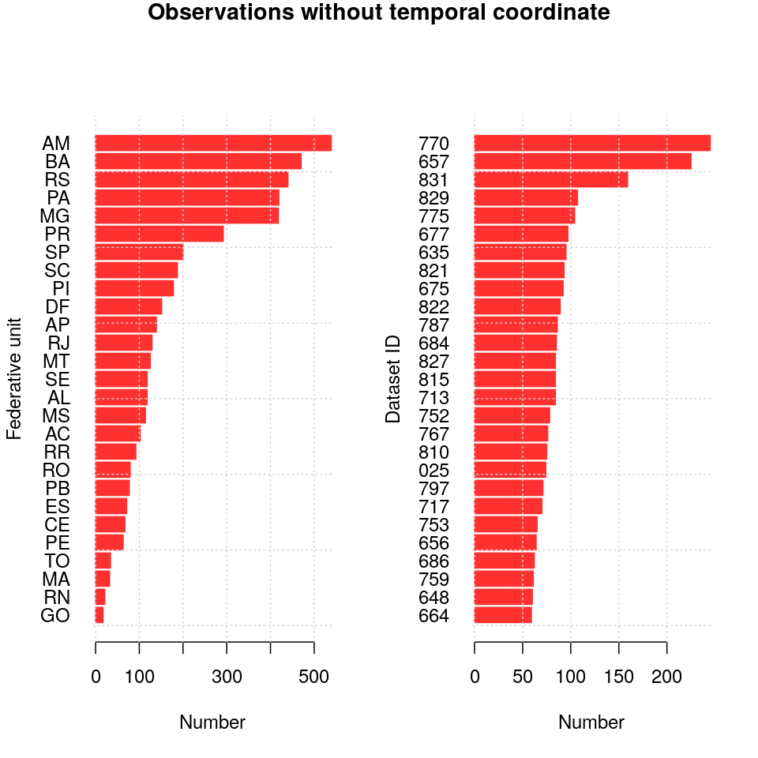
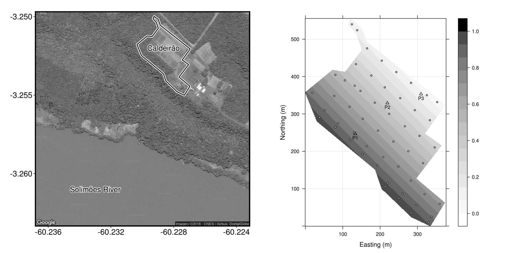
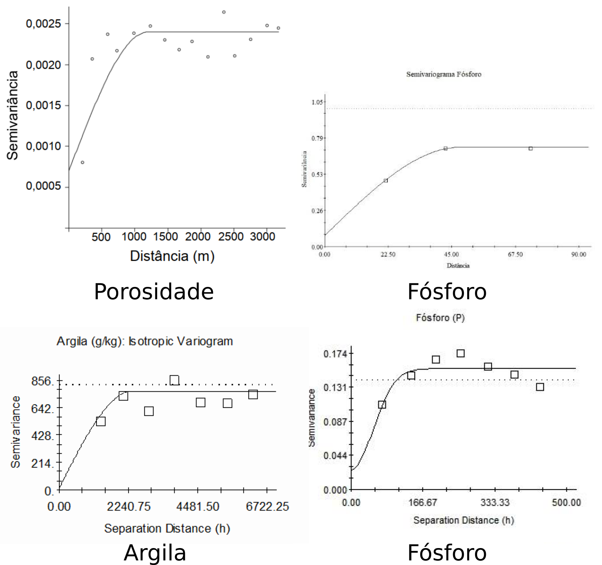

<script src="https://ajax.googleapis.com/ajax/libs/jquery/1.12.2/jquery.min.js"></script>
<script>
    $(document).ready(function() {
    $('slide:not(.title-slide, .backdrop, .segue)').append('<footer></footer>');
    $('footer').attr('label', 'Samuel-Rosa (2019) Novidades e Desafios do MDS em Alta Resolução');
  })
</script>

```{r, echo=FALSE, include=FALSE}
library(magrittr)
library(gstat)
library(sf)
library(raster)
library(spsann)
transparent <- 
  function (file, dir = "img/") {
    cmd <- glue::glue("convert {dir}{file} -transparent white {dir}{file}")
    system(cmd)
  } 
```

# Desafios

<!-- Annotations -->
<div class="notes"><p style="font-size:16px">
Vamos começar pelos desafios do MDS!
<br><br>
Para isso, eu quero fazer um exercício com vocês. Aqueles que trabalham com agricultura de precisão, por gentileza, engam o braço esquerdo. Muito bem. Por favor, eu preciso que vocês mantenham o braço esquerdo erguido.
<br><br>
Agora aqueles que trabalham com MDS, por gentileza, ergam o braço direito. Por favor, mantenham o braço direito erguido.
<br><br>
IDENTIFICAR ALGUÉM QUE TRABALHA COM AGRICULTURA DE PRECISÃO, MAS QUE ACREDITA NÃO TRABALHAR COM MDS. PERGUNTAR O QUE ENTENDE POR MDS.
</p></div>
<!-- Annotations -->

# O que é MDS?

## A primeira publicação!?

```{r, echo=FALSE, fig.align='center', out.width='85%'}

```

<!-- Annotations -->
<div class="notes"><p style="font-size:16px">
Infelizmente o MDS no Brasil foi muito cedo vinculado ao mapeamento de classes taxonômicas ou então ao mapeamento de propriedades do solo, por pedólogos, em grandes extensões territoriais.
</p></div>
<!-- Annotations -->

## A primeira definição!?

> Criação e população de sistemas de informação espacial do solo usando modelos numéricos que inferem as variações espacial e temporal dos tipos e propriedades do solo a partir de observações e conhecimento do solo e de variáveis ambientais relacionadas. [@LagacherieEtAl2007a; @MaEtAl2019]

<!-- Annotations -->
<div class="notes"><p style="font-size:16px">
Vejamos então o que é o MDS.
</p></div>
<!-- Annotations -->

## A primeira utilização!?

```{r, echo=FALSE, fig.align='center', out.width='80%'}
knitr::include_graphics("img/geoestatistica.png")
```

# Novidades

## Cloud computing

```{r, echo=FALSE, fig.align='center', out.width='75%'}

```

<!-- Annotations -->
<div class="notes"><p style="font-size:16px">
Add presenter notes to a slide.

To enable presenter mode add ?presentme=true to the URL of the presentation.
</p></div>
<!-- Annotations -->

## Google Earth Engine

* Acesso a dados geoespaciais, principalmente imagens de satélite (Landsat e Sentinel-2)
* Interface de programação em Python e Javascript
* Exemplos: Global Forest Cover Change, Global Forest Watch, MapBiomas (http://mapbiomas.org/)

> https://code.earthengine.google.com/

## MDS global de alta resolução (1/2)

```{r, echo=FALSE, fig.align='center', out.width='50%'}
knitr::include_graphics("img/soilgrids.png")
```

## MDS global de alta resolução (2/2)

```{r, echo=FALSE, fig.align='center', out.width='80%'}
knitr::include_graphics("img/soil-grids-website.png")
```

## MDS local de alta resolução (1/2)

```{r, echo=FALSE, fig.align='center', out.width='100%'}
knitr::include_graphics("img/toca_pred.png")
```

## MDS local de alta resolução (2/2)

```{r, echo=FALSE, fig.align='center', out.width='80%'}

```

# Desafios

# MDS de alta resolução em<br>grandes extensões

## Componentes do MDS

```{r, echo=FALSE, fig.align='center', out.width='55%'}

```

## Mais dados ou melhores modelos?

```{r, echo=FALSE, fig.align='center', out.width='100%'}

```

---

```{r, echo=FALSE, fig.align='center', out.width='100%'}
knitr::include_graphics("img/wosis.png")
```

---

```{r, echo=FALSE, fig.align='center', out.width='55%'}
knitr::include_graphics("img/febr-observacao-espaco.png")
```

---

```{r, echo=FALSE, fig.align='center', out.width='55%'}

```

---

```{r, echo=FALSE, fig.align='center', out.width='55%'}

```

---

```{r, echo=FALSE, fig.align='center', out.width='55%'}

```

---

```{r, echo=FALSE, fig.align='center', out.width='55%'}

```

# MDS de alta resolução em<br>pequenas extensões

## Configuração amostral espacial

```{r, echo=FALSE, fig.align='center'}
# bounds <- shapefile("data/boundary.shp")
# candi <- sp::spsample(bounds, 5000, type = "regular")
# candi <- coordinates(candi)
# colnames(candi) <- c("x", "y")
# library(spsann)
# schedule <- scheduleSPSANN(chains = 500, initial.temperature = 500, stopping = 100)
# res <- optimMSSD(points = 53, candi = candi, schedule = schedule, plotit = TRUE, boundary = bounds)
# save(res, file = "data/spsann.rda")
bounds <- sf::read_sf("data/boundary.shp")
caldeirao <- sp::spsample(x = sf::as_Spatial(bounds), n = 53, type = 'regular')
# caldeirao <- 
#   read.table("data/caldeirao.csv", header = TRUE, sep = ";") %>% 
#   dplyr::select(x, y, stake) %>% 
#   unique() %>% 
#   sf::st_as_sf(coords = c("x", "y"))
load("data/spsann.rda")
op <- par(mfrow = c(1, 2), bg = "transparent")
plot(bounds["x"], main = "Original", reset = FALSE, col = "transparent", axes = TRUE)
grid()
plot(caldeirao, add = TRUE, pch = 20, col = 1)
plot(bounds["x"], main = "Otimizada (spsann)", reset = FALSE, col = "transparent", axes = TRUE)
grid()
points(res$points[c("x", "y")], pch = 20, col = 1)
par(op)
```

## Informações auxiliares: covariáveis

```{r, echo=FALSE, fig.align='center', out.width='95%'}

```

## Modelos preditivos "mecanísticos"

$$K^+ = f(K^+_0 + K^+_1 + K^+_2 + K^+_3 - K^+_4 - K^+_5 - K^+_6)$$

* $K^+_0$: conteúdo original (mapa de fertilidade)
* $K^+_1$: adubação potássica (mapa de aplicação)
* $K^+_2$: ganhos por mineralização da MOS (mapa de cobertura do solo)
* $K^+_3$: ganhos por deposição de sedimentos (mapa do relevo)
* $K^+_4$: perdas por remoção de sedimentos (mapa do relevo)
* $K^+_5$: perdas por lixiviação (mapa 3D do solo)
* $K^+_6$: perdas por exportação pelas culturas (mapa de produtividade)

## Modelos preditivos geoestatísticos

```{r, echo=FALSE, fig.align='center', out.width='50%'}

```

# Considerações Finais

## Considerações Finais

* MDS de alta resolução em grandes extensões
  + Novidade: poder computacional, covariáveis, aprendizado de máquina
  + Desafio: dados do solo, em quantidade e qualidade, no espaço e no tempo
  + Sugestão: compartilhar mais os dados da pesquisa (www.ufsm.br/febr/)
* MDS de alta resolução em pequenas extensões
  + Novidade: sensores proximais
  + Desafio: reduzir necessidade de dados do solo (covariáveis, modelos "mecanísticos")
  + Sugestão: visitar mais a literatura sobre MDS

---

<div class="centered">
Muito obrigado pela sua atenção!

Alessandro Samuel-Rosa

alessandrorosa@utfpr.edu.br
</div>

```{r, echo=FALSE, fig.align='center', out.width='65%'}

```
  
## Referências {.tiny}
