<script src="https://ajax.googleapis.com/ajax/libs/jquery/1.12.2/jquery.min.js"></script>
<script>
  $(document).ready(function() {
  $('slide:not(.title-slide, .backdrop, .segue)').append('<footer></footer>');
  $('footer').attr('label', 'A. Samuel-Rosa (2019) Modelado espacial predictivo del suelo');
 })
</script>

```{r, echo=FALSE, include=FALSE}
library(magrittr)
library(raster)
library(sf)
source("helper.R")
```

# Suelo y cambio climático

<!-- Annotations -->
<div class="notes"><p style="font-size:16px">
Buenos días señoras y señores.
<br><br>
Es un gran placer poder participar del Congreso Peruano de Ciencia del suelo de 2019 y contribuir a la discusión sobre el rol del suelo frente al cambio climático.
</p></div>
<!-- Annotations -->

## Suelo y cambio climático

```{r, echo=FALSE, fig.align='center', out.width='75%'}
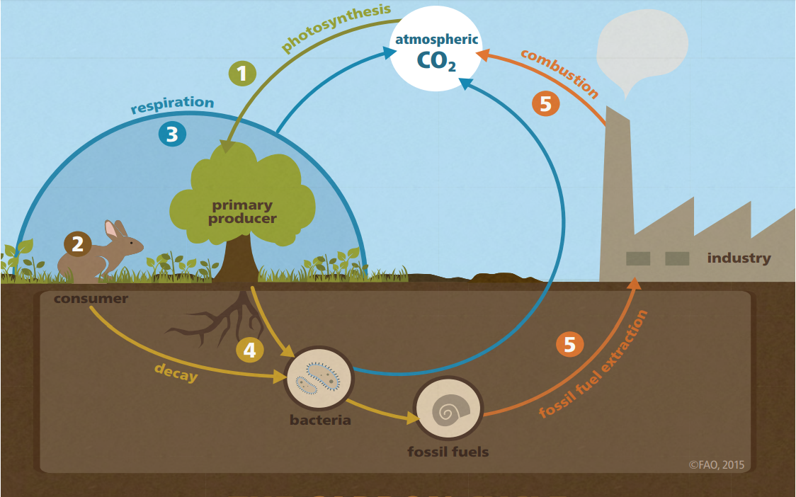
```

<!-- Annotations -->
<div class="notes"><p style="font-size:16px">
Todos aquí sabemos que el suelo ayuda en el combate y en la adaptación al cambio climático porque desempeña, entre otras cosas, un papel clave en el ciclo del carbono.
<br><br>
Para que podamos realmente combatir y adaptarse a los cambios climáticos que son irreversibles, necesitamos información detallada sobre el suelo y sus propiedades.
<br><br>
Como el cambio climático es un fenómeno global, la producción de información sobre el suelo necesita ser pensada también globalmente y, más importante que eso, compartida entre todos los pueblos.
</p></div>
<!-- Annotations -->

# Mapeo digital del suelo

<!-- Annotations -->
<div class="notes"><p style="font-size:16px">
Hoy, la técnica de producción de información espacial del suelo y sus propiedades, desde la agricultura de precisión hasta el nivel global, se llama __mapeo digital del suelo__.
<br><br>
Y es una técnica en la que el interés crece también en Perú, tanto para lidiar con las cuestiones globales del cambio climático, que muy afectan a Perú, como para lidiar con cuestiones locales, como el problema del cadmio en el suelo y la producción de cacao.
</p></div>
<!-- Annotations -->

## Mapeo digital del suelo (1/2)

```{r, echo=FALSE, fig.align='center', out.width='75%'}
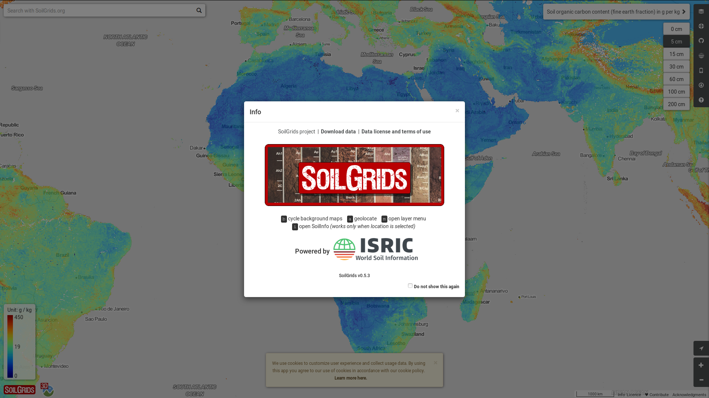
```

<!-- Annotations -->
<div class="notes"><p style="font-size:16px">
El mapeo digital del suelo fue una verdadera revolución en la manera de producir información espacial del suelo.
<br><br>
Hoy ya tenemos plataformas como SoilGrids, que utiliza datos de perfiles del suelo e informaciones ambientales asociadas del mundo entero para producir mapas de diversas propiedades del suelo en diversas produndidades. Una plataforma que consigue, en una cuestión de días, actualizar toda la información disponible tan pronto como se disponga de nuevos datos. Y esta información está disponible gratuitamente en la palma de nuestras manos.
<br><br>
Pero a pesar de ser una técnica ya consolidada de producción de información espacial del suelo, hoy no pretendo hablar sólo de los aspectos positivos del MDS.
</p></div>
<!-- Annotations -->

## Mapeo digital del suelo (2/2)

```{r, echo=FALSE, fig.align='center', out.width='80%'}
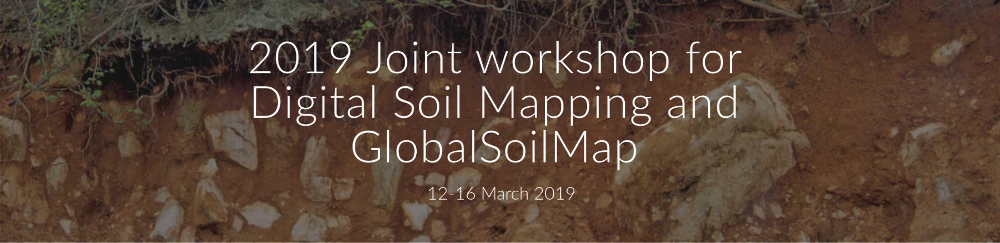
```

Uno de los principales desafíos del mapeo digital del suelo es integrar el conocimiento pedológico!

<!-- Annotations -->
<div class="notes"><p style="font-size:16px">
Quiero hacer un análisis un poco más crítico del MDS, de las prácticas de ese campo de la investigación, en un intento de pensar el avance de la ciencia del suelo como un todo a fin de ayudar en el combate y adaptación al cambio climático.
<br><br>
La motivación para este análisis fue uno de los principales desafíos planteados por expertos del área en el último encuentro del Grupo de Trabajo en Mapeo Digital del Suelo de la Unión Internacional de Ciencias del Suelo que tuvo lugar en marzo en Santiago de Chile.
<br><br>
Así, más que convencerlos a usar el MDS, mi objetivo aquí es invitarlos a pensar la evolución de esa área y de la ciencia del suelo para producir información del suelo cada vez más útil.
</p></div>
<!-- Annotations -->

## Estructura de la conferencia

1. Modelado explicativo y modelado predictivo
2. Fundamentos da modelagem espacial do solo
3. Mapeamento digital do solo
4. Descoberta de conhecimento
5. Considerações finais

<!-- Annotations -->
<div class="notes"><p style="font-size:16px">
Para alcanzar ese objetivo, he estructurado la presentación de la siguiente manera:
<br><br>
Primero presentaré algunas definiciones importantes del campo de la estadística, más precisamente del campo del modelado estadístico.
<br><br>
A continuación, haré una breve revisión del historial y de los fundamentos del modelado espacial del suelo.
<br><br>
Después voy a hablar más específicamente sobre el funcionamiento del MDS.
<br><br>
Y antes de hacer mis consideraciones finales, abordaré el tema del descubrimiento de conocimiento y algunas experiencias en el MDS.
</p></div>
<!-- Annotations -->

# Modelado explicativo y<br>Modelado predictivo

<!-- Annotations -->
<div class="notes"><p style="font-size:16px">
Bueno, en general, podemos analizar los datos del suelo que recogemos en la naturaleza usando dos estrategias de modelado estadístico diferentes.
<br><br>
Son ellas el modelado explicativo y el modelado predictivo.
</p></div>
<!-- Annotations -->

## Modelado estadístico | Las dos culturas

```{r, echo = FALSE, fig.align = 'center'}
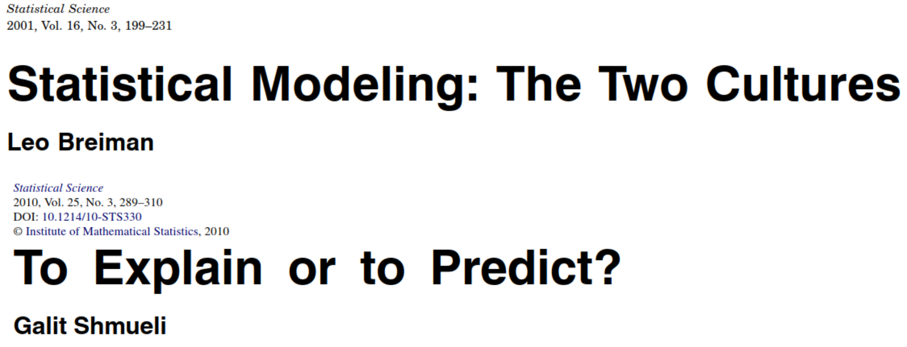
```

<!-- Annotations -->
<div class="notes"><p style="font-size:16px">
El estadístico Leo Breiman, en un artículo de 2001, llamó a estos enfoques de __las dos culturas del modelado estadístico__.
<br><br>
Más recientemente, la estadística Galit Shmueli presentó una descripción detallada de esas "dos culturas".
<br><br>
Los conceptos que voy a presentar a continuación se basan, en gran medida, en las ideas de estos dos estadísticos.
<br><br>
(Te recomiendo que, si es posible, reservan un tiempo para leer estos dos artículos, que son muy inspiradores y reveladores.) (AGUARDAR ALGUNS SEGUNDOS)
</p></div>
<!-- Annotations -->

## Modelado estadístico | Modelo de generación de datos

```{r, echo = FALSE, fig.align = 'center'}
dataModel(type = "none")
```

<!-- Annotations -->
<div class="notes"><p style="font-size:16px">
Antes de hablar sobre las dos culturas del modelado estadístico, vamos a definir un modelo de generación de los datos del suelo que recogemos en la naturaleza.
<br><br>
Para Leo Breiman, podemos considerar la naturaleza como si fuera una gran _caja negra_, de la que tenemos muy poco conocimiento del interior. Todo lo que sabemos es que cuando un conjunto de variables independientes, que podemos llamar ___x___, entra por uno de los lados de la caja negra, del otro lado salen las llamadas variables respuesta, que podemos llamar ___y___.
<br><br>
En términos bastante generales, el modelado se ocupará del camino recorrido entre ___x___ y ___y___.
</p></div>
<!-- Annotations -->

## Modelado explicativo | ¿Cuál es la causa?

```{r, echo = FALSE, fig.align = 'center'}
dataModel(type = "explain")
```

<!-- Annotations -->
<div class="notes"><p style="font-size:16px">
Sabemos que una de las funciones de la ciencia es abrir la gran caja negra de la naturaleza, entender su interior, explicar las __causas__ de los fenómenos.
<br><br>
El __modelo explicativo__ tiene como objetivo identificar cuáles son las __causas__ que llevaron, del conjunto de variables independientes, ___x___, hasta las variables respuesta, ___y___. Ella intentará identificar cuáles fueron y cómo funcionaron los procesos que ocurrieron en la naturaleza para producir ___y___.
<br><br>
Es claro que la complejidad de la naturaleza hace el camino a recorrer para entender esas __causas__ bastante "sinuoso", difícil de recorrer y conocer con detalle. Por esa razón, toda explicación producida no es más que una aproximación del comportamiento promedio, más esperado, más comúnmente observado en la naturaleza.
<br><br>
(Antes de continuar, quiero que ustedes atenten para el hecho de que la actitud explicativa es mirar hacia el pasado, para lo que ya ocurrió, una actitud retrospectiva.)
</p></div>
<!-- Annotations -->

## Modelado predictivo | ¿Cuál es la asociación?

```{r, echo = FALSE, fig.align = 'center'}
dataModel(type = "predict")
```

<!-- Annotations -->
<div class="notes"><p style="font-size:16px">
Otro propósito de la ciencia es utilizar el conocimiento existente para hacer pronósticos, predicciones. Por ejemplo, pronósticos de lo que puede ocurrir en la naturaleza en un determinado momento en el futuro en situaciones específicas, más o menos parecidas a situaciones actuales o pretéritas. En esto consiste el modelado predictivo, que está precupada fundamentalmente en entender la __asociación__ entre ___x___ y ___y___. La naturaleza puede seguir siendo una caja negra.
<br><br>
Vean que el modelado predictivo posee un movimiento prospectivo, de mirar hacia adelante, hacia el futuro. Otra característica importante es su objeto de interés. Mientras que el modelado explicativo se preocupa más con el comportamiento medio de la naturaleza, el modelado predictivo se preocupa más con casos individuales, situaciones específicas.
<br><br>
(Lo que debe quedar claro es que, para el modelado predictivo, no es necesario comprender las __causas__ reales que llevaron de ___x___ hasta ___y___. Basta conocer la __asociación__ entre ellos.)
</p></div>
<!-- Annotations -->

## Modelado explicativo y Modelado predictivo | Otras diferencias

```{r, echo = FALSE, fig.align = 'center'}
dataModel(type = "both")
```
<!-- Annotations -->
<div class="notes"><p style="font-size:16px">
Como acabamos de ver, el camino recorrido entre ___x___ y ___y___ puede ser analizado bajo al menos dos perspectivas diferentes. Y cada una tiene objetivos diferentes. De ello resulta que cada perspectiva tiene demandas diferentes.
<br><br>
Por ejemplo, el modelado predictivo, por no considerar explícitamente las __causas__ reales de los fenómenos, requiere gran volumen de datos y modelos estadísticos que sean capaces de manejar ese gran volumen de datos y descubrir el mayor número posible de __asociaciones__ relevantes.
<br><br>
Por otro lado, el modelado explicativo requiere menos datos, pero demanda conocimientos, teorías más profundas, que estén explicitadas. Y también requiere modelos estadísticos más parsimoniosos, que sean posibles de interpretación y comprensión por humanos.
</p></div>
<!-- Annotations -->

# Fundamentos del Modelado Espacial del suelo

<!-- Annotations -->
<div class="notes"><p style="font-size:16px">
Ahora que hemos definido los dos tipos principales de modelado estadístico de los datos, quiero introducir, o simplemente rescatar, los fundamentos del modelado espacial del suelo.
</p></div>
<!-- Annotations -->

## La Ley Básica de la Ciencia del Suelo (1/2)

En 1886, el científico ruso, Vasily Dokuchaev, postuló que:

> Cualquier... suelo es siempre y en todas partes una mera _función_ de los siguientes factores de la formación del suelo: (1) la naturaleza (contenido y estructura) de la roca madre; (2) el clima del terreno; (3) la masa y el carácter de la vegetación; (4) la edad del terreno; y, finalmente, (5) la topografía del terreno. [@Florinsky2012]

Ecuación de los factores de formación del suelo:

$$\pi = f(cl, o, r, p, t, \ldots)$$

<!-- Annotations -->
<div class="notes"><p style="font-size:16px">
Yo voy a empezar trayendo el fragmento, ya bien conocido, del padre de la ciencia del suelo, el científico ruso Vasily Dokuchaev, publicado en uno de sus informes de evaluación de tierras en Rusia. Sergey Zakharov, otro científico ruso, más tarde llamó el postulado de Dokuchaev de __la primera ley básica de la ciencia del suelo__. (LER POSTULADO)
<br><br>
Tal vez hoy ese postulado sea más conocido en la forma de la ecuación de los factores de formación del suelo de Zakharov-Jenny, donde $\pi$ es el suelo (do ruso _?????_, "pochva") y sus propiedades, que son función, $f$, de los factores de formacion del suelo: $cl$ -- clima, $o$ -- organismos vivos, $r$ -- relieve, $p$ -- material parental, $t$ -- tiempo, y $\ldots$ -- otros factores de menor importancia.
</p></div>
<!-- Annotations -->

## La Ley Básica de la Ciencia del Suelo (2/2)

```{r, echo = FALSE, fig.align = 'center'}
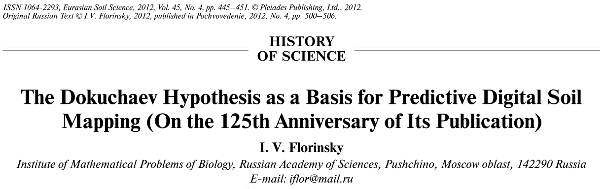
```

> Resulta que (a) si los _factores_ mencionados son los mismos en dos localidades diferentes (por muy separadas que estén), los suelos en las dos localidades también deben ser similares, y viceversa; en consecuencia, (b) si hemos estudiado a fondo estos factores, _podemos predecir de antemano_ cómo debería ser el suelo. (@Florinsky2012)

<!-- Annotations -->
<div class="notes"><p style="font-size:16px">
El postulado de Dokuchaev, publicado en ruso en el siglo 19, fue acompañado por una importante deducción, que fue rescatada 125 años después por el científico ruso Igor Florinsky.
<br><br>
¡Veamos lo que ella dice! (LER DEDUÇÃO)
<br><br>
Vean que esta deducción carga, nada menos que la idea central del modelado predictivo espacial del suelo, o lo que nos acostumbramos más recientemente a llamar de MDS.
<br><br>
Dokuchaev quería explicar, usando una ecuación matemática general, las causas reales de la variación espacial del suelo y usar esa ecuación matemática general para hacer predicciones, tanto espaciales como temporales.
</p></div>
<!-- Annotations -->

## Ecuación de los factores de formación (1/2)

```{r, echo = FALSE, fig.align = 'center', out.width='45%'}
knitr::include_graphics("img/JennyEtAl1934.png")
```

<!-- Annotations -->
<div class="notes"><p style="font-size:16px">
Dokuchaev y sus contemporáneos no pudieron resolver la ecuación general de los factores de formación. La principal razón era la falta de datos sobre todos los factores de formación y la imposibilidad de expresar algunos de ellos de manera cuantitativa. La geología era uno de ellos.
<br><br>
Además, buscar una ecuación general era una tarea de extrema complejidad, prácticamente imposible.
<br><br>
Más tarde, el científico Hanns Jenny y sus contemporáneos sugirieron que un camino más fácil era resolver, empíricamente, ecuaciones individuales para cada factor de formación. Ellos desarrollaron varios experimentos empíricos para determinar cómo la variación de un factor de formación resulta en la variación de una propiedad del suelo.
<br><br>
En este ejemplo de 1934, un modelo de regresión lineal fue ajustado a los datos observados para explicar la variación del contenido de nitrógeno en el suelo en función de la variación de la precipitación en una zona semiárida.
</p></div>
<!-- Annotations -->

## Ecuación de los factores de formación (2/2)

> Los mapas de suelo muestran la disposición regional de las propiedades y los tipos del suelo, pero no permiten conocer las relaciones "causales". La curva, por otra parte, revela la dependencia de las propiedades del suelo con respecto a los factores que forman el suelo, pero la conversión de dicho conocimiento fundamental a condiciones de campo específicas es imposible a menos que se conozca la distribución regional de los formadores de suelo. [@Jenny1941]

<!-- Annotations -->
<div class="notes"><p style="font-size:16px">
Jenny, así como Dokuchaev, también vislumbraba la posibilidad de usar las explicaciones causales -- organizadas na forma de equações ajustadas empiricamente aos dados -- de la variación espacial del suelo para hacer predicciones. Esto aparece en las conclusiones de su famoso libro de 1941. ¡Vamos a ver lo que dijo! (LER CONCLUSÃO)
<br><br>
Así como Dokuchaev, Jenny y sus contemporáneos estaban limitados por la disponibilidad de datos de los factores de formación. A pesar de la facilidad de encontrar soluciones empíricas para las ecuaciones propuestas, algunos factores de formación aún no podían expresarse de manera cuantitativa. Y, más importante que eso, para aplicar las ecuaciones ajustadas para predicción, era necesario conocer precisamente la distribución regional de los factores de formación de antemano.
</p></div>
<!-- Annotations -->

# Mapeo digital del suelo

<!-- Annotations -->
<div class="notes"><p style="font-size:16px">
Curiosamente, las dificultades enfrentadas por Dokuchaev y Jenny son las mismas que encontramos todavía hoy.
<br><br>
Los factores de formación del suelo no son exactamente conocidos en todas partes. Algunos factores de formación todavía no se pueden expresar cuantitativamente. Y la ecuación general de formación del suelo permanece sin solución.
<br><br>
Pero aún así hacemos predicciones espaciales usando el mapeo digital del suelo! ¿Como eso es posible?
</p></div>
<!-- Annotations -->

## Avances tecnológicos (1/2)

```{r, echo=FALSE, fig.align='center', out.width='65%'}
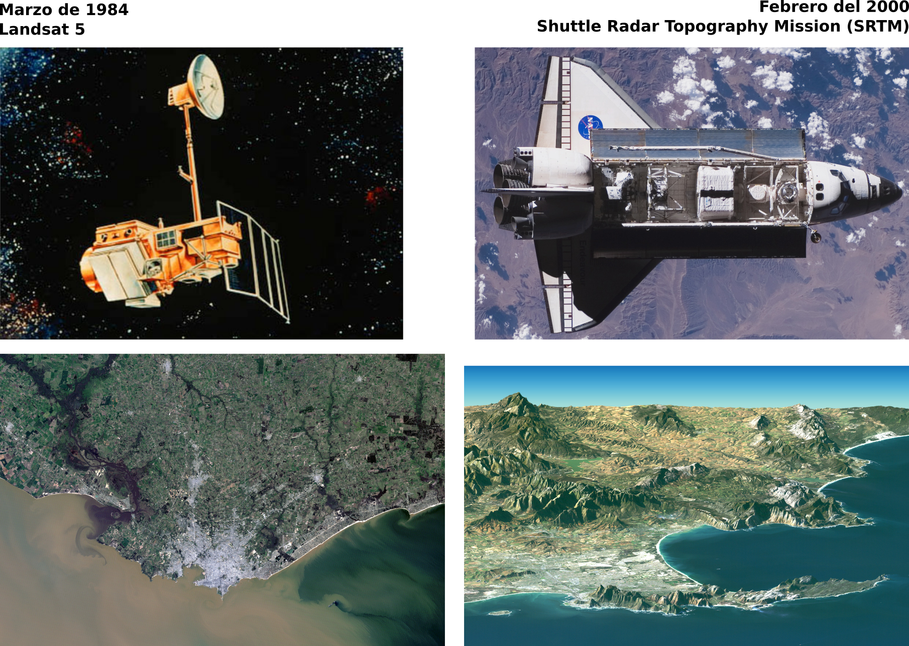
```

<!-- Annotations -->
<div class="notes"><p style="font-size:16px">
Para hablar sobre el surgimiento del MDS, primero hay que destacar algunos avances tecnológicos importantísimos que ocurrieron en los últimos 50 años. Estos avances están todos interrelacionados. Pero voy a separarlos en dos grupos.
<br><br>
El primero de ellos fue la detección remota, la posibilidad de obtener un gran volumen de datos sobre la superficie de la Tierra incluso estando a grandes distancias.
<br><br>
Cuando pensamos en el MDS, tal vez el mayor marco de la detección remota ha sido el lanzamiento del satélite Landsat 5, hace unos 35 años. Este satélite produjo imágenes quincenales de la superficie de la Tierra, en una resolución espacial de 30 metros, por casi tres décadas.
<br><br>
Otro marco de la detección remota para el MDS fue el mapeo de la topografía de toda la Tierra hace unos 20 años. Inicialmente en una resolución espacial de 90 metros, hoy los datos del SRTM están disponibles en la misma resolución espacial de las imágenes del Landsat 5.
</p></div>
<!-- Annotations -->

## Avances tecnológicos (2/2)

```{r, echo=FALSE, fig.align='center', out.width='55%'}

```

<!-- Annotations -->
<div class="notes"><p style="font-size:16px">
Nuestro segundo grupo de importantes avances tecnológicos se refiere a la construcción de la computadora personal. La computadora personal, y su popularización, principalmente a partir de los años 1990, facilitó el acceso a innumerables herramientas recién desarrolladas. Por supuesto, todo ello gracias a la creación de Internet.
<br><br>
A partir del ordenador personal y de Internet se ha facilitado mucho el acceso, por ejemplo, a los datos del satélite Landsat 5 y del SRTM, que están disponibles gratuitamente desde hace muchos años. La amplia disponibilidad de estos productos, en tan alta resolución, ha ayudado y mucho en el desarrollo y popularización del MDS en todo el mundo.
<br><br>
Y como el volumen de datos disponibles comenzó a aumentar rápidamente, ya no era posible analizarlos como se hacía hasta entonces. Los avances en matemáticas y estadística, con nuevos y más complejos modelos para análisis de datos, el aprendizaje de máquina, la minería de datos, eran la herramienta que faltaba para hacer que el MDS se convierta en realidad.
</p></div>
<!-- Annotations -->

## Mapeo digital del suelo (1/7)

```{r, echo=FALSE, fig.align='center', out.width='65%'}
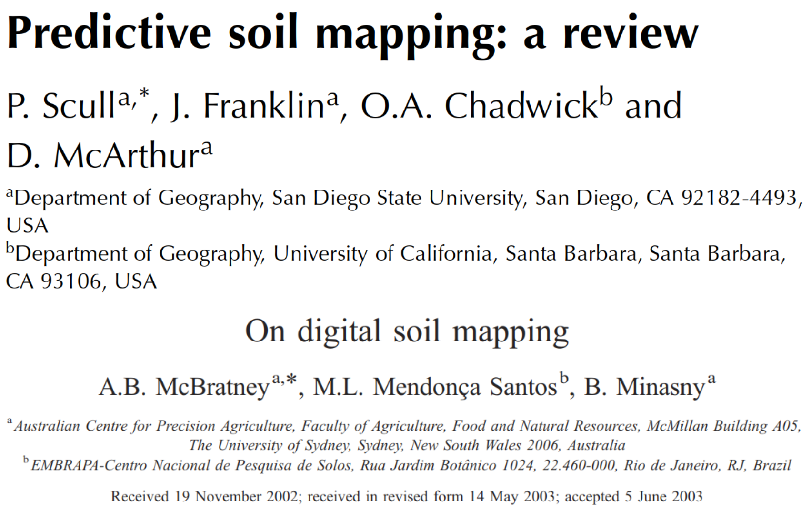
```

<!-- Annotations -->
<div class="notes"><p style="font-size:16px">
Fue sólo después de estos avances tecnológicos, más precisamente en el año 2003, que el MDS fue formalmente descrito por primera vez.
<br><br>
Se trata de dos importantes publicaciones preparadas por dos grupos distintos de investigadores, uno de ellos basado en Estados Unidos, el otro en Australia. Ambos son lectura obligatoria para quien quiera conocer mejor el MDS.
</p></div>
<!-- Annotations -->

## Mapeo digital del suelo (2/7)

El mapeo digital del suelo es:

> La creación y la población de sistemas de información espacial del suelo mediante modelos numéricos que infieren las variaciones espaciales y temporales de los tipos y propiedades del suelo a partir de las observaciones y el conocimiento del suelo y de las variables ambientales relacionadas. [@LagacherieEtAl2007a; @MaEtAl2019]

<!-- Annotations -->
<div class="notes"><p style="font-size:16px">
Una definición formal del mapeo digital del suelo fue presentada algunos años más tarde y parcialmente actualizada recientemente. Veamos lo que ella dice. (LER DEFINIÇÃO)
<br><br>
Más adelante volveré a esa definición.
<br><br>
Ahora quiero es establecer la diferencia fundamental entre (1) lo que hoy conocemos por MDS y (2) las preocupaciones pedológicas de Dokuchaev y Jenny y sus contemporáneos. Al establecer esta diferencia, voy a hacer un análisis del MDS y reflexionar sobre su potencial de incluir más conocimiento pedológico causal y también producir conocimiento pedológico causal nuevo, principalmente sobre la formación y el funcionamiento del suelo.
<br><br>
El objetivo, como he dicho antes, és invitarlos a pensar la evolución del MDS para producir información del suelo cada vez más útil. Información espacial para tratar, tanto con el cambio climático global, como con otras demandas locales como el problema del cadmio en el suelo y el cultivo de cacao en Perú.
</p></div>
<!-- Annotations -->

## Mapeo digital del suelo (3/7)

```{r, echo=FALSE, fig.align='center', out.width='70%'}
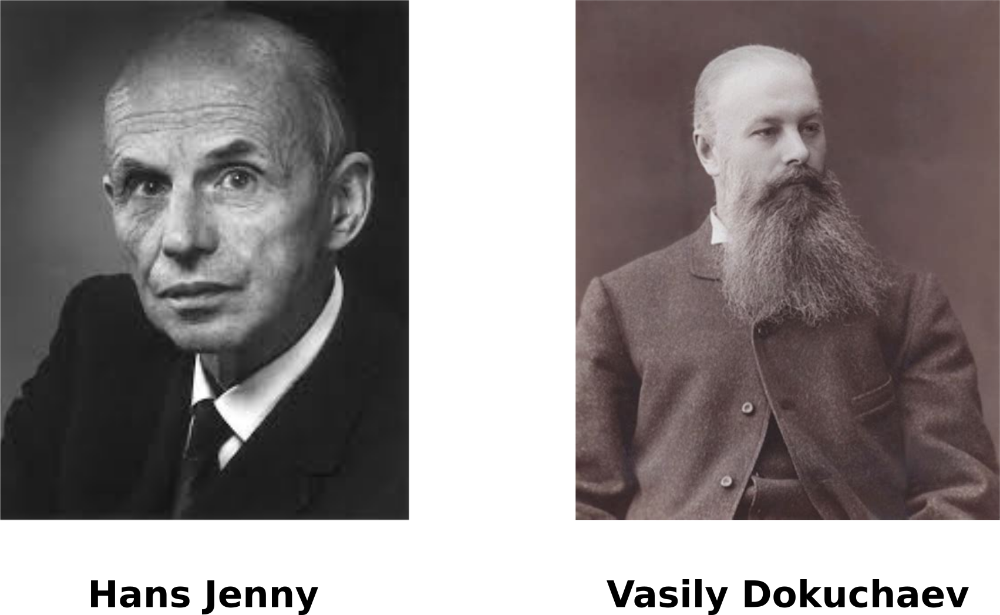
```

<!-- Annotations -->
<div class="notes"><p style="font-size:16px">
Hemos visto anteriormente que Dokuchaev y Jenny pretendían, antes que nada, identificar y explicar las __causas__ reales de la variación espacial del suelo a partir del estudio detallado de los factores de formación del suelo. Y esas explicaciones serían organizadas en forma de ecuaciones matemáticas.
<br><br>
Si los factores de formación fueran exhaustivamente estudiados y conocidos en todas partes, entonces ambos Dokuchaev y Jenny dedujeron que sería posible echar mano del conocimiento causal, de las ecuaciones matemáticas, para hacer predicciones espaciales y también temporales.
<br><br>
Su premisa más fundamental era que, para hacer predicciones del suelo, primero era preciso conocer el modelo verdadero que llevó a su formación.
</p></div>
<!-- Annotations -->

## Mapeo digital del suelo (4/7)

```{r, echo = FALSE, fig.align = 'center'}
dataModel(type = "explain")
```

<!-- Annotations -->
<div class="notes"><p style="font-size:16px">
Esto significa que el enfoque de Dokuchaev y Jenny era el __modelado explicativo del suelo__.
</p></div>
<!-- Annotations -->

## Mapeo digital del suelo (5/7)

> La creación y la población de sistemas de información espacial del suelo mediante modelos numéricos que infieren las variaciones espaciales y temporales de los tipos y propiedades del suelo a partir de las observaciones y el conocimiento del suelo y de las variables ambientales relacionadas. [@LagacherieEtAl2007a; @MaEtAl2019]

* Datos del suelo, legados o recogidos específicamente para el estudio en cuestión,
* Datos de las variables, variables tomadas como substitutas de los factores de formación, y
* Modelos estadísticos, que capturan los patrones de asociación.

<!-- Annotations -->
<div class="notes"><p style="font-size:16px">
Volvamos al concepto del MDS.
<br><br>
Nos muestra que el MDS, en términos operativos, no está preocupado explícitamente por las __causas__ reales de la variación espacial del suelo. Y una de las razones para ello es que, como ya se ha dicho antes, los factores de formación no se conocen exhaustivamente en todas partes. En vez de eso, el MDS explora sólo la __asociación__ entre las propiedades observadas del suelo y las llamadas variables ambientales relacionadas, también llamadas de covariables.
<br><br>
Esas __covariables__ son datos espaciales, como los obtenidos por el Landsat 5, o el modelo digital de elevación del STRM, que desde un punto de vista pedológico pueden ser interpretadas como __substitutos__, __indicadores__ de los factores de formación. Como el volumen de estos datos de covariables suele ser muy grande, necesitamos utilizar técnicas computacionales bastante complejas que puedan encontrar patrones de asociación entre los datos para hacer predicciones más adelante.
</p></div>
<!-- Annotations -->

## Mapeo digital del suelo (6/7)

```{r, echo = FALSE, fig.align = 'center'}
dataModel(type = "predict")
```

<!-- Annotations -->
<div class="notes"><p style="font-size:16px">
En resumen, el MDS consiste en el __modelado predictivo del suelo__.
</p></div>
<!-- Annotations -->

## Mapeo digital del suelo (7/7)

```{r, echo=FALSE, eval=FALSE}
wcs <- "http://data.isric.org/geoserver/ows?service=wcs&version=1.1.0&request=GetCapabilities"
layer <- "sg250m:CRFVOL_M_sl1_250m"
l1 <- XML::newXMLNode("WCS_GDAL")
l1.s <- XML::newXMLNode("ServiceURL", wcs, parent = l1)
l1.l <- XML::newXMLNode("CoverageName", layer, parent = l1)
xml.out <- "data/tmp.xml"
XML::saveXML(l1, file = xml.out)
dstfile <- "data/sg250m_CRFVOL_M_sl1_250m.tif"
gdalUtils::gdalwarp(srcfile = xml.out, dstfile = dstfile, cutline = "data/peru.shp", crop_to_cutline = TRUE)
system("rm data/tmp.xml")
```

```{r, echo=FALSE, fig.asp=1, fig.align='center', out.width='50%'}
peru <- sf::read_sf("data/peru.shp")
depth <- raster::raster("data/sg250m_CRFVOL_M_sl1_250m.tif")
wosis <- sf::read_sf("data/wosis.shp")
plot(depth, main = "Volumen de fragmentos gruesos (%)")
plot(peru['id'], add = TRUE, col = "transparent", reset = FALSE)
points(-74.93333, -8.383056, pch = 20, col = 'red')
plot(unique(wosis['profile_id']), add = TRUE, col = "black")
text(-74.93333, -8.383056, "Pucallpa", pos = 4)
```

<!-- Annotations -->
<div class="notes"><p style="font-size:16px">
Incluso sin considerar, explícitamente, las __causas__ reales de la formación del suelo, el MDS logra producir mapas bastante precisos. En este ejemplo tenemos el mapa del volumen de fragmentos gruesos en la capa superficial del suelo en el Perú producido usando modelos globales. A pesar de haber utilizado datos de __apenas 33 perfiles__ de suelo de Perú, hay fuerte concordancia con el conocimiento de que en la región andina el suelo posee mayor volumen de fragmentos gruesos que aquí en la región amazónica.
<br><br>
Esta información es muy importante y servirá para calcular el stock de carbono en el suelo peruano. Por eso nos preocupa la presencia de una anomalía en las predicciones en el norte del país. La causa de esta anomalía no fue la falta de conocimiento pedológico causal en el modelo global, sino la pequeña disponibilidad de datos locales: sólo 33 perfiles.
<br><br>
Yo dije al principio de la conferencia que la inclusión del conocimiento pedológico causal es uno de los principales desafíos del MDS. Sin embargo, en muchos casos, en prácticamente todos los países latinoamericanos, la disponibilidad de datos sigue siendo el mayor obstáculo, especialmente cuando necesitamos producir información detalhada del suelo para resolver cuestiones globales como el cambio climático.
</p></div>
<!-- Annotations -->

# Descubrimiento de conocimiento

<!-- Annotations -->
<div class="notes"><p style="font-size:16px">
Cuando la disponibilidad de datos ya no es un problema, como ocurre en algunos países con largo historial de inversión en mapeo del suelo y sistema de información consolidados, entonces se puede producir información bastante detallada del suelo.
<br><br>
Sin embargo, producir nuevos conocimientos sobre la formacion y comportamiento del suelo frente a los cambios climáticos también nos parece fundamental para enfrentar el cambio climático.
<br><br>
¿Sería posible extraer ese tipo de conocimiento pedológico causal nuevo, sobre la formacion, sobre el comportamiento del suelo, usando el MDS?
</p></div>
<!-- Annotations -->

## Descubrimiento de conocimiento sobre el suelo

```{r, echo = FALSE, fig.align = 'center', out.width='75%'}
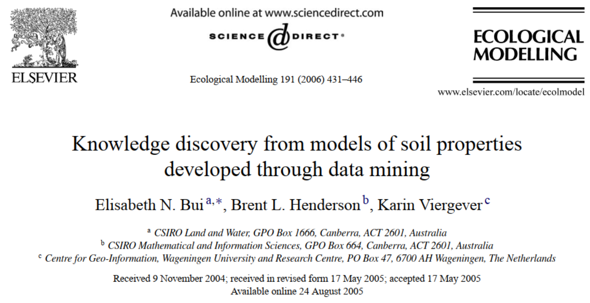
```

<!-- Annotations -->
<div class="notes"><p style="font-size:16px">
La idea de utilizar el aprendizaje de máquina y la minería de datos, que son elementos básicos de la caja de herramientas del MDS, para descubrir nuevos conocimientos no es novedad. Hace mucho tiempo se intenta utilizar los resultados del MDS para ir más allá de la producción de mapas.
<br><br>
Como las bases de datos utilizadas en el MDS generalmente son grandes para ser analizadas, se espera que los patrones de asociación capturados por los algoritmos de minería de datos puedan ser traducidos en conocimiento pedológico causal.
<br><br>
Una de las grandes dificultades para hacer esto reside en la complejidad de los algoritmos de minería de datos, como las redes neuronales artificiales, por ejemplo. No es casual que estos métodos se llaman cajas negras: son muy eficientes en hacer predicciones precisas usando los patrones encontrados en los datos, pero estos patrones encontrados raramente pueden ser traducidos en conocimiento causal comprensible por los humanos.
</p></div>
<!-- Annotations -->

## Pasos del descubrimiento de conocimiento

```{r, echo = FALSE, fig.align = 'center', out.width='65%'}
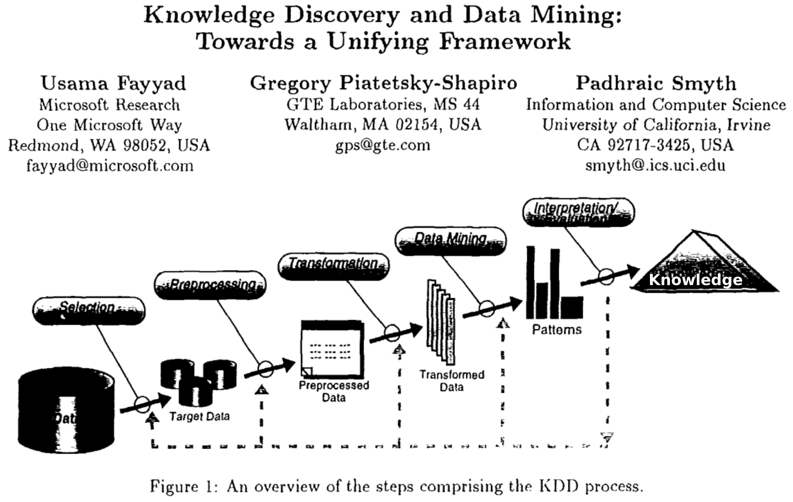
```

<!-- Annotations -->
<div class="notes"><p style="font-size:16px">
El proceso de descubrimiento de conocimiento en bases de datos usando minería de datos fue descrito por primera vez en los años 1980. En general, el proceso consiste en los siguientes pasos:
<br>
En primer lugar se seleccionan los datos que se utilizarán efectivamente.
<br>
A continuación, estos datos son preprocesados, por ejemplo, para la eliminación de observaciones incompletas.
<br>
El tercer paso trata de la transformación de los datos, por ejemplo, estandarización, normalización, entre otros.
<br>
El cuarto paso es aquel en que se elige y aplica los métodos de minería de datos para capturar los patrones de asociación entre los datos.
<br>
El quinto y último paso es el de la interpretación y la evaluación de los resultados. Si es necesario, se repiten los pasos anteriores hasta que se encuentren resultados concluyentes que lleven a la construcción de nuevo conocimiento del área.
</p></div>
<!-- Annotations -->

## Pasos del mapeo digital del suelo

```{r, echo = FALSE, fig.align = 'center'}
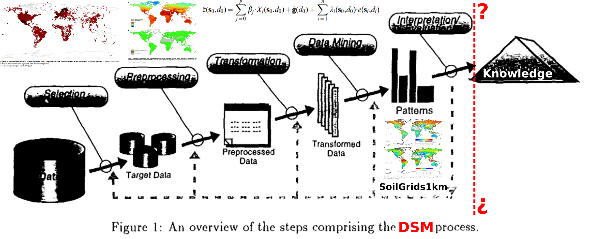
```

<!-- Annotations -->
<div class="notes"><p style="font-size:16px">
En el contexto del MDS, que aproximadamente sigue los mismos pasos, nuestra preocupación es con la posibilidad de construcción de nuevo conocimiento del área, conocimiento pedológico causal.
<br><br>
En esta secuencia de pasos mostrada anteriormente, la producción de mapas del suelo forma parte del paso de extracción de los patrones de asociación entre los datos del suelo y los datos de las covariables. La producción del mapa, en sí, precede al paso de interpretación y evaluación.
<br><br>
Tradicionalmente, en el MDS, el paso de interpretación y evaluación consiste en el cálculo de estadísticas de calidad de los mapas, o más precisamente en la validación de los mapas, donde se calculan medidas como el error medio, el error cuadrático medio, y así sucesivamente.
<br><br>
Así, la mayor parte de los trabajos científicos del área abordan los diferentes componentes del MDS con la meta de mejorar esas estadísticas de calidad, pues son una manera objetiva y clara de evaluación.
</p></div>
<!-- Annotations -->

## ¿Cómo y dónde recoger los datos del suelo?

```{r, echo = FALSE, fig.align = 'center', out.width='100%'}
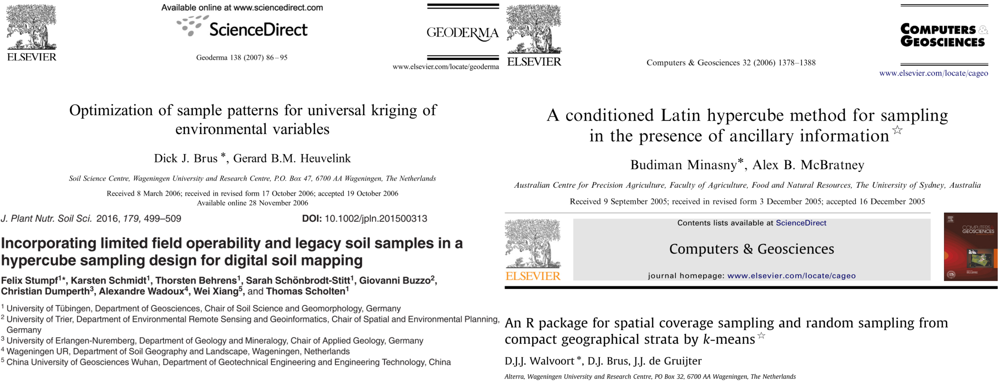
```

<!-- Annotations -->
<div class="notes"><p style="font-size:16px">
Por ejemplo, varios investigadores estudiaron la mejor manera de decidir sobre los lugares de recolección de las muestras de suelo para el MDS de manera a minimizar alguna medida de incertidumbre o error de los modelos estadísticos.
<br><br>
Esto es de extrema importancia porque cada tipo de modelo estadístico que se puede utilizar tiene demandas completamente distintas.
<br><br>
Los modelos de regresión lineal exigen un tipo de configuración de muestreo, que es diferente de la mejor configuración de la muestra para la geoestadística y el krigado, que también son demandas diferentes de las de un algoritmo de aprendizaje de máquina como una red neuronal artificial.
</p></div>
<!-- Annotations -->

## ¿Qué modelos estadísticos utilizar?

```{r, echo = FALSE, fig.align = 'center', out.width='100%'}
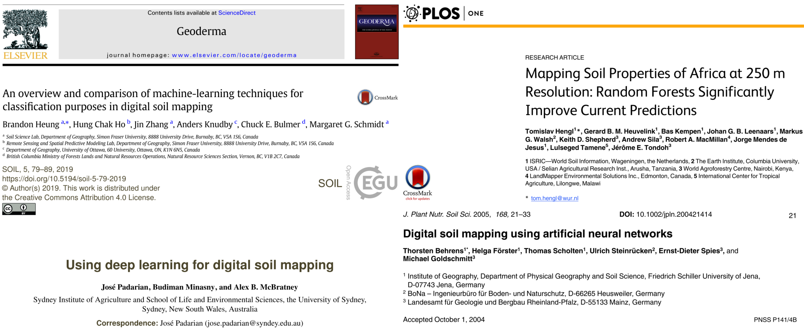
```

<!-- Annotations -->
<div class="notes"><p style="font-size:16px">
Numerosos investigadores intentaron resolver el problema de decidir qué modelo estadístico utilizar. Después de todo, hay cientos de modelos y algoritmos de minería de datos a nuestra disposición. Y periódicamente se crean nuevos algoritmos, y estos algoritmos pueden resultar útiles para el MDS. Entonces se hace necesario evaluar los mismos y esa evaluación se hace en función de las estadísticas de calidad de los mapas.
<br><br>
Una solución para la elección de los modelos que ha crecido en popularidad es su combinación, es decir, el uso de múltiples modelos diferentes combinados. Como cada uno captura diferentes estructuras de asociación en los datos, su uso conjunto aumenta las posibilidades de producir mapas más precisos.
<br><br>
Pero al mismo tiempo esto hace que la construcción de conocimiento causal prácticamente imposible.
</p></div>
<!-- Annotations -->

## ¿Cuáles covariables utilizar?

```{r, echo = FALSE, fig.align = 'center', out.width='100%'}
knitr::include_graphics("img/papers-covariates.png")
```

<!-- Annotations -->
<div class="notes"><p style="font-size:16px">
Uno de los pasos del MDS en que más se ha intentado insertar conocimiento pedológico causal es la selección de las covariables. Esto parte del principio de que las covariables pueden ser interpretadas como substitutas de los factores de formación. Sería responsabilidad del científico seleccionar las covariables en función de su capacidad de representar los factores de formación y el conocimiento ya existente.
<br><br>
Sin embargo, al igual que los modelos estadísticos, el número de covariables disponibles para el MDS aumenta todos los días, fruto principalmente del avance de la detección remota. Como los datos de las muestras del suelo siempre son limitados, también se limita el número de covariables que se pueden utilizar en el MDS. Y como ese volumen de datos ya es bastante grande para ser interpretado por un ser humano, la definición de cuáles covariables usar casi siempre será definido por el modelo y dependerá de las estadísticas de calidad de los mapas.
</p></div>
<!-- Annotations -->

## Inclusión de conocimiento pedológico

```{r, echo = FALSE, fig.align = 'center', out.width='100%'}
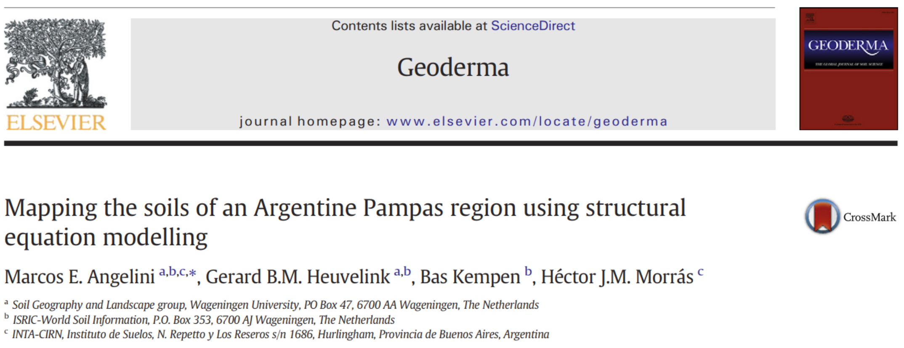
```

<!-- Annotations -->
<div class="notes"><p style="font-size:16px">
En general, los modelos de MDS construidos dando mucho énfasis a la inclusión de conocimiento pedológico causal producen mapas cuyas estadísticas de calidad son bastante malas.
<br><br>
Un trabajo muy interesante que recomiendo que todos ustedes lean fue desarrollado por un colega del INTA, Marcos Angelini. Este trabajo muestra un enfoque completamente diferente de MDS, basado fundamentalmente en las relaciones causales conocidas entre los factores de formación del suelo, y cómo éstas determinan la variación conjunta de diversas propiedades del suelo.
<br><br>
Los resultados de este estudio mostraron que es posible insertar conocimiento pedológico causal en los diferentes pasos del MDS. Pero el costo tal vez ha sido muy alto, pues las estadísticas de calidad de los mapas generados cuestionan fuertemente su utilidad práctica.
<br><br>
En resumen, parece que la inclusión del conocimiento causal y la eficiencia predictiva andan en direcciones opuestas en el MDS.
</p></div>
<!-- Annotations -->

## Importancia de las covariables

```{r, echo = FALSE, fig.align = 'center', out.width='80%'}
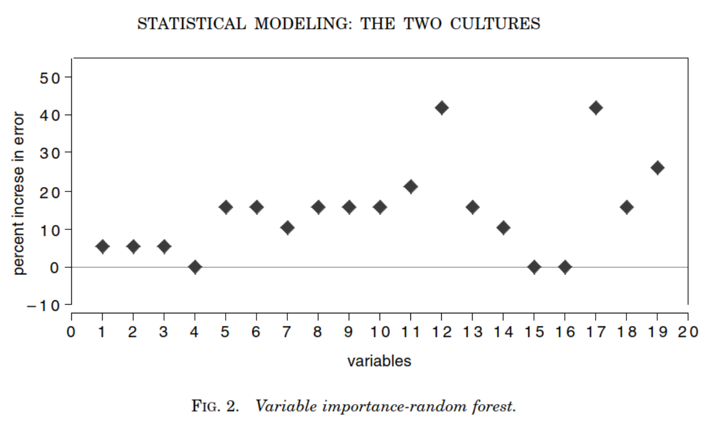
```

<!-- Annotations -->
<div class="notes"><p style="font-size:16px">
En lo que se refiere a la extracción de conocimiento causal nuevo a partir del MDS, una de las estrategias que más ha sido utilizadas consiste en, nuevamente, interpretando las covariables como representantes de los factores de formación, calcular medidas de importancia de esas covariables para inferir sobre la formación del suelo.
<br><br>
Las medidas de importancia de los algoritmos de minería de datos se crearon exactamente para permitir cierto grado de interpretabilidad a los resultados de estos modelos. Serían medidas aproximadamente comparables a los coeficientes de un modelo de regresión.
<br><br>
Tenemos aquí un ejemplo, tomado del artículo de Leo Breiman que mencioné al principio de la conferencia. Cuanto más importante es una covariable, mayor sería el aumento del error del modelo si fuera retirada del mismo. Así las covariables que aparecen en la parte superior del gráfico serían las más importantes, mientras que aquellas con valor próximo de cero podían ser descartadas del modelo.
</p></div>
<!-- Annotations -->

## Validación de mapas del suelo

```{r, echo=FALSE, fig.align='center', out.width='85%'}
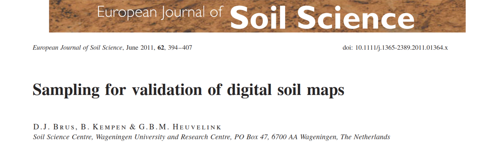
```

<!-- Annotations -->
<div class="notes"><p style="font-size:16px">
Antes de continuar con las medidas de importancia de las covariables, quiero destacar un aspecto muy importante del MDS que es la validación de los mapas del suelo y el cálculo de medidas de calidad. Este es un paso fundamental de la producción de información espacial del suelo que sea efectivamente útil para sus usuarios.
<br><br>
El MDS se destaca por la preocupación en proporcionar a sus usuarios medidas que indican cuánto las informaciones del suelo se acercan a la realidad, medidas que permiten tomar la decisión de usar o no una información de manera más clara, más objetiva.
</p></div>
<!-- Annotations -->

## Descubrimiento del conocimiento

```{r, echo=FALSE, fig.align='center', out.height='100%'}
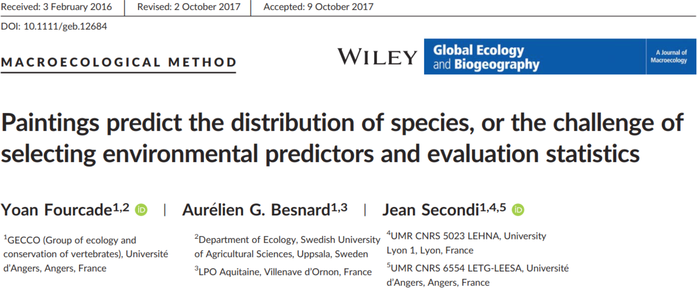
```

<!-- Annotations -->
<div class="notes"><p style="font-size:16px">
El problema fundamental que enfrentamos aquí es que la validación de los mapas usando estadísticas puntuales puede no ser suficiente, sobre todo si estamos interesados en incluir o extraer conocimiento pedológico causal de los ejercicios de MDS.
<br><br>
Un trabajo muy interesante, publicado hace tres años, trajo a la luz una deficiencia de las estadísticas de calidad usadas en la validación de los modelos predictivos, pero también un problema relacionado con los propios modelos predictivos, las técnicas de minería de datos usadas para capturar patrones de asociación.
<br><br>
Los autores de este trabajo notaron que los algoritmos de aprendizaje de máquina siempre extraen algún patrón de asociación en los datos espaciales. Para ello, basta que los datos de las covariables tuvieran alguna estructura de correlación espacial, presentar alguna variación espacial autocorrelacionada.
</p></div>
<!-- Annotations -->

## ¿Descubrimiento del conocimiento?

```{r, echo=FALSE, fig.align='center', out.width='65%'}
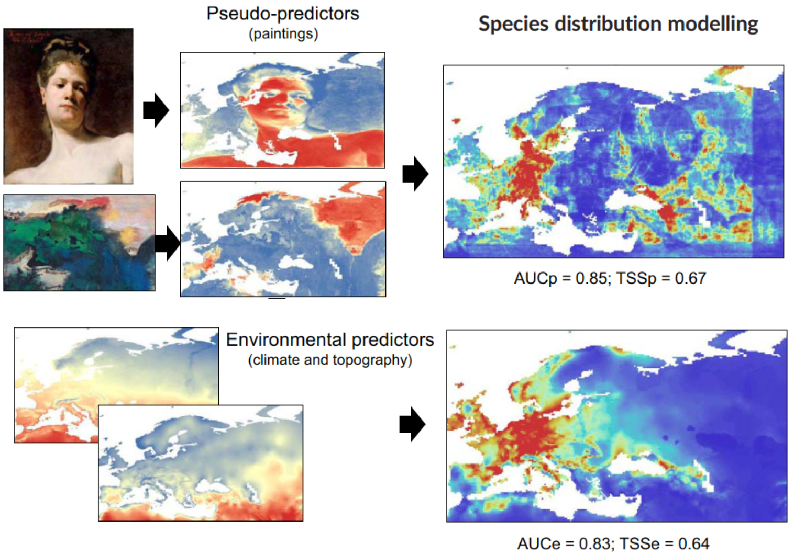
```

<!-- Annotations -->
<div class="notes"><p style="font-size:16px">
¡Así que ellos decidieron usar pinturas como covariables! ¡Eso mismo, pinturas!
<br><br>
Aquí, en la esquina superior izquierda de la pantalla, tenemos dos pinturas que fueron georeferenciadas y procesadas para servir de covariables en un modelo de distribución espacial de especies. En la esquina inferior izquierda están covariables tradicionales que pueden ser interpretadas como relacionadas con los factores ambientales que controlan la distribución espacial de las especies. En el lado derecho están las predicciones de los modelos construidos usando cada uno de los conjuntos de covariables.
<br><br>
Veamos que el patrón general de mapas es aproximadamente el mismo, así como las estadísticas de calidad. Según esas estadísticas, podríamos usar cualquiera de los mapas.
<br><br>
¿Cómo vamos a explicar la importancia de una pintura desde el punto de vista causal para la distribución espacial de especies? ¿Y la formación del suelo?
</p></div>
<!-- Annotations -->

# Consideraciones finales

## Revisión

* Primeros pasos del modelado del suelo: entender las __causas__ de la variación para luego hacer __prediciones__.
* Propuesta compleja y falta de datos de los factores de formación
* Detección remota y minería de datos para predicción del suelo
* Mapeo digital del suelo
* Desafíos del mapeo digital del suelo es integrar el conocimiento pedológico

<!-- Annotations -->
<div class="notes"><p style="font-size:16px">
Nosotros hemos visto que los primeros pasos del modelado cuantitativo del suelo consistían en, primero, explicar las causas verdaderas de la variación espacial y temporal del suelo para solamente entonces hacer predicciones espaciales y temporales. La complejidad de esta propuesta y la falta de datos de los factores de formación del suelo impidieron que la meta fuera alcanzada.
<br><br>
Como alternativa, los productos de la detección remota pasaron a ser usados como __substitutos__ de los factores de formación y los algoritmos usados para resolver la ecuación, en lugar de preocuparse por las causas verdaderas de la variación del suelo, se limitan a identificar y cuantificar los patrones de asociación existentes en las bases de datos. ¡Su meta es la predicción!
<br><br>
Hoy el MDS mira a los primeros pasos del modelado cuantitativo del suelo preocupado sobre cómo hacer para insertar conocimiento pedológico causal en su ejecución y extraer conocimiento nuevo. El dilema es que la explicación y la predicción parecen caminar en direcciones opuestas.
</p></div>
<!-- Annotations -->

## Preguntas (aún) sin respuesta

1. ¿Debemos preocuparnos en insertar conocimiento pedológico causal en la ejecución del MDS?
2. ¿Debemos preocuparnos en generar conocimiento pedológico __causal__ nuevo con el MDS?

Si es así, cómo hacer esto cuando los modelos utilizados se preocupan sólo con la __asociación__ entre los datos? ¿Cómo interpretar pedologicamente modelos estadísticos creados sin el propósito de ser interpretados o comprendidos? ¿Cómo medir la razonabilidad pedológica de los productos del MDS además de las estadísticas del error de predicción?

<!-- Annotations -->
<div class="notes"><p style="font-size:16px">
Y llegamos al final de la conferencia con las mismas preguntas aún sin respuesta.
<br><br>
¿Es que realmente debemos preocuparnos por insertar el conocimiento pedológico causal en la ejecución del MDS cuando la experiencia demuestra que esto suele llevar a predicciones de menor calidad?
<br><br>
¿Es que realmente debemos preocuparnos en generar conocimiento pedológico __causal__ nuevo con el MDS cuando la experiencia demuestra que este tipo de interpretación de los resultados de la minería de datos es muy frágil y de confiabilidad limitada?
</p></div>
<!-- Annotations -->

## Para reflejar

> Los mapas de suelo muestran la disposición regional de las propiedades y los tipos del suelo, pero no permiten conocer las relaciones "causales". La curva, por otra parte, revela la dependencia de las propiedades del suelo con respecto a los factores que forman el suelo, pero la conversión de dicho conocimiento fundamental a condiciones de campo específicas es imposible a menos que se conozca la distribución regional de los formadores de suelo. [@Jenny1941]

Tal vez sea más apropiado usar la biogeoquímica y el modelado mecanístico de la evolución del suelo y del paisaje para explicar las causas de la formación del suelo y su funcionamiento.

<!-- Annotations -->
<div class="notes"><p style="font-size:16px">
Termino con el fragmento de las conclusiones del libro de Hans Jenny mostrado al principio de la conferencia, porque pienso que puede ayudar a responder a algunas de las dudas que tenemos hoy en el MDS.
<br><br>
Tal vez sea más apropiado usar la biogeoquímica y el modelado mecanístico de la evolución del suelo y del paisaje si queremos realmente explicar las causas de la formación del suelo y su funcionamiento.
<br><br>
Mientras tanto, el MDS podría dedicarse sólo a la definición de estrategas para producir información espacial cada vez más precisa y útil.
<br><br>
Pero, no seré yo quien responderá a estas preguntas y, por lo tanto, espero que ustedes estén interesados en ayudar a resolver algunos de los problemas fundamentales del MDS (que no son pocos!).
</p></div>
<!-- Annotations -->

---

<div class="centered">
¡Muchas gracias por su atención!

Alessandro Samuel-Rosa (alessandrorosa@utfpr.edu.br)
</div>

```{r, echo=FALSE, fig.align='center', out.width='65%'}
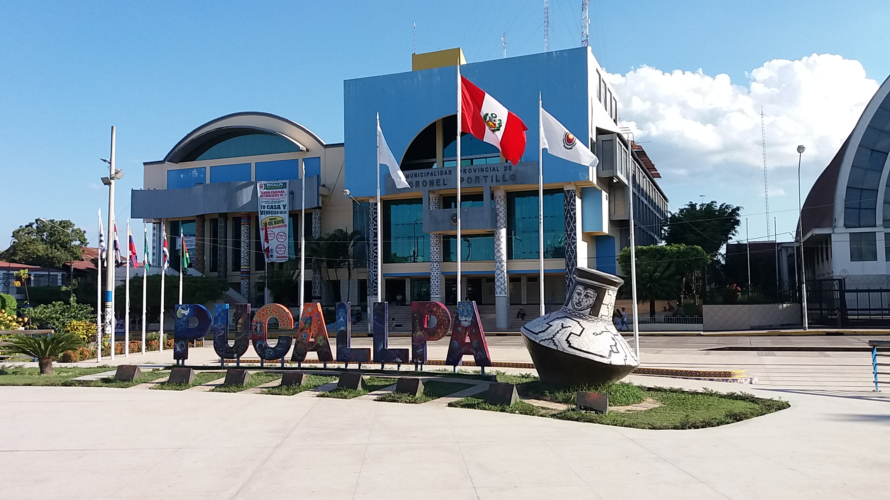
```

# Referencias

## Referencias {.tiny}
