<script src="https://ajax.googleapis.com/ajax/libs/jquery/1.12.2/jquery.min.js"></script>
<script>
    $(document).ready(function() {
    $('slide:not(.title-slide, .backdrop, .segue)').append('<footer></footer>');
    $('footer').attr('label', 'Samuel-Rosa (2019) Minicurso de Mapeamento Digital do Solo');
  })
</script>

```{r, echo=FALSE, include=FALSE}
library(magrittr)
```

# Estrutura do minicurso

## Estrutura do minicurso

* Motivação
* Preparação do ambiente computacional
* Bases do mapeamento digital do solo
* Dados do solo
* Dados das covariáveis
* Modelos (geo)estatísticos
* Incerteza das predições
* Validação das predições
* Vamos praticar?

# Motivação

## Produção de informação espacial do solo

```{r, echo=FALSE, fig.align='center', fig.asp=1, fig.cap='Temos informação apenas onde amostramos o solo', out.width='45%'}
data(meuse, package = 'sp')
data(meuse.area, package = 'sp')
plot(meuse.area, type = 'l', axes = FALSE, xlab = '', ylab = '')
points(meuse[c("x", "y")], pch = 20, col = 'firebrick')
grid()
```

## SoilGrids

```{r, echo=FALSE, fig.align='center', out.width='75%', fig.cap='Você já conhece esse portal/aplicativo?'}
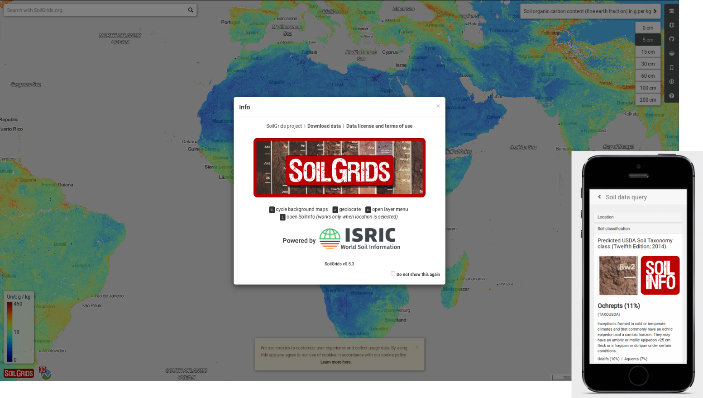
```

# Preparação do ambiente computacional

## Preparação do ambiente computacional

* Instalação do QGIS e R
  + Complementos do QGIS
  + Pacotes do R
* Descarregamento dos dados -- área de estudo no sul do Brasil
  + Dados do solo
  + Dados das covariáveis

* Mais detalhes em https://samuel-rosa.github.io/teaching/minicurso-mds/

# Bases do MDS

## Histórico, conceitos e definições

Em 1886, o cientista russo, Vasily Vasili'evich Dokuchaev, postulou que:

> "qualquer... solo é sempre e em qualquer lugar mera função dos seguintes fatores de formação: (1) a natureza (conteúdo e estrutura) da rocha parental; (2) o clima do terreno; (3) a massa e carácter da vegetação; (4) a idade do terreno; e, finalmente, (5) a topografia do terreno."

Equação dos fatores de formação do solo -- modelo CLORPT:

s = f(cl, o, r, p, t, ...)

## Histórico, conceitos e definições

```{r, echo = FALSE, fig.align = 'center'}
knitr::include_graphics("img/florinsky.png")
```

> Resulta que (a) se os _fatores_ mencionados são os mesmos em dois locais diferentes (por muito separados que estejam), os solos resultantes nos dois locais também devem ser similares, e vice-versa; em consequência, (b) se tivermos estudado a fundo esses fatores, _podemos predizer de antemão_ como deveria ser o solo. (@Florinsky2012)

## Componentes básicos

```{r, echo=FALSE, fig.align='center', out.width='85%'}
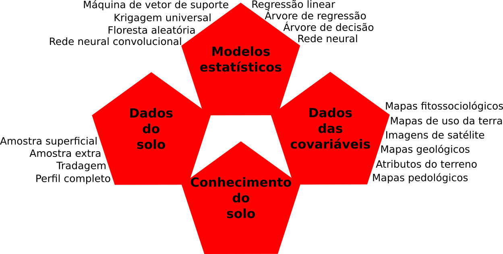
```

# Dados do solo

## Dados do solo

- Variável resposta ou variável dependente
    + Representação: $Y$
- Natureza
    + Qualitativa (ordinal ou nominal) ou quantitativa (contínua ou discreta)
- Suporte amostral
    + Areal ou pontual
- Latitude e longitude
    + Representação: $\boldsymbol{s}$
- Uma observação de uma variável do solo: $y(\boldsymbol{s}_i)$

## Fontes de dados do solo

Existem duas fontes principais de dados do solo:

- Dados preexistentes
    + Dados legados, coletados nas muitas décadas passadas
    + Deixados para as próximas gerações
    + Disponíveis em repositórios de dados
- Amostragem no campo
    + Amostragem não-probabilística (otimização amostral -- calibração dos modelos)
    + Amostragem probabilística (amostragem aleatória simples ou estratificada -- validação dos modelos)
    
## Fontes de dados preexistentes {.columns-2}

No Brasil, existem múltiplas fontes de dados legados do solo

A principal fonte de dados é o Repositório Brasileiro Livre para Dados Abertos do Solo (febr)

URL: http://www.ufsm.br/febr/

```{r, fig.align='center', echo=FALSE, out.width='100%'}
knitr::include_graphics("img/febr-observacao-espaco.png")
```

## Amostragem no campo

```{r, fig.align='center', echo=FALSE, out.width='55%'}
knitr::include_graphics("img/sampling.jpg")
```

# Dados das covariáveis

## Dados das covariáveis

- Indicadores dos fatores de formação do solo
- Variáveis explicativas, variáveis preditoras, variáveis independentes
- Covariação espacial e/ou temporal

## Dados das covariáveis

s = f(s, c, o, r, p, a, n)

- s, solo
- c, clima
- o, organismos
- r, relevo
- p, material de origem
- a, idade
- n, coordenadas espaciais

[@McBratneyEtAl2003]

## Precipitação pluviométrica

```{r, echo=FALSE, fig.align='center', out.width='95%'}
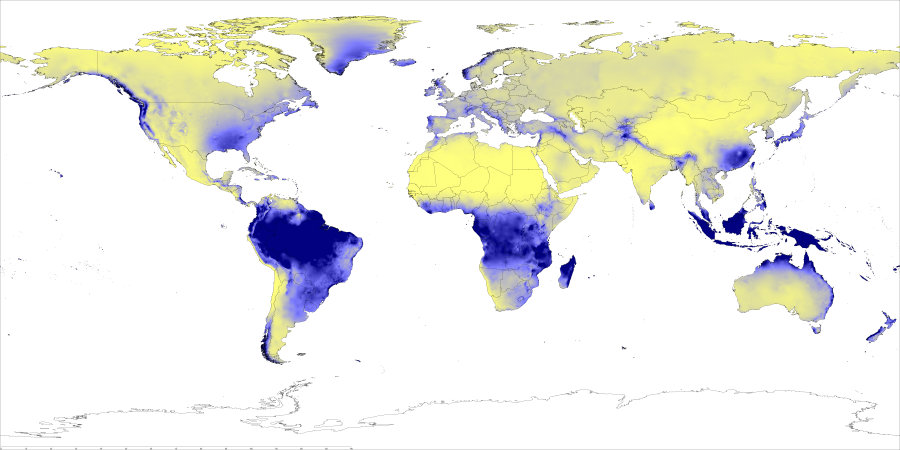
```

## Índice de área foliar

```{r, echo=FALSE, fig.align='center', out.width='95%'}
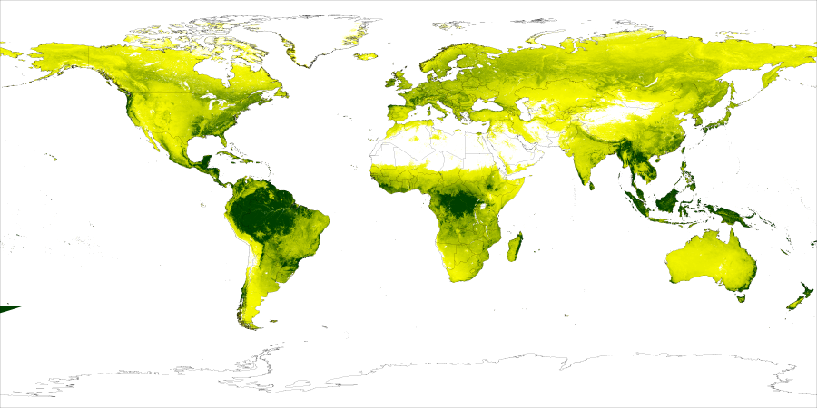
```

## Índice de umidade topográfica

```{r, echo=FALSE, fig.align='center', out.width='95%'}
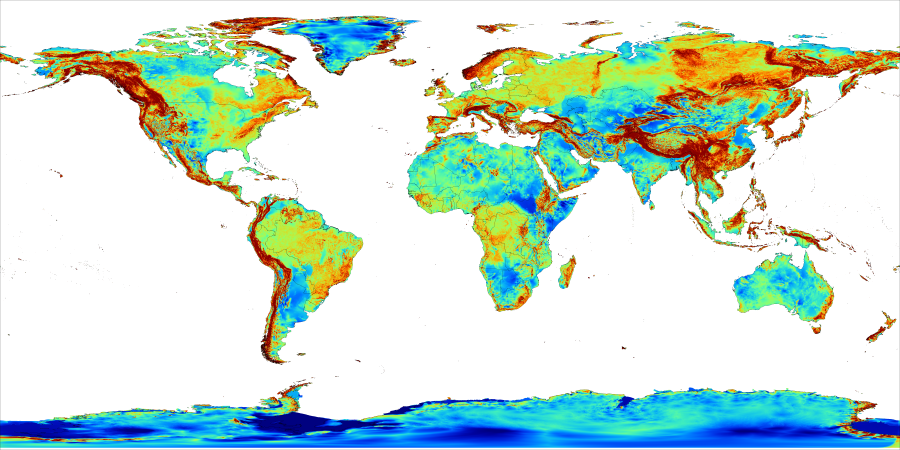
```

## Idades geológicas

```{r, echo=FALSE, fig.align='center', out.width='95%'}
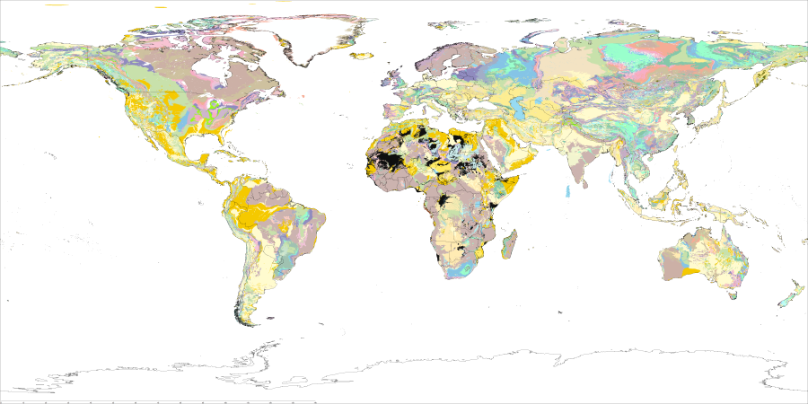
```

## Duas covariáveis "novas"

O modelo SCORPAN possui dois elementos bastante diferentes do modelo CLORPT

s = f(__s__, c, o, r, p, a, __n__)

- __n__ são as coordenadas espaciais (latitude e longitude, ou _northing_ e _easting_)
- __s__ são informações preexistentes do solo (mapas pedológicos antigos)

Vejamos dois exemplos!

## Precipitação pluviométrica (latitude)

```{r, echo=FALSE, fig.align='center', out.width='95%'}

```

## Informações preexistentes do solo

Podemos pensar nas informações preexistentes do solo da seguinte maneira:

s' = f(c', o', r', p', a', n')

s = f(c', o', r', p', a', n', c, o, r, p, a, n)

## Grupo de solo dominante

```{r, echo=FALSE, fig.align='center', out.width='95%'}
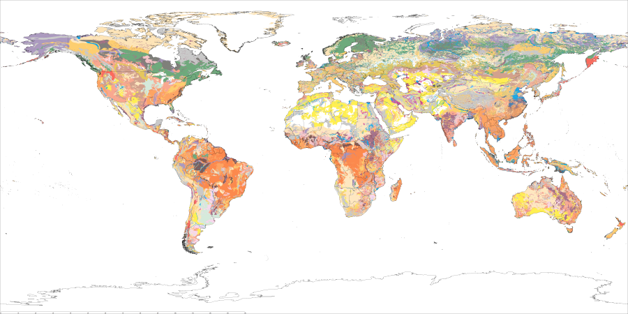
```

# Modelos (geo)estatísticos

## Dados do solo e covariáveis (calibração)

Temos um conjunto de _n_ = 100 observações com coordenadas espaciais (latitude e longitude) e dados da variável do solo (argila) e das covariáveis espaciais (elevação e declividade)

```{r, echo=FALSE}
data.frame(
  observação = c("001", "002", "...", "100"),
  latitude = c("-31,45", "-32,14", "...", "-33,78"),
  longitude = c("-53,14", "-53,79", "...", "-52,99"),
  argila = c(450, 460, "...", 350),
  elevacao = c(100, 97, "...", 10),
  declividade = c(5, 6, "...", 1)
) %>% 
  knitr::kable()
```

## Dados das covariáveis (predição)

Queremos saber o valor da variável do solo (argila) em três locais onde temos apenas dados das covariáveis espaciais (elevação e declividade)

```{r, echo=FALSE}
data.frame(
  observacao = c("101", "102", "103"),
  latitude = c("-31,46", "-31,12", "-31,88"),
  longitude = c("-53,24", "-54,79", "-54,15"),
  argila = c("?", "?", "?"),
  elevacao = c(88, 102, 77),
  declividade = c(25, 4, 1)
) %>% 
  knitr::kable()
```

Para fazer isso, primeiro usamos os dados da tabela completa para construir (calibrar) um modelo (geo)estatístico. Com o modelo (geo)estatístico, predizemos o valor da variável do solo na tabela imcompleta.

## Modelos (geo)estatísticos

No mapeamento digital do solo utilizamos modelos (geo)estatísticos para tratar a variação espacial do solo

$$Y(\boldsymbol{s}) = \mu(\boldsymbol{s}) + Z(\boldsymbol{s}) + \varepsilon(\boldsymbol{s})$$

- $Y(\boldsymbol{s})$ -- característica (variável) do solo
- $\mu(\boldsymbol{s})$ -- ___características do ambiente___ (neste minicurso)
- $Z(\boldsymbol{s})$ -- dependência espacial
- $\varepsilon(\boldsymbol{s})$ -- erro

## Modelos (geo)estatísticos

* O uso de modelos (geo)estatísticos tem implicações na maneira como entendemos e representamos a propriedade do solo sendo mapeada
  + Endentemos uma propriedade do solo como uma variável aleatória
  + Representamos uma variável aleatória usando uma função de distribuição de probabilidade
* Variáveis aleatórias qualitativas (classe de solo, classe textural):
  + $Y(\boldsymbol{s})$ = $p$[LV] + $p$[NV] + $p$[RR] + $p$[GX] = 0,70 + 0,25 + 0,03 + 0,02 = 1,00
- Variáveis aleatórias quantitativas (conteúdo de argila, pH, conteúdo de carbono):
  + $Y(\boldsymbol{s})$ = 12,45 g kg^-1^ $\pm$ 2,27 g kg^-1^

## Regressão linear simples

```{r, echo=FALSE, fig.align='center', out.width='50%'}
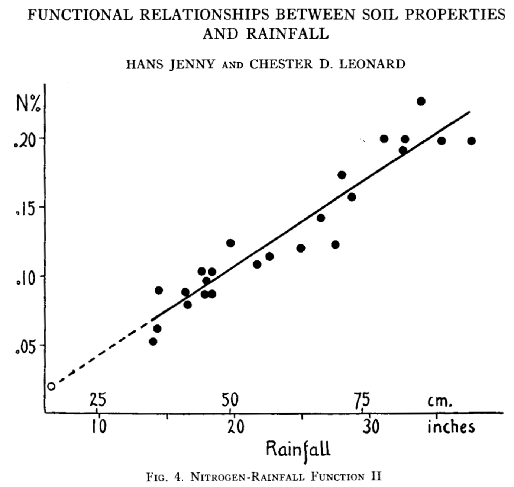
```

## Árvore de classificação e regressão

```{r, echo=FALSE, fig.align='center', out.width='45%'}
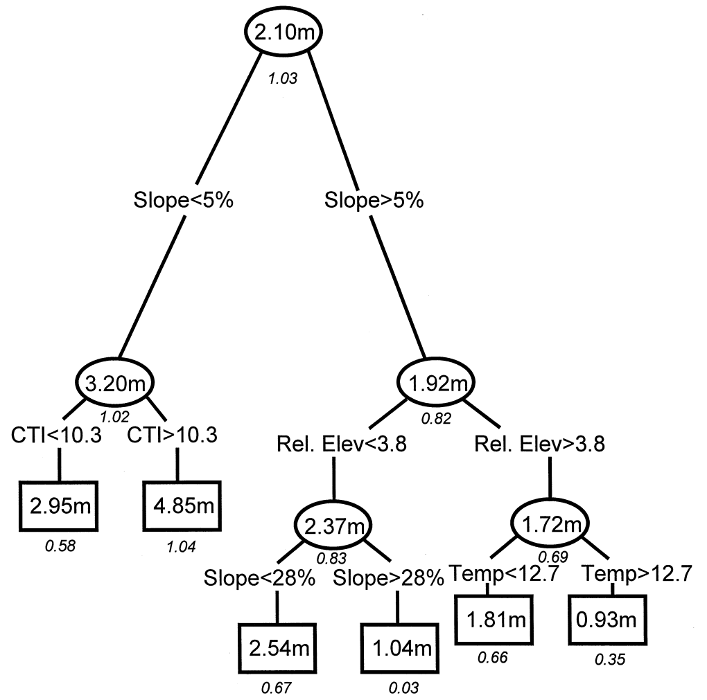
```

## Análise discriminante linear

```{r, echo=FALSE, fig.align='center', out.width='75%'}
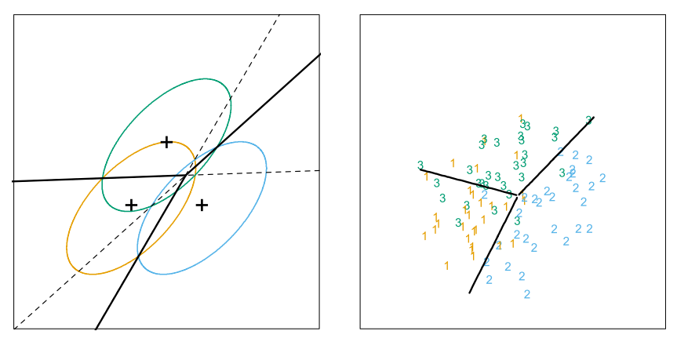
```

## Máquina de vetor de suporte

```{r, echo=FALSE, fig.align='center', out.width='75%'}
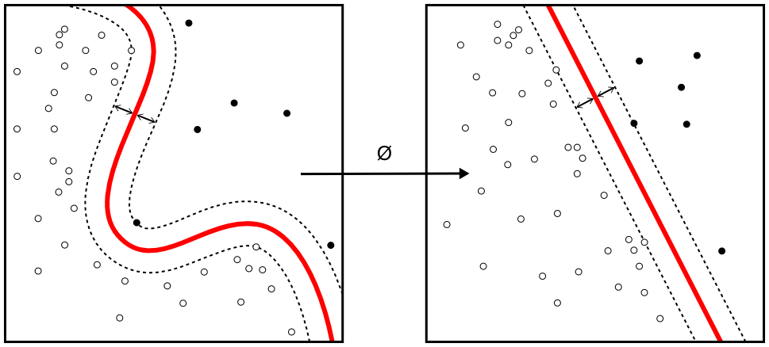
```

# Incerteza das predições

## Representação da incerteza

Uma aspecto muito importante do MDS é sua capacidade de informar a ___incerteza___ sobre as predições

A incerteza advém do fato de estarmos "adivinhando" -- predizendo -- os valores das variáveis do solo sem coletar amostras do solo

* A maneira de representar a incerteza depende do tipo de variável do solo sendo mapeada
  + Variáveis quantitativas: desvio padrão e intervalo de predição
  * Variáveis qualitativas: pureza teórica, entropia de Shannon e índice de confusão

## Desvio padrão {.columns-2}

O desvio padrão de uma variável é uma medida bastante conhecida

Aqui temos como exemplo uma variável com distribuição normal e representações de seu desvio padrão $\sigma$

```{r, echo=FALSE, fig.align='center', out.width='100%'}
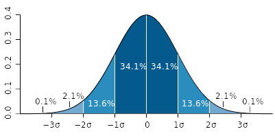
```

## Desvio padrão

Predições do conteúdo de argila na camada superficial do solo (esquerda) e o desvio padrão do erro dessas predições (direita) como medida de incerteza

```{r, echo=FALSE, fig.align='center', out.width='80%'}
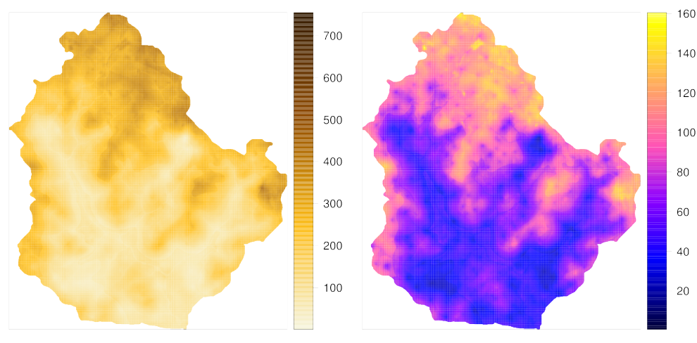
```

## Intervalo de predição

O intervalo de predição é representado como uma faixa (faixa de valores mais prováveis de serem encontrados no campo) em torno do valor predito (valor mais provável de ser encontrado no campo)

```{r, echo=FALSE, fig.align='center', out.width='70%'}
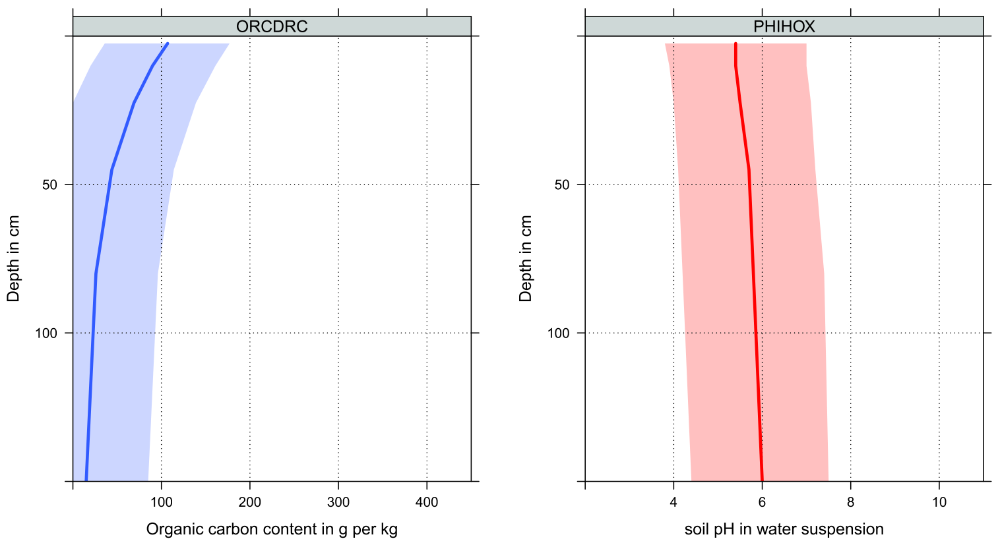
```

## Pureza teórica

Maior valor de probabilidade predita em um ponto de interesse

$$\varPi(\boldsymbol{s}) = \max\limits_{i \in k}(\hat{\pi}(y_i, \boldsymbol{s}))$$

Qual é o valor da pureza teórica?

$Y(\boldsymbol{s})$ = $p$[LV] + $p$[NV] + $p$[RR] + $p$[GX] = 0,70 + 0,25 + 0,03 + 0,02 = 1,00

```{r}
p <- c(0.70, 0.25, 0.03, 0.02)
max(p)
```

## Pureza teórica {.columns-2}

Maior valor de probabilidade predita em um ponto de interesse

* Para isso precisamos conhecer a probabilidade de ocorrência de cada uma das classes
  + A chance de encontrarmos aquela classe no campo

```{r, echo=FALSE, fig.align='center', out.width='100%'}
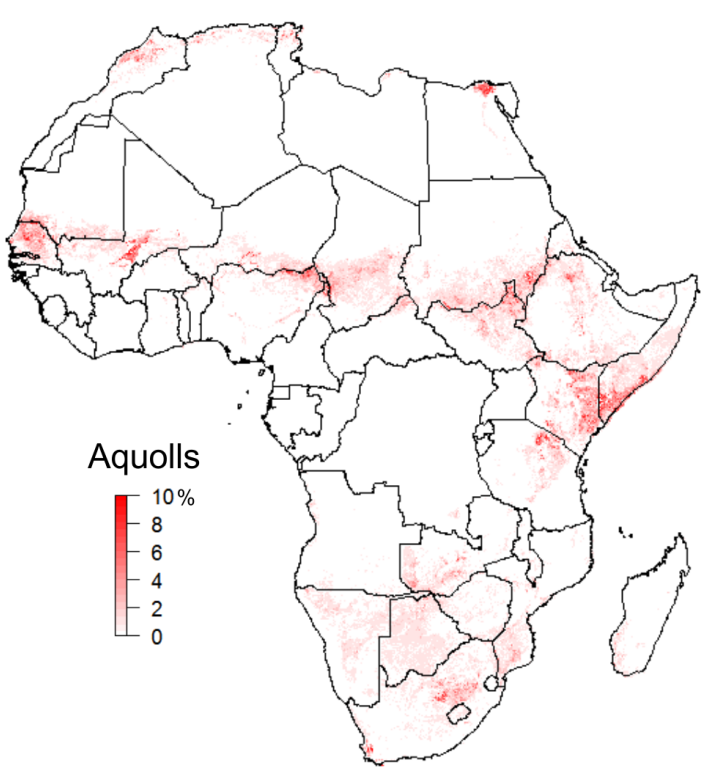
```

## Entropia de Shannon

Grau de "desordem" das predições

$$H(\boldsymbol{s}) = - \sum_{i = 1}^k \hat{\pi}(y_i, \boldsymbol{s})\log_k\hat{\pi}(y_i, \boldsymbol{s})$$

Qual é o valor da entropia de Shannon?

$Y(\boldsymbol{s})$ = $p$[LV] + $p$[NV] + $p$[RR] + $p$[GX] = 0,70 + 0,25 + 0,03 + 0,02 = 1,00

```{r}
p <- c(0.70, 0.25, 0.03, 0.02)
-sum(p * log(p, base = length(p)))
```

## Entropia de Shannon {.columns-2}

Grau de "desordem" das predições

* Uma medida da dificuldade que o modelo (geo)estatístico tem para decidir, entre ___todas as classes existentes___, qual é a classe mais provável de encontrar em um determinado local
  + Quanto maior a entropia, maior a dificuldade encontrada pelo modelo

```{r, echo=FALSE, fig.align='center', out.width='100%'}
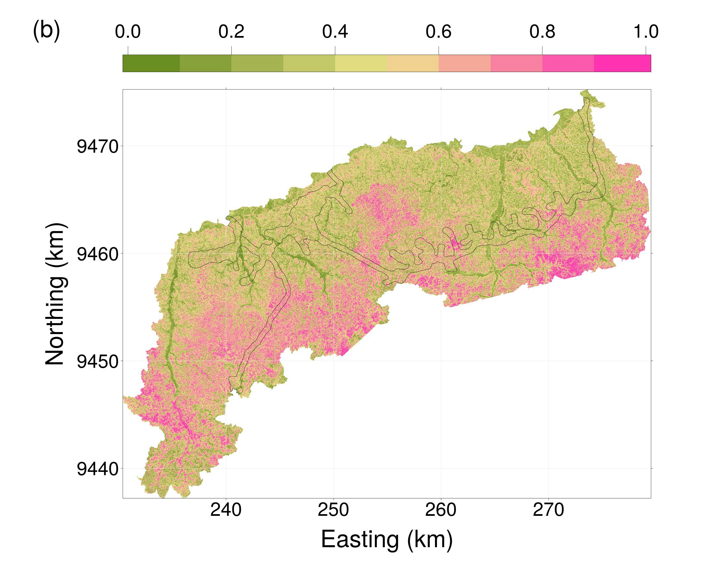
```

## Índice de confusão

Confusão entre as duas classes mais prováveis

$$CI(\boldsymbol{s}) = 1 - (\max\limits_{i \in k}(\hat{\pi}(y_i, \boldsymbol{s})) - \max\limits_{i \in k-1}(\hat{\pi}(y_i, \boldsymbol{s})))$$

Qual é o valor do índice de confusão?

$Y(\boldsymbol{s})$ = $p$[LV] + $p$[NV] + $p$[RR] + $p$[GX] = 0,70 + 0,25 + 0,03 + 0,02 = 1,00

```{r}
p <- c(0.70, 0.25, 0.03, 0.02)
1 - (max(p) - max(p[-which.max(p)]))
```

## Índice de confusão {.columns-2}

Assim como a entropia, é uma medida da "desordem" das predições

* A principal diferença é que meda a dificuldade que o modelo (geo)estatístico tem para decidir-se entre as ___duas classes mais prováveis___ de encontrar em um determinado local
  + Quanto maior o índice de confusão, maior a dificuldade encontrada pelo modelo

```{r, echo=FALSE, fig.align='center', out.width='100%'}

```

# Validação das predições

## Validação estatística

* Feitas as predições, precisamos saber quão boas elas são -- para isso serve a validação
* Comparamos os valores preditos (argilaPred) com valores medidos no campo (argilaObs)

```{r, echo=FALSE}
data.frame(
  perfil = c("101", "102", "103"),
  latitude = c("-31,46", "-31,12", "-31,88"),
  longitude = c("-53,24", "-54,79", "-54,15"),
  argilaPred = c(542, 345, 652),
  argilaObs = c(530, 360, 648)
) %>% 
  knitr::kable()
```

## Validação cruzada

```{r, echo=FALSE, fig.align='center', out.width='50%'}

```

Dividimos os dados em grupos. Alguns grupos são usados para calibrar o modelo. Um dos grupos é usado para validar o modelo. E assim sucessivamente, até usar todos os grupos em algum momento para validar o modelo.

## Validação externa

A validação cruzada é usada quando temos pouca disponibilidade de recursos.

O mais apropriado é usar a validação externa: dados adicionais coletados especialmente para a validação do modelo

- Prova real da qualidade de um mapa
- Reduzir vieses/vícios
- Amostragem probabilística
    + Simples
    + Estratificada

## Amostragem probabilística {.columns-2}

```{r, echo=FALSE, fig.align='center', out.width='100%'}

```

```{r, echo=FALSE, fig.align='center', out.width='100%'}
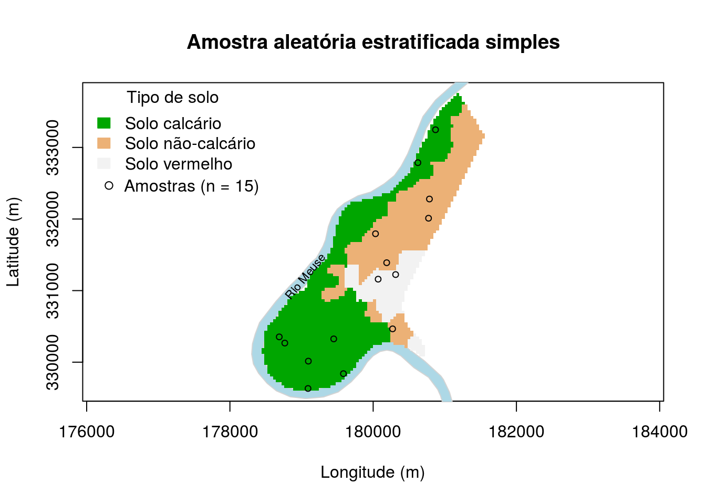
```

## Medidas de qualidade das predições

- Variáveis quantitativas
    + Erro médio -- diferença média em relação aos valores reais
    + Erro absoluto e quadrático -- dispersão dos erros
    + Raiz quadrada do erro quadrático médio -- dispersão dos erros
    + Eficiência do modelo -- quantidade de variância explicada

```{r, echo=FALSE}
data.frame(
  perfil = c("101", "102", "103"),
  latitude = c("-31,46", "-31,12", "-31,88"),
  longitude = c("-53,24", "-54,79", "-54,15"),
  argilaPred = c(542, 345, 652),
  argilaObs = c(530, 360, 648)
) %>% 
  knitr::kable()
```

## Medidas de qualidade das predições

- Variáveis quantitativas
    + Erro médio -- quanto mais próximo de zero, melhor
    + Erro absoluto e quadrático -- quanto mais baixo, melhor
    + Raiz quadrada do erro quadrático médio -- quanto mais baixo, melhor
    + Eficiência do modelo -- quanto mais próximo de um, melhor

```{r, echo=FALSE}
data.frame(
  perfil = c("101", "102", "103"),
  latitude = c("-31,46", "-31,12", "-31,88"),
  longitude = c("-53,24", "-54,79", "-54,15"),
  argilaPred = c(542, 345, 652),
  argilaObs = c(530, 360, 648)
) %>% 
  knitr::kable()
```

## Medidas de qualidade das predições

- Variáveis qualitativas
    + Pureza geral e por classe -- percentual de acerto
    + Kappa geral e por classe -- proporção de acerto comparada a um classificador aleatório

```{r, echo=FALSE}
data.frame(
  perfil = c("101", "102", "103"),
  latitude = c("-31,46", "-31,12", "-31,88"),
  longitude = c("-53,24", "-54,79", "-54,15"),
  classPred = c("LV", "NV", "RR"),
  classeObs = c("NV", "LV", "RR")
) %>% 
  knitr::kable()
```

## Medidas de qualidade das predições

- Variáveis qualitativas
    + Pureza geral e por classe -- quanto mais próximo de um, melhor
    + Kappa geral e por classe -- quanto mais próximo de um, melhor

```{r, echo=FALSE}
data.frame(
  perfil = c("101", "102", "103"),
  latitude = c("-31,46", "-31,12", "-31,88"),
  longitude = c("-53,24", "-54,79", "-54,15"),
  classPred = c("LV", "NV", "RR"),
  classeObs = c("NV", "LV", "RR")
) %>% 
  knitr::kable()
```

# Vamos praticar!!!

## Referências {.tiny}
