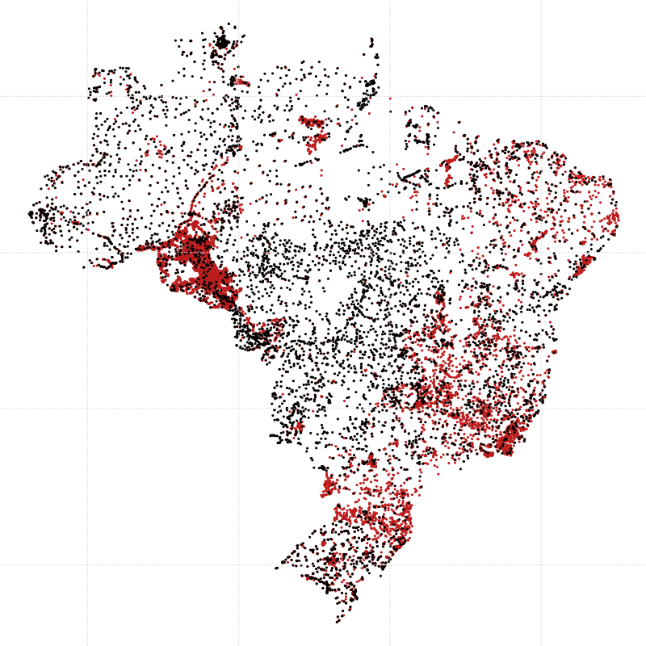

<script src="https://ajax.googleapis.com/ajax/libs/jquery/1.12.2/jquery.min.js"></script>
<script>
    $(document).ready(function() {
    $('slide:not(.title-slide, .backdrop, .segue)').append('<footer></footer>');
    $('footer').attr('label', 'Samuel-Rosa (2020) Acesso Aberto a Dados do Solo');
  })
</script>


## Quantos pontos a figura contém? {.columns-2}

* Os pontos ao lado representam locais de amostragem do solo
  * São locais para onde temos ___dados abertos do solo___

Registre sua estimativa em</br>
[www.pedometria.org/projeto/febr/](https://www.pedometria.org/projeto/febr/)
<!-- https://forms.gle/PJSjpNfkqKYjDp3H8 -->

O sócio da SBCS cuja estimativa chegar mais perto do número correto receberá um prêmio pedológico!

```{r, echo=FALSE, fig.align='center', out.width='100%'}
knitr::include_graphics("img/pontos-pronasolos.png")
```

---

<iframe src="https://docs.google.com/spreadsheets/d/e/2PACX-1vTaruWRUvvDwpU7TQ7yDNqKMYeodNr-y8HUXe_kLopBRkBcwiEEUK3Fsp1W2lpoyiL3_Pp0xPERVA9k/pubchart?oid=536920078&format=image" title="Quantos pontos a figura contém?"></iframe>

# Um pouco de história

<!-- Annotations -->
<div class="notes"><p style="font-size:16px">
Para falar sobre acesso aberto aos dados da pesquisa em ciência do solo, eu primeiro vou tentar demarcar o ponto da história da ciência do solo brasileira em que, hoje, início da terceira década do século XXI, nós nos encontramos.
</p></div>
<!-- Annotations -->

## 2020–2050

```{r, echo=FALSE, fig.align='right', out.width='60%'}
knitr::include_graphics("img/pronasolos.jpeg")
```

> Pelos próximos 30 anos, o PronaSolos envolverá dezenas de instituições parceiras, dedicadas à investigação, documentação, inventário e interpretação dos ___dados de solos___ brasileiros. O objetivo é mapear os solos de 1,3 milhão de km² do País nos primeiros dez anos, e mais 6,9 milhões de km² até 2048, em escalas que vão de 1:25.000 a 1:100.000.

<!-- Annotations -->
<div class="notes"><p style="font-size:16px">
Como já é de amplo conhecimento, recentemente fora lançado o Programa Nacional de Levantamento e Interpretação de Solos do Brasil, o PronaSolos. Coordenado pela Embrapa, o PronaSolos está planejado, inicialmente, para ter duração de três décadas, ou seja, até a metade deste século. Nesse período de 30 anos, se almeja produzir e distribuir informação atualizada e detalhada sobre o solo de todo o País. Para isso, o programa conta com inúmeras instituições parceiras de norte a sul e leste a oeste do Brasil.
</p></div>
<!-- Annotations -->

## 1970–1985

```{r, echo=FALSE, fig.align='right', out.width='50%'}
knitr::include_graphics("img/radam.png")
```

> O projeto RADAM - Radar na Amazônia – foi criado em 1970, priorizando a coleta de ___dados___ sobre recursos minerais, solos, vegetação, uso da terra e cartografia da Amazônia e áreas adjacentes da região Nordeste. Em 1975, o levantamento foi expandido para o restante do território nacional, visando o mapeamento integrado dos recursos naturais e passando a ser denominado Projeto RADAMBRASIL.

<!-- Annotations -->
<div class="notes"><p style="font-size:16px">
Ora, o PronaSolos, enquanto programa de estado, não é muito diferente do bastante conhecido Projeto RADAMBRASIL. O RADAMBRASIL, criado graças aos ótimos resultados do projeto Radar da Amazônia, também tinha a meta de produzir informação sobre recursos naturais como o solo. Naquela época, tais informações foram produzidas em um nível de detalhe que permitiu conhecer melhor o território nacional e planejar sua ocupação para diferentes usos. Assim, as informações sobre os recursos do solo e da terra produzidos pelo Projeto RADAMBRASIL foram fundamentais para a expansão da agricultura brasileira observada nas três últimas décadas do século XX.
</p></div>
<!-- Annotations -->

## E antes disso... na Rússia e EUA {.columns-2}

```{r, echo=FALSE, fig.align='right', out.width='100%'}
knitr::include_graphics("img/dokuchaev.png")
```

```{r, echo=FALSE, fig.align='right', out.width='100%'}
knitr::include_graphics("img/Dust-storm-Texas-1935.png")
```

<!-- Annotations -->
<div class="notes"><p style="font-size:16px">
Vamos voltar ainda mais no tempo e recordar os esforços de cientistas do solo na Rússia, na segunda metade do século XIX, e nos Estados Unidos, na primeira metade do século XX. Em ambos os países, problemas relacionados à produção de alimentos—a seca na Rússia e a erosão eólica nos Estados Unidos—criaram a demanda pela produção de informação do solo. Um volume de dados muito grande foi produzido nesses países—assim como na experiência brasileira com o Projeto RADAMBRASIL. Os cientistas russos e norte-americanos tiveram que desenvolver soluções inovadoras para lidar com o grande volume de dados que eles agora tinham em mãos e com a diversidade do solo que estava se revelando para eles. Dokuchaev, por exemplo, desenvolveu equações matemáticas. Nos EUA, com o volume de dados aumentando rapidamente, a solução encontrada foi criar um sistema de classificação do solo—que mais tarde deu origem ao Soil Taxonomy.
</p></div>
<!-- Annotations -->

## O que foi que mudou desde então?


<!-- Annotations -->
<div class="notes"><p style="font-size:16px">
Olhando para esses esforços nacionais de produção de informação do solo, me parece razoável defender a hipótese de que pouca coisa mudou desde Dokuchaev. De tempos em tempos, uma questão de interesse (inter)nacional gera a demanda pela produção de informação do solo. Com o tempo, essas questões ficam cada vez mais complexas, exigindo informações mais detalhadas e atualizadas sobre o solo. Para isso, um volume sempre maior de dados do solo é necessário. Para tratar desse volume cada vez maior de dados, são utilizadas—ou mesmo desenvolvidas—novas ferramentas e métodos, que também são sempre mais complexas do que aquelas utilizadas pela geração anterior. E isso me trás de volta ao período que estamos encerrando agora.
</p></div>
<!-- Annotations -->

## 1985–2015 (ferramentas) {.columns-2}

__Pedometria__

* 1985–2000
  * computadores
  * Internet
  * (geo)estatística
  * sensoriamento remoto
  * sistemas de informação geográfica

__Mapeamento digital do solo__

* 2000–2015
  * sensoriamento proximal
  * bancos de dados
  * computação de alto desempenho
  * aprendizado de máquina
  * programação em R e Python

<!-- Annotations -->
<div class="notes"><p style="font-size:16px">
UM aspecto importante é que as ferramentas usadas anteriormente não são descartadas. O que ocorre é que as novas ferramentas são agregadas.

</p></div>
<!-- Annotations -->

## 1985–2015 (procedimentos)


<!-- Annotations -->
<div class="notes"><p style="font-size:16px">

</p></div>
<!-- Annotations -->

## Digitalização

```{r, echo=FALSE, fig.align='center', out.width='70%'}
knitr::include_graphics("img/digital.jpg")
```

<!-- Annotations -->
<div class="notes"><p style="font-size:16px">

</p></div>
<!-- Annotations -->

## Decentralização

```{r, echo=FALSE, fig.align='center', out.width='70%'}
knitr::include_graphics("img/network.png")
```

<!-- Annotations -->
<div class="notes"><p style="font-size:16px">

</p></div>
<!-- Annotations -->

## Diversificação

```{r, echo=FALSE, fig.align='center', out.width='70%'}
knitr::include_graphics("img/diversidade.jpg")
```

<!-- Annotations -->
<div class="notes"><p style="font-size:16px">

</p></div>
<!-- Annotations -->

## 1985–2015 (dados do solo) {.columns-2}

<!-- {.columns-2} -->
```{r, echo=FALSE, out.width='100%'}
knitr::include_graphics("img/pontos-ibge.png")
```

```{r, echo=FALSE, out.width='100%'}

```

<!-- Annotations -->
<div class="notes"><p style="font-size:16px">

</p></div>
<!-- Annotations -->

<!-- Toda pesquisa em ciência do solo utiliza dados, sejam eles produzidos no campo ou em laboratório. Apesar do esforço para sua produção, esses dados costumam ser usados poucas vezes. Muitos acabam se perdendo para sempre. Imagine se todos os dados já produzidos estivessem organizados e disponíveis para reúso? Quantas velhas perguntas seríamos capazes responder? Quantas novas perguntas poderíamos formular? -->
<!--  Na live da SBCS do dia 05 de outubro, você vai conhecer como o compartilhamento dos dados que você produziu pode contribuir para o sucesso do PronaSolos. -->

# O que são dados abertos?

---

```{r, echo=FALSE, fig.align='center', out.width='85%'}
knitr::include_graphics(
  "https://upload.wikimedia.org/wikipedia/commons/thumb/3/3e/Locked_up_data.jpg/1024px-Locked_up_data.jpg"
)
```

## As três leis dos dados abertos

1. Encontrados na Internet
    * Do contrário, é como se os dados não existissem
    * <del>"Os dados estão disponíveis mediante contato com os autores."</del>

## As três leis dos dados abertos

1. Encontrados na Internet
    * Do contrário, é como se os dados não existissem
    * <del>"Os dados estão disponíveis mediante contato com os autores."</del>
2. Formato que permita imediata leitura e manipulação em software
    * Do contrário, os dados não são dados... são texto ou imagem
    * <del>"Os dados estão disponíveis no apêndice da tese."</del>

## As três leis dos dados abertos

1. Encontrados na Internet
    * Do contrário, é como se os dados não existissem
    * <del>"Os dados estão disponíveis mediante contato com os autores."</del>
2. Formato que permita imediata leitura e manipulação em software
    * Do contrário, os dados não são dados... são texto ou imagem
    * <del>"Os dados estão disponíveis no apêndice da tese."</del>
3. Livres de impedimentos legais ao reúso e redistribuição
    * Do contrário, os dados são inúteis
    * <del>"Licença Creative Commons Atribuição-NãoComercial-CompartilhaIgual"</del>

## Oito princípios básicos

1. __Completos:__ todos os dados serem publicizados, não apenas uma parte deles
2. __Primários:__ como na fonte, não uma versão agregada ou transformada
3. __Atuais:__ publicados o mais rápido o possível para garantir seu valor
4. __Acessíveis:__ disponibilizados ao maior público para a maior variedade de usos
5. __Processáveis por máquina:__ estrutura que não exige intervenção manual
6. __Acesso não discriminatório:__ disponíveis à todos, sem exigir identificação
7. __Formato não proprietário:__ fora do controle de empresa ou organização
8. __Livre de licenças:__ sem regulações de direitos autorais ou segredo industrial

<!-- Annotations -->
<div class="notes"><p style="font-size:16px">
Add presenter notes to a slide.

To enable presenter mode add ?presentme=true to the URL of the presentation.
</p></div>
<!-- Annotations -->

## References {.tiny}
