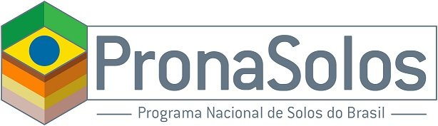
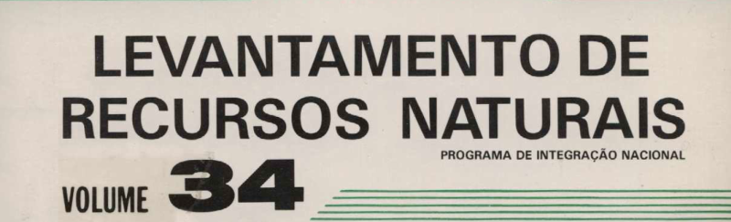
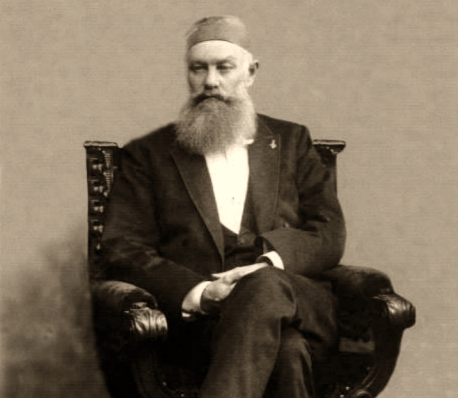
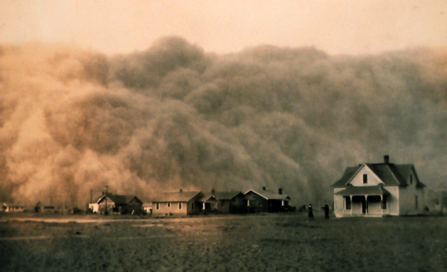
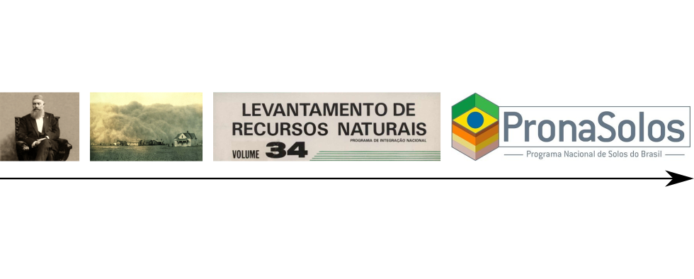
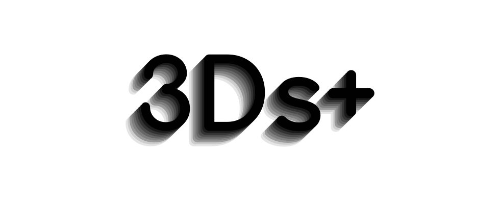
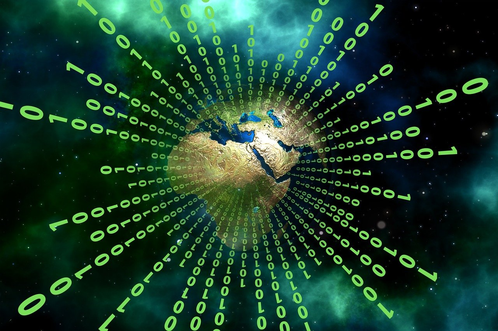
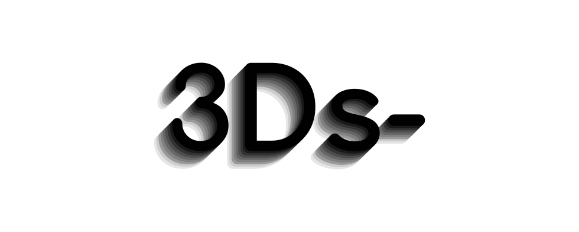
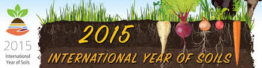
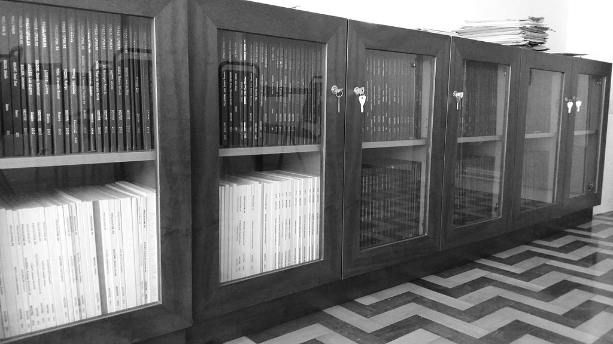

<script src="https://ajax.googleapis.com/ajax/libs/jquery/1.12.2/jquery.min.js"></script>
<script>
    $(document).ready(function() {
    $('slide:not(.title-slide, .backdrop, .segue)').append('<footer></footer>');
    $('footer').attr('label', 'Samuel-Rosa (2020) Acesso Aberto aos Dados da Pesquisa em Ciência do Solo');
  })
</script>

<!--  -->

## Quantos pontos a figura contém? {.columns-2}

* Os pontos ao lado representam locais de amostragem do solo
  * São locais para onde temos ___dados abertos do solo___

Registre sua estimativa em [www.pedometria.org/quantos-pontos](https://www.pedometria.org/quantos-pontos)

O estudante cuja estimativa estiver mais próxima do número correto—e estiver presente—receberá um prêmio pedológico no final da _live_!

```{r, echo=FALSE, fig.align='center', out.width='100%'}
knitr::include_graphics("img/pontos-pronasolos.png")
```

---

<iframe src="https://docs.google.com/spreadsheets/d/e/2PACX-1vTaruWRUvvDwpU7TQ7yDNqKMYeodNr-y8HUXe_kLopBRkBcwiEEUK3Fsp1W2lpoyiL3_Pp0xPERVA9k/pubchart?oid=536920078&format=image" title="Quantos pontos a figura contém?"></iframe>

# Um pouco de contexto

<!-- Annotations -->
<div class="notes"><p style="font-size:16px">
Para falar sobre acesso aberto aos dados da pesquisa em ciência do solo, primeiro eu vou tentar demarcar o ponto da história da ciência do solo, principalmente a ciência do solo brasileira, em que nós nos encontramos hoje, início da terceira década do século XXI.
</p></div>
<!-- Annotations -->

## 2020–2050

```{r, echo=FALSE, fig.align='right', out.width='60%'}

```

> Pelos próximos 30 anos, o PronaSolos envolverá dezenas de instituições parceiras, dedicadas à investigação, documentação, inventário e interpretação dos ___dados de solos___ brasileiros. O objetivo é mapear os solos de 1,3 milhão de km² do País nos primeiros dez anos, e mais 6,9 milhões de km² até 2048, em escalas que vão de 1:25.000 a 1:100.000.

<!-- Annotations -->
<div class="notes"><p style="font-size:16px">
Como já é de amplo conhecimento, recentemente fora lançado o Programa Nacional de Levantamento e Interpretação de Solos do Brasil, o PronaSolos, tema do evento de hoje. Coordenado pela Embrapa, o PronaSolos está planejado, inicialmente, para ter uma duração de três décadas, ou seja, até a metade deste século. Nesse período de 30 anos, se almeja produzir e distribuir informação atualizada e detalhada sobre o solo de todo o País. Para isso, o programa conta com inúmeras instituições parceiras de norte a sul e leste a oeste do Brasil.
</p></div>
<!-- Annotations -->

## 1970–1985

```{r, echo=FALSE, fig.align='right', out.width='50%'}

```

> O projeto RADAM - Radar na Amazônia – foi criado em 1970, priorizando a coleta de ___dados___ sobre recursos minerais, solos, vegetação, uso da terra e cartografia da Amazônia e áreas adjacentes da região Nordeste. Em 1975, o levantamento foi expandido para o restante do território nacional, visando o mapeamento integrado dos recursos naturais e passando a ser denominado Projeto RADAMBRASIL.

<!-- Annotations -->
<div class="notes"><p style="font-size:16px">
Ora, o PronaSolos, enquanto programa de estado, não é muito diferente do bastante conhecido Projeto RADAMBRASIL. O RADAMBRASIL, criado graças aos ótimos resultados do projeto Radar da Amazônia, também tinha a meta de produzir informação sobre recursos naturais como o solo. Naquela época, tais informações foram produzidas em um nível de detalhe que permitiu conhecer melhor o território nacional e planejar sua ocupação para diferentes usos. Assim, as informações sobre os recursos do solo e da terra produzidos pelo Projeto RADAMBRASIL foram fundamentais para a expansão da agricultura brasileira observada nas três últimas décadas do século XX.
</p></div>
<!-- Annotations -->

## E antes disso... na Rússia e EUA {.columns-2}

```{r, echo=FALSE, fig.align='right', out.width='100%'}

```

```{r, echo=FALSE, fig.align='right', out.width='100%'}

```

<!-- Annotations -->
<div class="notes"><p style="font-size:16px">
Vamos voltar ainda mais no tempo e recordar os esforços de cientistas do solo na Rússia, na segunda metade do século XIX, e nos Estados Unidos, na primeira metade do século XX. Em ambos os países, problemas relacionados à produção de alimentos—a seca na Rússia e a erosão eólica nos Estados Unidos—criaram a demanda pela produção de informação do solo. Um volume de dados muito grande foi produzido nesses países—assim como na experiência brasileira com o Projeto RADAMBRASIL. Os cientistas russos e norte-americanos tiveram que desenvolver soluções inovadoras para lidar com o grande volume de dados que eles agora tinham em mãos e com a diversidade do solo que estava se revelando para eles. Dokuchaev, por exemplo, desenvolveu equações matemáticas. Nos EUA, com o volume de dados aumentando rapidamente, a solução encontrada foi criar um sistema de classificação do solo—que mais tarde deu origem ao Soil Taxonomy.
</p></div>
<!-- Annotations -->

## O que foi que mudou desde então?



<!-- Annotations -->
<div class="notes"><p style="font-size:16px">
Olhando para esses esforços nacionais de produção de informação do solo, me parece razoável defender a hipótese de que pouca coisa mudou desde Dokuchaev. De tempos em tempos, uma questão de interesse (inter)nacional gera a demanda pela produção de informação do solo. Com o tempo, essas questões ficam cada vez mais complexas, exigindo informações mais detalhadas e atualizadas sobre o solo. Para isso, um volume sempre maior de dados do solo é necessário. Para tratar desse volume cada vez maior de dados, são utilizadas—ou mesmo desenvolvidas—novas ferramentas e métodos, que também são sempre mais complexas do que aquelas utilizadas pela geração anterior. E isso me trás de volta ao período que estamos encerrando agora.
</p></div>
<!-- Annotations -->

## 1985–2015 | Ferramentas: pedometria e mapeamento digital do solo {.columns-2}

* 1985–2000
  * computadores
  * Internet
  * (geo)estatística
  * sensoriamento remoto
  * sistemas de informação geográfica

<p></p>

* 2000–2015
  * sensoriamento proximal
  * bancos de dados
  * computação de alto desempenho
  * aprendizado de máquina
  * programação em R e Python

<!-- Annotations -->
<div class="notes"><p style="font-size:16px">
Para muitos cientistas do solo, e por bastante tempo, as últimas décadas foram vistas com muito pessimisto. Para alguns, a pedologia estaria morta e enterrada. Contudo, se prestarmos alguma atenção, veremos que o período entre 1985 e 2015 foi marcado por um desenvolvimento tecnológico muito grande, de velocidade nunca antes vista pela humanidade. E as novas tecnologias foram muito rapidamente adotadas na ciência do solo, passando a fazer parte da caixa de ferramentas de muitos cientistas do solo. É nesse período que são cunhados os termos "pedometria" e "mapeamento digital do solo", termos que vêm definir algo que já se conhecia há bastante tempo, mas que era aplicado de maneira dispersa e experimental. Termos que hoje definem aquela que pode ser a disciplina mais vanguardista da ciência do solo.
</p></div>
<!-- Annotations -->

## 1985–2015 | Métodos: digitalização, decentralização, diversificação



<!-- Annotations -->
<div class="notes"><p style="font-size:16px">
Esse período obviamente trouxe mudanças, muitas delas positivas, mudanças essas que eu vou chamar de os 3Ds+: digitalização, decentralização, diversificação.
</p></div>
<!-- Annotations -->

## Digitalização

```{r, echo=FALSE, fig.align='center', out.width='70%'}

```

<!-- Annotations -->
<div class="notes"><p style="font-size:16px">
Quando eu falo em digitalização, estou me referindo ao fato de que o tramento e análise dos dados e a produção de informação do solo passaram quase que totalmente para o meio digital. Em alguns casos, os dados já começam a deixar a trincheira em meio digital. Essa mudança foi positiva por inúmeras razões. Ela permitiu o tratamento mais rápido de um volume cada vez maior de dados. Permitiu também o uso de novas e mais complexas ferramentas de análise de dados. E, é claro, facilitou o compartilhamento e acesso aos dados e à informação para produtores e usuários de dados, bem como para os usuários de informações do solo.
</p></div>
<!-- Annotations -->

## Decentralização

```{r, echo=FALSE, fig.align='center', out.width='70%'}
knitr::include_graphics("img/network.png")
```

<!-- Annotations -->
<div class="notes"><p style="font-size:16px">
A decentralização de que eu falo se refere ao fato de que a produção de dados e informação do solo deixou de ser responsabilidade e interesse principal de algumas poucas instituições como IBGE, CPRM e EMBRAPA. Essas instituições lançaram as bases da produção de dados e informação do solo e promoveram, com as universidades, a formação de centenas de cientistas do solo. Essa sólida formação científica, aliada ao maior acesso aos dados existentes de recursos do solo e da terra, à popularização das ferramentas computacionais e desenvolvimentos tecnológicos, facilitou muito a produção de novos dados e informação do solo. Universidades, instituições de pesquisa e extensão, profissionais liberais, empresas de consultoria, cooperativas, associações... Em resumo, a produção de dados e informação do solo se popularizou.
</p></div>
<!-- Annotations -->

## Diversificação

```{r, echo=FALSE, fig.align='center', out.width='70%'}
knitr::include_graphics("img/diversidade.jpg")
```

<!-- Annotations -->
<div class="notes"><p style="font-size:16px">
Por fim, a diversificação. Se a digitalização facilitou a decentralização da produção de dados e informação do solo, a última facilitou a sua diversificação. As iniciativas passaram a produzir dados para atender a demandas locais ou regionais bem mais específicas. São demandas por informação sobre uma ou mais propriedades químicas ou físicas ou biológicas do solo. Demandas vindas da agricultura de precisão, do licenciamento ambiental, do zoneamento agroecológico, do planejamento de uso da terra, da recuperação de áreas contaminadas, entre muitos outros. Em resumo, o uso de dados e informação do solo se popularizou.
</p></div>
<!-- Annotations -->

## 1985–2015 | Métodos: dispersão, desorganização, desperdício


<!-- Annotations -->
<div class="notes"><p style="font-size:16px">
É claro que sempre há um lado negativo das coisas, que é aquele que fica pra ser resolvido pelas próximas gerações, e que eu vou chamar aqui de os 3Ds negativos: dispersão, desorganização, desperdício.
</p></div>
<!-- Annotations -->

## Dispersão, Desorganização {.columns-2}

```{r, echo=FALSE, fig.align='center', out.width='90%'}

```

```{r, echo=FALSE, fig.align='center', out.width='80%'}
knitr::include_graphics("img/gsp.jpeg")
```

<!-- Annotations -->
<div class="notes"><p style="font-size:16px">
A falta de uma organização coletiva dos esforços de produção de dados e informação do solo é uma marca bastante característica das últimas décadas. Sabe-se pouco sobre os métodos e procedimentos utilizados nas diferentes situações, sobre quais locais já foram estudados e amostrados, sobre qual é a acurácia e precisão dos dados e informações gerados, e mesmo onde estão esses dados e informações. Não é difícil imaginar que, num cenário de dispersão de esforços, estudos quase idênticos já tenham sido realizados sem que um soubesse da existência do outro. Iniciativas internacionais, como a Aliança Global pelo Solo, e nacionais, como o PronaSolos, são resultado da preocupação, em todo o mundo, não apenas de cientistas do solo, mas também de tomadores dos decisão, com esse cenário.
</p></div>
<!-- Annotations -->

## Desperdício

```{r, echo=FALSE, fig.align='center', out.width='80%'}

```

<!-- Annotations -->
<div class="notes"><p style="font-size:16px">
A desorganização e dispersão dos esforços resulta no desperdício de recursos. Como bem sabemos, toda pesquisa em ciência do solo utiliza dados, sejam eles produzidos no campo ou em laboratório. Mas apesar dos recursos dispendidos para sua produção, os dados da pesquisa em ciência do solo costumam ser usados poucas vezes. Muitos acabam se perdendo para sempre, trancados numa biblioteca. Imaginem se todos os dados do solo já produzidos estivessem organizados e disponíveis para reúso? Quantas velhas perguntas nós seríamos capazes responder? Quantas novas perguntas nós seríamos capazes de formular? É por isso que a abertura dos dados da pesquisa em ciência do solo precisa deixar de ser uma promessa e se tornar realidade. Vamos ver como fazer isso!
</p></div>
<!-- Annotations -->

# O que são dados abertos do solo?

<!-- Annotations -->
<div class="notes"><p style="font-size:16px">
Em geral, a abertura dos dados do solo é um processo bastante simples. O mais importante é que sejam respeitadas as três leis dos dados abertos.
</p></div>
<!-- Annotations -->

## As três leis dos dados abertos

1. Encontrados na Internet
    * Do contrário, é como se os dados não existissem
    * <del>"Os dados estão disponíveis mediante contato com os autores."</del>

<!-- Annotations -->
<div class="notes"><p style="font-size:16px">
A primeira lei estabelece que dados abertos são aqueles dados que podem ser encontrados na internet, sem a necessidade de ter que contactar seus autores ou responsáveis. Pra facilitar o entendimento, tente imaginar situações como aquelas em que o autor já se aposentou ou faleceu, ou mudou de emprego, ou teve o computador roubado, ou o disco rígido completamente corrompido, ou o autor desorganizado que não fará ideia alguma de onde os dados se encontram 25 anos após a sua produção.
</p></div>
<!-- Annotations -->

## As três leis dos dados abertos

1. Encontrados na Internet
    * Do contrário, é como se os dados não existissem
    * <del>"Os dados estão disponíveis mediante contato com os autores."</del>
2. Formato que permita imediata leitura e manipulação em software
    * Do contrário, é como se a existência dos dados fosse indesejada
    * <del>"Os dados estão disponíveis no apêndice da tese."</del>

<!-- Annotations -->
<div class="notes"><p style="font-size:16px">
A segunda lei estabelece que os dados devem estar armazenados em um arquivo digital que possa ser lido e manipulado imediatamente em um software de análise de dados. Isso inclui o formato de arquivo, que não deve ser proprietário, ou seja, não deve exigir o uso de um software privado específico. Inclui também a estrutura dos dados dentro do arquivo, que deve ser a mais simples o possível. Exemplos? Dados tabulares em arquivos CSV, TXT, ODS ou XLSX. Disponibilizar dados em arquivos PDF ou DOCX é como se não quiséssemos que os dados realmente sejam reutilizados.
</p></div>
<!-- Annotations -->

## As três leis dos dados abertos

1. Encontrados na Internet
    * Do contrário, é como se os dados não existissem
    * <del>"Os dados estão disponíveis mediante contato com os autores."</del>
2. Formato que permita imediata leitura e manipulação em software
    * Do contrário, é como se a existência dos dados fosse indesejada
    * <del>"Os dados estão disponíveis no apêndice da tese."</del>
3. Livres de impedimentos legais ao reúso e redistribuição
    * Do contrário, os dados são inúteis
    * <del>"Licença Creative Commons Atribuição-NãoComercial-CompartilhaIgual"</del>

<!-- Annotations -->
<div class="notes"><p style="font-size:16px">
Por fim, a terceira lei: os dados não devem ter impedimento legal ao seu reúso. Do contrário, eles são inúteis. Em outras palavras, de nada adianta os dados estarem bem organizados e disponíveis na internet, se o máximo que permitimos a terceiros é que olhem para os dados. A utilidade dos dados está exatamente na possibilidade de serem reutilizados—especialmente quando produzidos utilizando recursos públicos! Recapitulando...
</p></div>
<!-- Annotations -->

# Vamos abrir alguns dados?

<!-- Annotations -->
<div class="notes"><p style="font-size:16px">
Que tal praticarmos um pouco?
</p></div>
<!-- Annotations -->

## Uma contribuição para o sucesso do PronaSolos {.columns-2}

> Em 24 horas, passar a marca de 20.000 pontos com dados abertos para uso no PronaSolos!

[www.pedometria.org/projeto/febr/](https://www.pedometria.org/projeto/febr/)

* ZIP com __dados de sua autoria__ (XLSX) + publicação onde aparecem (PDF)

Obrigado pela sua contribuição! &#128150;

```{r, echo=FALSE, fig.align='center', out.width='100%'}
knitr::include_graphics("img/pontos-febr.png")
```

<!-- Annotations -->
<div class="notes"><p style="font-size:16px">
Para aqueles que tentaram adivinhar o número de pontos de observação e amostragem com dados abertos do solo para o PronaSolos, o resultado está na figura ao lado. São 18083 pontos, proveninentes de centenas de trabalhos diferentes conduzidos nos últimos 100 anos. Nós vamos conferir quem é o vencedor e fazer o anúncio após a palestra do Prof. Demattê. OMas ante disso, eu lanço aqui o seguinte desafio: com a sua contribuição, ultrapassar, em 24 horas, a marca dos 20 mil pontos com dados abertos para o PronaSolos. Tudo o que você precisa fazer é submeter dados de sua autoria e a publicação onde aparecem no endereço que aparece na tela. 
</p></div>
<!-- Annotations -->

## Bibliografia {.tiny}
